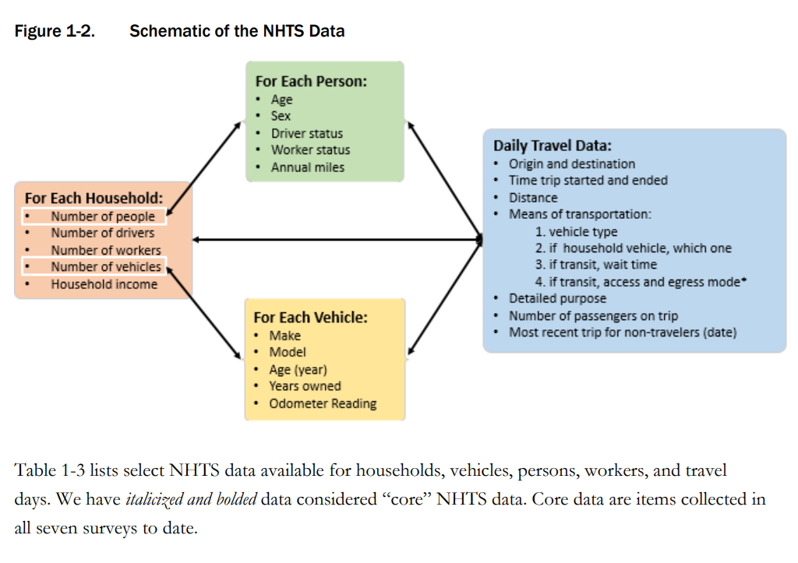
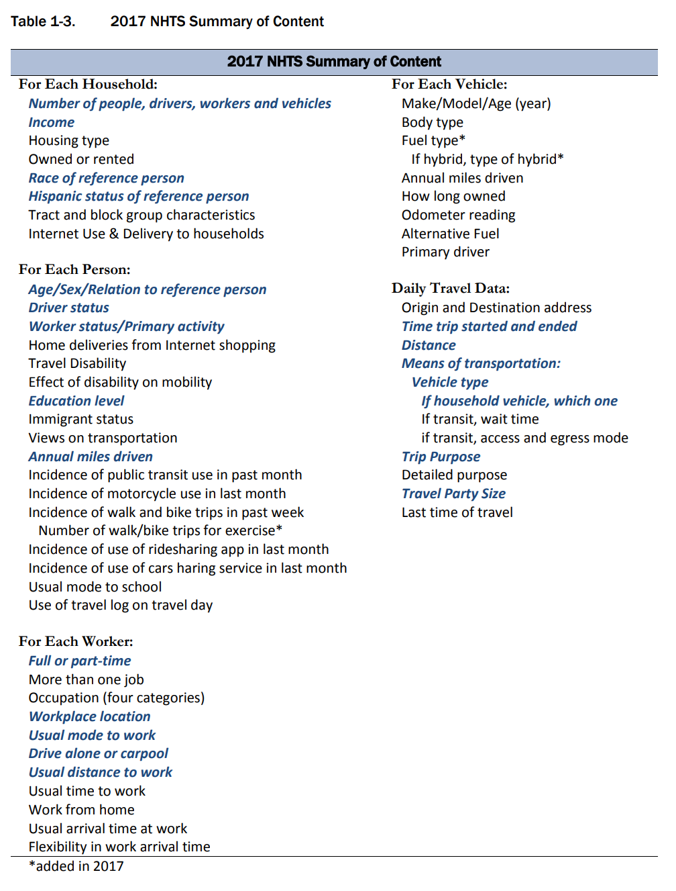
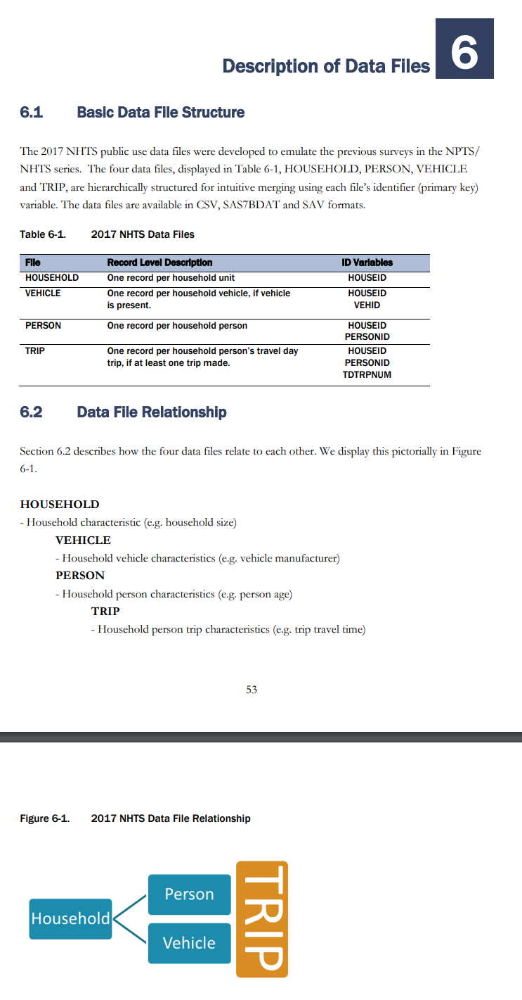
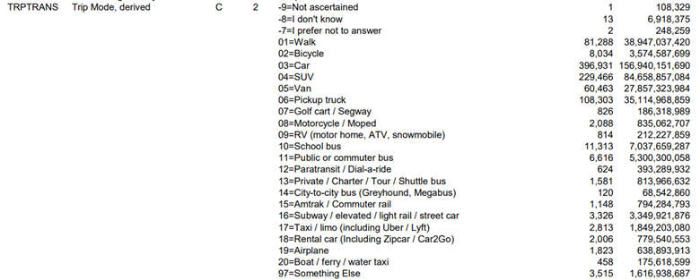
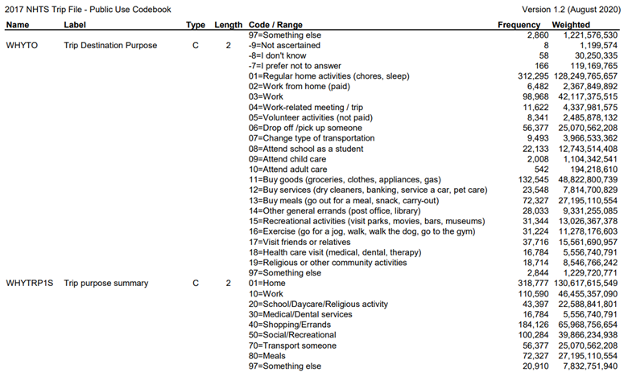
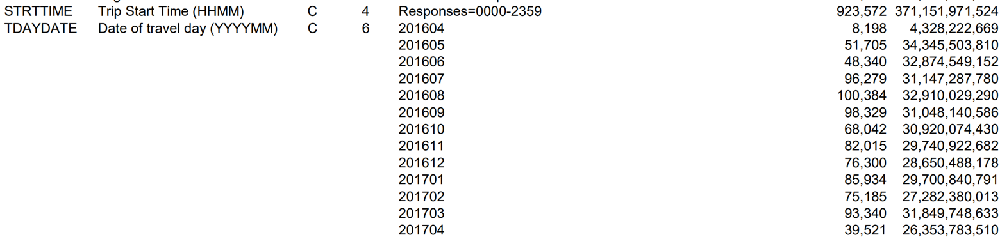

# Description and Overview

This code opens raw datasets from NHTS data in 2017, cleans them, possibly merges them, gives super basic summary tables of new stats that are a result of the new vars, and then saves as new datasets. Another code will then use the cleaned dataset from here to make more fancy summary stats.

These data sets are from the NHST 2017 survey. Documentation is [here](https://nhts.ornl.gov/documentation), with useful [user's guide](https://nhts.ornl.gov/assets/NHTS2017_UsersGuide_04232019_1.pdf), and [codebook](https://nhts.ornl.gov/assets/codebook_v1.2.pdf), and very simple [data dictionary](https://nhts.ornl.gov/assets/dictionary_v1_2.xlsx) that is also saved in Github [here](https://github.com/annitodd/GEMS-data/blob/main/gems-mode-choice/dictionary_v1_2.csv).

Data Dictionary: I'm taking the results from this code, and also putting it into the GEMS master data dictionary. They are in NEW TABs including "clean_mode_choice_data_ATB" and other tabs: <https://docs.google.com/spreadsheets/d/1RVxqALDAE1u4SC569Cq373_fafaE1nZiZBJJMiRTYu8/edit?usp=sharing>

GitHub: This .Rmd code (possibly qmd if I have to change it with the new update to R Studio) is synced to Github, and when this code is knit, it's also synced to GitHub, as a .md file, which makes the knitted code easy to read (kind of like python code.) Currently in a FORK: <https://github.com/annitodd/GEMS-data/blob/main/gems-mode-choice/10_mode-choice-cleaning.md>

## Datasets Description

-   trippub: each row is household-person-trip, without geo IDs, with lots of descriptions of the trips. It's public dataset.

-   tripsct: each row is a household-person-trip, with only geo IDs for *each* trip, like, trip origin geoID and trip destination geoID. The geo IDs are: 2 didget state code, county code, and 6 didget tract code.

-   hhct.csv: each row is a household, with a geo ID for the household.

Data file structure screen shot:

{width="180"}

{width="100"}

{width="180",height="344"}

## FIPS and geotype Descriptions
-   Fips codes -- state 2 characters, county 3 characters, census tract 6 characters
-   fips11_ATB is an a amalgamation -- make these three things into one id, using best practices, here: <https://www.census.gov/programs-surveys/geography/guidance/geo-identifiers.html>, 
-   fips11_ATB is created by concatenating them, not by multiplying


## steps in this code

Open datasets, clean merge datasets save resulting datasets \## result merged dataset, full joined: 10-mode-choice-cleaning_output-full-merged.parquet smaller dataset with fewer vars: (TBD)

Merge tripspub to ctTripspub, maybe merge to ct. Need to merge to county. Take the raw trips, have the county / fips codes, then look at how many trips by county do we have per trips tract IDs, then the microgeotypes -- crosswalk of tract to geotype

# Setup

```{r setup, include=FALSE}
knitr::opts_chunk$set(echo = TRUE, warning = FALSE, message = FALSE) 
```

```{r}
#rm(list=ls()) # Clear RStudio environment
#cat("\014") # Clear console
```

## libraries

```{r}
library(arrow)
library(tidyverse)
library(readxl)
library(rstudioapi)
library(scales)
library(writexl)
```

## file path directories

```{r}
# get current root directory of the user's Github repo
root <- getwd() # Saves current WD 
while ((basename(root) != "GEMS-data")) {
  root <- dirname(root)
} # Sets root equal to the location of the Github repo
source(file.path(root, "paths.R")) # Runs paths.R file found in users Github repo
```

```{r}
data_path <- 'C:/FHWA/For FHWA folks/Mode_choice_estimation/Data'
data_results <- 'C:/FHWA_R2/mode_choice_estimation/data'
```

# DATA - Open and Clean

## Dataset - trippub: Person-Trips

This has all of the trip information for every trip a household took in the survey, each row is a trip for each person that answered the survey

```{r}
df_trippub <- read_csv(file=file.path(data_path, 'trippub.csv'))
names(df_trippub)
#saveRDS(trippub, "df_trippub.rds")
#rm(trippub)
# View(df_trippub)
names(df_trippub)
```

### create key and ID vars

```{r}
df_trippub <- df_trippub  %>%
  mutate(rawdatafrom_trippub_ATB = 1)
```

### create defined modes

Uses TRPTRANS from NHTS

First I'm going to create smaller bins of modes because there are too many, there are like 17 or more The definitions are here: GEMS master data dictionary, in the clean_mode_choice_data tab: <https://docs.google.com/spreadsheets/d/1RVxqALDAE1u4SC569Cq373_fafaE1nZiZBJJMiRTYu8/edit#gid=81250909>



```{r}
df_trippub <- df_trippub  %>%
  mutate(mode_ATB = 
      case_when(TRPTRANS %in% c("01") ~ 'walk',
                TRPTRANS %in% c("02") ~ 'bike',
                TRPTRANS %in% c(10,11,12,13,14) ~ 'bus', 
                TRPTRANS %in% c(15, 16)~ 'rail',
                TRPTRANS %in% c(17) ~ 'taxi',
                TRPTRANS %in% c("03","04","05","06","08","09","18") ~ 'hv', 
                TRUE ~ "other")
      )
summary <- df_trippub |>
    group_by(TRPTRANS, mode_ATB) |>
  summarise(countN = n() ,
            Nmissing = sum(is.na(mode_ATB)),
    .groups = "drop") |> 
  arrange(TRPTRANS)   
summary
```

```{r}
summary <- df_trippub |>
    group_by(mode_ATB) |>
  summarise(countN = n() ,
            Nmissing = sum(is.na(mode_ATB)),
    .groups = "drop") |> 
  arrange(-countN)   
summary
```

### define trip purpose

trip_purpose_ATB generated from NHTS field 'whytrp1s' 

```{r}
df_trippub <- df_trippub  %>%
  mutate(trip_purpose_ATB = 
      case_when(WHYTRP1S %in% c("01") ~ 'home',
                WHYTRP1S %in% c("10") ~ 'work',
                WHYTRP1S %in% c("20") ~ 'school',
                WHYTRP1S %in% c("30") ~ 'medical',
                WHYTRP1S %in% c("40") ~ 'shopping',
                WHYTRP1S %in% c("50") ~ 'social',
                WHYTRP1S %in% c("70") ~ 'transp_someone',
                WHYTRP1S %in% c("80") ~ 'meals',
                TRUE ~ "other")
      )
summary <- df_trippub |>
    group_by(WHYTRP1S, trip_purpose_ATB) |>
  summarise(countN = n() ,
            Nmissing = sum(is.na(mode_ATB)),
    .groups = "drop") |> 
  arrange(WHYTRP1S)   
summary
```

### define time bins

trip_purpose_ATB generated from NHTS field 'STRTTIME' 

```{r}
# convert to numeric
df_trippub <- df_trippub  %>%
  mutate(STRTTIME_num = as.numeric(STRTTIME))
```

```{r}
df_trippub <- df_trippub  %>%
  mutate(start_time_bin_ATB = 
      case_when(STRTTIME_num <=  600 ~ 'morning_rush',
                STRTTIME_num >= 1600 ~ 'evening_rush',
                is.na(STRTTIME_num)  ~ 'missing time',
                TRUE ~ "other_time")
      )
summary <- df_trippub |>
    group_by(start_time_bin_ATB) |>
  summarise(countN = n() ,
            "Min start time" = min(STRTTIME_num),
            "Max start time" = max(STRTTIME_num),
            Nmissing = sum(is.na(mode_ATB)),
    .groups = "drop") |> 
  arrange(start_time_bin_ATB)   
summary
```

## Dataset - tripsct: County-Tract Crosswalk for trips

tripsct: each row is a household-person-trip, with only geo IDs for *each* trip, like, trip origin geoID and trip destination geoID.

-   The geo IDs are: 2 digit state code, county code, and 6 digit tract code.

Read in tripsct because it has the county fips codes and census tract to crosswalk. it is possibly the raw trip with od -- only has tract trip path with distance

```{r}
df_tripct <- read_csv(file=file.path(data_path, 'tripct.csv'))
names(df_tripct)
```

### create key and ID vars
variable to show where the data is from
```{r}
df_tripct <- df_tripct  %>%
  mutate(rawdatafrom_tripct_ATB = 1)
```
Concatenate geo IDs so that there is an 11 diget fips variable, the state ST, county CNTY, and census tract CT
```{r}
df_tripct <- df_tripct  %>% 
  unite(orig_fips11_ATB, c("ORIG_ST","ORIG_CNTY","ORIG_CT"),sep="_",remove = FALSE)
df_tripct <- df_tripct  %>% 
  unite(dest_fips11_ATB, c("DEST_ST","DEST_CNTY","DEST_CT"),sep="_",remove = FALSE)
```

## Dataset - hhct.csv: Household GEOIDs

hhct is restricted data. maps households to where the households are located.

-   hhct.csv: each row is a household, with a geo ID for the household.
-   geo IDs are

```{r}
df_hhct <- read_csv(file=file.path(data_path, 'hhct.csv'))
names(df_hhct)
```

### create key and ID vars

```{r}
df_hhct <- df_hhct  %>%
  mutate(rawdatafrom_hhct_ATB = 1)
```

Concatenate geo IDs so that there is an 11 diget fips variable, the state ST, county CNTY, and census tract CT, for the household
```{r}
df_hhct <- df_hhct  %>% 
  unite(hh_fips11_ATB, c("HHSTFIPS","HHCNTYFP","HHCT"),sep="_",remove = FALSE)
```

## Dataset - geo ID

with imputation, from Xiaodan: Please find the geospatial cluster and crosswalk file all in one place from Phase 1 of the GEMS project. It is based on the census 2010 boundary, which is aligned with NHTS geospatial resolutions. The imputation indicators mean the micro-geotype IDs are not generated in the original clustering analysis due to data quality/missing issues but are added through post-processing. We can use those imputation values, and totally fine to use those as non-imputed values. Anna: Yeah, the "with imputation" means all the tracts are assigned a type. This is what you should be using for now Annika.

-   fips_st : 2 digit state code, cty fips county code, and presumably tract code?

+---------------+-------------------------------------------------+
| FID           | CCTSM ID                                        |
+---------------+-------------------------------------------------+
| GEOID         | Census tract ID                                 |
+---------------+-------------------------------------------------+
| MicrotypeID   | Micro-geotype ID by census tract                |
+---------------+-------------------------------------------------+
| microtype     | Microtype ID by census tract                    |
+---------------+-------------------------------------------------+
| microtype_imp | If microtype ID is imputed using KNN method     |
+---------------+-------------------------------------------------+
| fips_st       | State FIPs code                                 |
+---------------+-------------------------------------------------+
| st_code       | State abbreviation                              |
+---------------+-------------------------------------------------+
| state         | State full name                                 |
+---------------+-------------------------------------------------+
| cty           | County FIPS code                                |
+---------------+-------------------------------------------------+
| ctyname       | County name                                     |
+---------------+-------------------------------------------------+
| cbsa          | Census Core-Based Statistical Areas (CBSA) code |
+---------------+-------------------------------------------------+
| cbsaname      | Census Core-Based Statistical Areas (CBSA) name |
+---------------+-------------------------------------------------+
| spatial_id    | Spatial ID for geotype label, \                 |
|               | spatial_id = CBSA code if CBSA != 99999,\       |
|               | spatial_id = county FIPS code if CBSA == 99999  |
+---------------+-------------------------------------------------+
| geotype       | Geotype ID by census tract                      |
+---------------+-------------------------------------------------+
| geotype_imp   | If Geotype ID is imputed using KNN method       |
+---------------+-------------------------------------------------+

```{r}
df_geoID <- read_csv(file=file.path(data_results, 'raw/ccst_geoid_key_transp_geo_with_imputation.csv'),trim_ws = FALSE, guess_max = Inf)
names(df_geoID)
```

### create key and ID vars

```{r}
df_geoID <- df_geoID  %>%
  mutate(rawdatafrom_geoID = 1)
```
Create fips state that's a string not a number and is separated into different vars
```{r}
df_geoID <- df_geoID  %>%
  separate_wider_position(GEOID,c(fipsstate=2,fipscounty=3,censustract=6),cols_remove = FALSE)
```
and make the fips11_ATB
```{r}
df_geoID <- df_geoID  %>% 
  unite(fips11_ATB, c("fipsstate","fipscounty","censustract"),sep="_",remove = FALSE)
```


# DATA - Merge

Examine the unique primary keys to make sure they're unique. These should have 0 observations, meaning that these uniquely identify the observations:

```{r}
df_trippub |>  
  summarise(n = n())
df_trippub |>  
  group_by(HOUSEID,PERSONID,TDTRPNUM) |>  
  summarise(n = n()) |>  
  filter(n > 1)
df_tripct |>  
  summarise(n = n()) 
df_tripct |>  
  group_by(HOUSEID,PERSONID,TDTRPNUM) |>  
  summarise(n = n()) |>  
  filter(n > 1)
df_hhct |>  
  summarise(n = n()) 
df_hhct |>  
  group_by(HOUSEID) |>  
  summarise(n = n()) |>  
  filter(n > 1)
```

Looks like GeoID has two GEO IDs that are not unique? Remove one.

```{r}
# count the number of geo IDs
df_geoID |>
  summarise(n = n())
# count duplicates of geo IDs
df_geoID |>
  group_by(GEOID) |>
  summarise(n = n()) |>  
  filter(n > 1)
df_geoID |>
  filter(GEOID=="36103159406")
df_geoID <- df_geoID %>% 
  filter((GEOID!="36103159406" | FID!=3030))
```

This will tell us the relationship between the files. It looks like hhct has more observations of households than trippub has households:

```{r stop_knit}
#can't keep this in memory? So stopping the knitted part here
knitr::knit_exit()
```

```{r}
# same unique?
df_trippub |>
  group_by(HOUSEID) |> 
  summarise(n = n(),
            n_distinct(HOUSEID))
```

## merge trippub to tripct
This looks like it works perfectly -- as it should:

```{r}
df_temp1 <- full_join(df_trippub,df_tripct,
                     by=c("HOUSEID","PERSONID","TDTRPNUM"))
df_temp1
```

## merge that to hhct with full join

```{r}
df_temp2 <- full_join(df_temp1,df_hhct,
                     by=c("HOUSEID"))
df_temp2
```

looks like they don't equally merge, as we saw before (hhct has more households on file)

```{r}
df_temp2 |>
  count(rawdatafrom_trippub_ATB,rawdatafrom_tripct_ATB,rawdatafrom_hhct_ATB)
```

## merge in geotypes
match fips codes with the microtypes and geotypes
### for origin
```{r}
df_geoID_origin <- df_geoID %>% 
  select(fips11_ATB, geotype,microtype,MicrotypeID) %>% 
  rename(origin_geotype_ATB = geotype,
         origin_microtype_ATB = microtype,
         origin_geoXmicrotype_ATB = MicrotypeID) 
```

```{r}
df_temp3 <- left_join(df_temp2,df_geoID_origin,
                      by = join_by("orig_fips11_ATB" == "fips11_ATB"),`keep = TRUE` )
```

### for destination
```{r}
df_geoID_dest <- df_geoID %>% 
  select(fips11_ATB, geotype,microtype,MicrotypeID) %>% 
  rename(dest_geotype_ATB = geotype,
         dest_microtype_ATB = microtype,
         dest_geoXmicrotype_ATB = MicrotypeID) 
```

```{r}
df_temp4 <- left_join(df_temp3,df_geoID_dest,
                      by = join_by("dest_fips11_ATB" == "fips11_ATB"),`keep = TRUE` )
```

### for household location
```{r}
df_geoID_hh <- df_geoID %>% 
  select(fips11_ATB, geotype,microtype,MicrotypeID) %>% 
  rename(hh_geotype_ATB = geotype,
         hh_microtype_ATB = microtype,
         hh_geoXmicrotype_ATB = MicrotypeID) 
```

```{r}
df_temp5 <- left_join(df_temp4,df_geoID_hh,
                      by = join_by("hh_fips11_ATB" == "fips11_ATB"),`keep = TRUE` )
```


# DATA - Save
## reorder
```{r}
 df_temp10 <- df_temp5 %>% 
  relocate(contains("_ATB"))
```
remove temporary dataframes
```{r}
rm(df_temp1)
rm(df_temp2)
rm(df_temp3)
rm(df_temp4)
rm(df_temp5)
rm(df_temp6)
rm(df_temp7)
rm(df_temp8)
rm(df_temp9)
```


## save

Save the complete merged file as a parquet file and a csv file, and also a R specific rds file

```{r}
write_parquet(df_temp10,  file.path(data_results, "10-mode-choice-cleaning_output-full-merged.parquet"))
write_rds(df_temp10,  file.path(data_results, "10-mode-choice-cleaning_output-full-merged.rds"))
write_csv(df_temp10,  file.path(data_results, "10-mode-choice-cleaning_output-full-merged.csv"))
```

Save only the variables we might want into a smaller file
(Currently nothing here)
```{r}

```

# Clean up and conclude
## Remove temp10
```{r}
rm(df_temp10)
```
## Exit knittr
```{r exit}
knitr::knit_exit()
```

# The End------------------------------------------------------------------
#-------------------------------------------------------------------------- 

## Notes 

location \<- location %\>% dplyr::mutate(hometract = HHSTFIPS \* 10\^9 + HHCNTYFP\*10\^6 + HHCT) %\>% dplyr::select(HOUSEID, hometract) \# Next Steps

# define distance bins

in the "transition_matrix" tab of the GEMS Master Data dictionary sheet DistanceBinID "Trip distance bin defined as following: • bin1 - distance between 0 and 1 mile • bin2 - distance between 1 and 2 miles • bin3 - distance between 2 and 4 miles • bin4 - distance between 4 and 8 miles • bin5 - distance between 8 and 15 miles • bin6 - distance between 15 and 20 miles • bin7 - distance between 20 and 35 miles • bin8 - distance above 35 miles" \### Note is this inclusive? Check at some point

```{r}

```

## Overview & background

Are there enough counties where there are enough trips within them broken down into heterogeneity that we want to estimate the coefs

enough counties with enough trips for each mode --\> that's what we need

then want to divide by heterogeneous groups.

Next to get heads around: Do we need number of or proportion for each section for each to do the proportional mnl thing Also do we need to weight it?

Goal: how should we collapse the data

## clean data enough that we can get a lots of different histograms

```{r}

```

## Histogram of trip counts by county. Each county will have a number of trips that's within the county

------------------------------------------------------------------------

------------------------------------------------------------------------

-   

```{r}

```

## Histogram of trip counts by mode by county

```{r}

```

## Also pull in the micro geotype indicators

i'll need to ask Xiaodan where the cross walk is between census-tract and microgeotypes

```{r}

```

## TEMPO -- look at how they did it

Use nhts does county level does fractional split logit? they have bins of income levels how did they decide to use their bins? Were they defining the bins <https://www.nrel.gov/transportation/tempo-model.html>

Note: keep all new vars etc, new definitions, at the beginning or in a separate code

## Future next step

### doing a mnl fractional, even if not totally decided on how to make one unit of obs

filter raw trip in the NHTS by origin county tripct is census tract -- last 4 didgets or something is county number of trips by county by mode

-   After that then \*

*User Classes* another need to have definitions of user classes income, age, vehicle ownership -- do we want to keep that definition? Use this to look at definitions -- but don't merge with it bc maybe it excluded some trips: nhts_user_classes_inc_veh_sr.csv 264234 C:\FHWA\For FHWA folks\CleanData\NHTS Xiaodan

*Time Classes* there's a definition somewhere

*Distance Class* Can use this to see what the different classes are -- but these merge with geo types not with census TransitionMatrix-100m.csv 31919 C:\FHWA\For FHWA folks\CleanData Xiaodan

```{r}


  

#df <- load("C:/FHWA_R2/This is from before/Mode_choice_estimation/Data/ModeChoice_Tour_A.Rdata")
```

# train distance data merged to trip locations.

load(file= file.path(datadir,'NHTS_tract_origin_train_dist_transgeo.RData'))

# NOTE: "ct" is restricted, only data for us, like hhct

# "pub" public data

# "perwgt" is also public

# Step 1. Tripspub, maybe merge to ct. Need to merge to county. Take the

# raw trips, have the county / fips codes, then look at how many trips by county

# do we have per trips

# tract IDs, then the microgeotypes -- crosswalk of tract to geotype

This is from before I talked to Anna and Xiaodan:

```{r}
df <- load("C:/FHWA_R2/This is from before/Mode_choice_estimation/Data/ModeChoice_Tour_A.Rdata")
  # readr
("C:/FHWA/For FHWA folks/Mode_choice_estimation/Data/ModeChoice_Tour_A.Rdata")
  
# df_ProBiz_survey_employees <- read_csv(paste0(box, probiz_path))
```

```{r}
df <- od.tr.purpose2 
rm(od.tr.purpose2)
df_mode <- TravelMode
rm(TravelMode)
```

# Summary Stats

```{r}
summary <- df |> 
  group_by(TDTRPNUM) |>
  summarise(count = n())
summary

summary <- df |> 
  group_by(o_geotype) |>
  summarise(count = n())
summary

summary <- df |> 
  group_by(o_microtype) |>
  summarise(count = n())
summary

summary <- df |> 
  group_by(d_geotype) |>
  summarise(count = n())
summary

summary <- df |> 
  group_by(d_microtype) |>
  summarise(count = n())
summary

summary <- df |> 
  group_by(whytrp1s) |>
  summarise(count = n())
summary


```

```{r}
summary <- df_mode |> 
  group_by(mode_ATB) |>
  summarise(count = n())
summary
summary <- df_mode |> 
  group_by(mode_ATB) |>
  summarise(
    countN = n(),
    across(where(is.numeric),~mean(.x),.names = "{.col}_avg"),
    across(where(is.factor ),~n_distinct(.x),.names = "{.col}_Ndis"))
summary

summary <- df_mode |> 
  group_by(trip_purpose_ATB) |>
  summarise(count = n())
summary

summary_modeXpurpose <- df_mode |> 
  group_by(mode_ATB, trip_purpose_ATB) |>
  summarise(count = n())
summary

summary <- df_mode |> 
  group_by(hometract) |>
  summarise(count = n())
summary

```

```{r}
hist_temp <- 
```

```{r summary}
summary  <-   df_temp |> 
  group_by(lever_position_fleetsize,
           originalDataset,
           lever_position_price) |> 
  summarise(
          across(where(is.numeric),~mean(.x),.names = "{.col}_avg"),
          countN = n(),
          across(.cols=everything(), ~mean(is.na(.x)),.names = "{.col}_Missing"),
          
            PCTwaittimeIs0 = mean(waitTime<0.000001),
            across(where(is.factor ),~n_distinct(.x),.names = "{.col}_Ndis"),
            
            , .groups = "drop") |> 
  arrange(countN) 
problems <- problems |> 
  arrange(lever_position_price, lever_position_fleetsize)
problems <- problems |> 
  relocate(lever_position_price, lever_position_fleetsize,
            contains("wait"),
           contains("duration")
  )
# |> 
  # filter(lever_position_fleetsize==1 & lever_position_price==1)
readr::write_csv(problems,file = paste0(data_dir_on_this_machine,
                             "ReadyForAnalysis/",
                             glue("{placeTitleShort}_{year}_",                        "stacked_",
                                  "{categoryTitleShort}_{leverTitleShort}_",
                                  "Paired_",
                                  "SUMMARY",
                                  "_103",
                                  ".csv"  )))
```

```{r}
(hist_employees_per_company <- 
  df_ProBiz_survey_employees %>% 
    count(c_company_name)%>% 
    ggplot(aes(x = n)) +
    geom_histogram(binwidth = 5, 
                   boundary = 0, 
                   fill = "darkred",
                   color = "black") +
    scale_x_continuous(n.breaks = 15) +
    theme_bw() +
    theme(plot.caption = element_text(hjust = 0)) + # set the left align here
    labs(x = "Number of employees per company",
         y = "Number of companys",
         title = "Histogram of number of employees per company",
         caption = "* Binwidth = 10\n ** Total number of companies is 275"))
```
