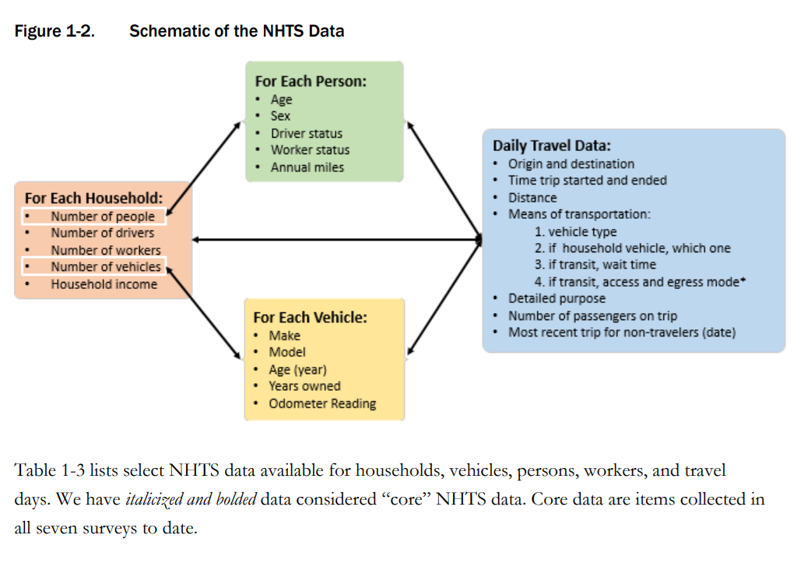
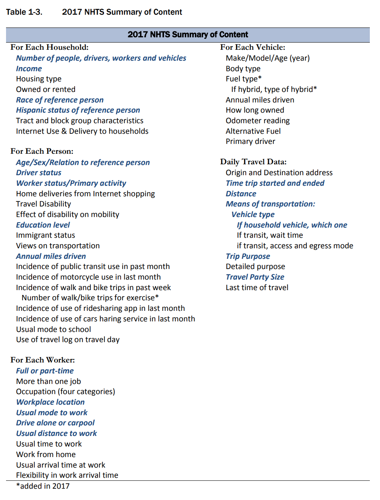
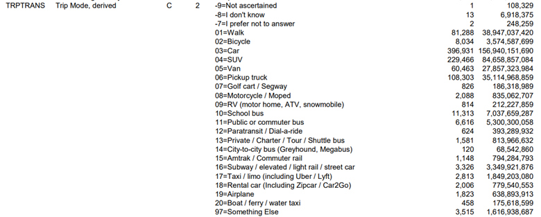

Annika created this code doc on 10/21/2023. Last compiled on 2023-12-18

# Description and Overview

This code opens raw datasets from NHTS data in 2017, cleans them,
possibly merges them, gives super basic summary tables of new stats that
are a result of the new vars, and then saves as new datasets. Another
code will then use the cleaned dataset from here to make more fancy
summary stats.

These data sets are from the NHST 2017 survey. Documentation is
[here](https://nhts.ornl.gov/documentation), with useful [user’s
guide](https://nhts.ornl.gov/assets/NHTS2017_UsersGuide_04232019_1.pdf),
and [codebook](https://nhts.ornl.gov/assets/codebook_v1.2.pdf), and very
simple [data
dictionary](https://nhts.ornl.gov/assets/dictionary_v1_2.xlsx) that is
also saved in Github
[here](https://github.com/annitodd/GEMS-data/blob/main/gems-mode-choice/dictionary_v1_2.csv).

Data Dictionary: I’m taking the results from this code, and also putting
it into the GEMS master data dictionary. They are in NEW TABs including
“clean_mode_choice_data_ATB” and other tabs:
<https://docs.google.com/spreadsheets/d/1RVxqALDAE1u4SC569Cq373_fafaE1nZiZBJJMiRTYu8/edit?usp=sharing>

GitHub: This .Rmd code (possibly qmd if I have to change it with the new
update to R Studio) is synced to Github, and when this code is knit,
it’s also synced to GitHub, as a .md file, which makes the knitted code
easy to read (kind of like python code.) Currently in a FORK:
<https://github.com/annitodd/GEMS-data/blob/main/gems-mode-choice/10_mode-choice-cleaning.md>

## Datasets Description

- trippub: each row is household-person-trip, without geo IDs, with lots
  of descriptions of the trips. It’s public dataset.

- tripsct: each row is a household-person-trip, with only geo IDs for
  *each* trip, like, trip origin geoID and trip destination geoID. The
  geo IDs are: 2 didget state code, county code, and 6 didget tract
  code.

- hhct.csv: each row is a household, with a geo ID for the household.

Data file structure screen shot:





{width=“180”,height=“344”}

## FIPS and geotype Descriptions

- Fips codes – state 2 characters, county 3 characters, census tract 6
  characters
- fips11_ATB is an a amalgamation – make these three things into one id,
  using best practices, here:
  <https://www.census.gov/programs-surveys/geography/guidance/geo-identifiers.html>,
- fips11_ATB is created by concatenating them, not by multiplying

## steps in this code

Open datasets, clean merge datasets save resulting datasets \## result
merged dataset, full joined:
10-mode-choice-cleaning_output-full-merged.parquet smaller dataset with
fewer vars: (TBD)

Merge tripspub to ctTripspub, maybe merge to ct. Need to merge to
county. Take the raw trips, have the county / fips codes, then look at
how many trips by county do we have per trips tract IDs, then the
microgeotypes – crosswalk of tract to geotype

# Setup

``` r
#rm(list=ls()) # Clear RStudio environment
#cat("\014") # Clear console
```

## libraries

``` r
library(arrow)
library(tidyverse)
library(readxl)
library(rstudioapi)
library(scales)
library(writexl)
```

## file path directories

``` r
# get current root directory of the user's Github repo
root <- getwd() # Saves current WD 
while ((basename(root) != "GEMS-data")) {
  root <- dirname(root)
} # Sets root equal to the location of the Github repo
source(file.path(root, "paths.R")) # Runs paths.R file found in users Github repo
```

``` r
data_path <- 'C:/FHWA/For FHWA folks/Mode_choice_estimation/Data'
data_results <- 'C:/FHWA_R2/mode_choice_estimation/data'
```

# DATA - Open and Clean

## Dataset - trippub: Person-Trips

This has all of the trip information for every trip a household took in
the survey, each row is a trip for each person that answered the survey

``` r
df_trippub <- read_csv(file=file.path(data_path, 'trippub.csv'))
names(df_trippub)
```

    ##   [1] "HOUSEID"   "PERSONID"  "TDTRPNUM"  "STRTTIME"  "ENDTIME"   "TRVLCMIN" 
    ##   [7] "TRPMILES"  "TRPTRANS"  "TRPACCMP"  "TRPHHACC"  "VEHID"     "TRWAITTM" 
    ##  [13] "NUMTRANS"  "TRACCTM"   "DROP_PRK"  "TREGRTM"   "WHODROVE"  "WHYFROM"  
    ##  [19] "LOOP_TRIP" "TRPHHVEH"  "HHMEMDRV"  "HH_ONTD"   "NONHHCNT"  "NUMONTRP" 
    ##  [25] "PSGR_FLG"  "PUBTRANS"  "TRIPPURP"  "DWELTIME"  "TDWKND"    "VMT_MILE" 
    ##  [31] "DRVR_FLG"  "WHYTRP1S"  "ONTD_P1"   "ONTD_P2"   "ONTD_P3"   "ONTD_P4"  
    ##  [37] "ONTD_P5"   "ONTD_P6"   "ONTD_P7"   "ONTD_P8"   "ONTD_P9"   "ONTD_P10" 
    ##  [43] "ONTD_P11"  "ONTD_P12"  "ONTD_P13"  "TDCASEID"  "TRACC_WLK" "TRACC_POV"
    ##  [49] "TRACC_BUS" "TRACC_CRL" "TRACC_SUB" "TRACC_OTH" "TREGR_WLK" "TREGR_POV"
    ##  [55] "TREGR_BUS" "TREGR_CRL" "TREGR_SUB" "TREGR_OTH" "WHYTO"     "TRAVDAY"  
    ##  [61] "HOMEOWN"   "HHSIZE"    "HHVEHCNT"  "HHFAMINC"  "DRVRCNT"   "HHSTATE"  
    ##  [67] "HHSTFIPS"  "NUMADLT"   "WRKCOUNT"  "TDAYDATE"  "HHRESP"    "LIF_CYC"  
    ##  [73] "MSACAT"    "MSASIZE"   "RAIL"      "URBAN"     "URBANSIZE" "URBRUR"   
    ##  [79] "GASPRICE"  "CENSUS_D"  "CENSUS_R"  "CDIVMSAR"  "HH_RACE"   "HH_HISP"  
    ##  [85] "HH_CBSA"   "SMPLSRCE"  "R_AGE"     "EDUC"      "R_SEX"     "PRMACT"   
    ##  [91] "PROXY"     "WORKER"    "DRIVER"    "WTTRDFIN"  "WHYTRP90"  "R_AGE_IMP"
    ##  [97] "R_SEX_IMP" "HBHUR"     "HTHTNRNT"  "HTPPOPDN"  "HTRESDN"   "HTEEMPDN" 
    ## [103] "HBHTNRNT"  "HBPPOPDN"  "HBRESDN"

``` r
#saveRDS(trippub, "df_trippub.rds")
#rm(trippub)
# View(df_trippub)
names(df_trippub)
```

    ##   [1] "HOUSEID"   "PERSONID"  "TDTRPNUM"  "STRTTIME"  "ENDTIME"   "TRVLCMIN" 
    ##   [7] "TRPMILES"  "TRPTRANS"  "TRPACCMP"  "TRPHHACC"  "VEHID"     "TRWAITTM" 
    ##  [13] "NUMTRANS"  "TRACCTM"   "DROP_PRK"  "TREGRTM"   "WHODROVE"  "WHYFROM"  
    ##  [19] "LOOP_TRIP" "TRPHHVEH"  "HHMEMDRV"  "HH_ONTD"   "NONHHCNT"  "NUMONTRP" 
    ##  [25] "PSGR_FLG"  "PUBTRANS"  "TRIPPURP"  "DWELTIME"  "TDWKND"    "VMT_MILE" 
    ##  [31] "DRVR_FLG"  "WHYTRP1S"  "ONTD_P1"   "ONTD_P2"   "ONTD_P3"   "ONTD_P4"  
    ##  [37] "ONTD_P5"   "ONTD_P6"   "ONTD_P7"   "ONTD_P8"   "ONTD_P9"   "ONTD_P10" 
    ##  [43] "ONTD_P11"  "ONTD_P12"  "ONTD_P13"  "TDCASEID"  "TRACC_WLK" "TRACC_POV"
    ##  [49] "TRACC_BUS" "TRACC_CRL" "TRACC_SUB" "TRACC_OTH" "TREGR_WLK" "TREGR_POV"
    ##  [55] "TREGR_BUS" "TREGR_CRL" "TREGR_SUB" "TREGR_OTH" "WHYTO"     "TRAVDAY"  
    ##  [61] "HOMEOWN"   "HHSIZE"    "HHVEHCNT"  "HHFAMINC"  "DRVRCNT"   "HHSTATE"  
    ##  [67] "HHSTFIPS"  "NUMADLT"   "WRKCOUNT"  "TDAYDATE"  "HHRESP"    "LIF_CYC"  
    ##  [73] "MSACAT"    "MSASIZE"   "RAIL"      "URBAN"     "URBANSIZE" "URBRUR"   
    ##  [79] "GASPRICE"  "CENSUS_D"  "CENSUS_R"  "CDIVMSAR"  "HH_RACE"   "HH_HISP"  
    ##  [85] "HH_CBSA"   "SMPLSRCE"  "R_AGE"     "EDUC"      "R_SEX"     "PRMACT"   
    ##  [91] "PROXY"     "WORKER"    "DRIVER"    "WTTRDFIN"  "WHYTRP90"  "R_AGE_IMP"
    ##  [97] "R_SEX_IMP" "HBHUR"     "HTHTNRNT"  "HTPPOPDN"  "HTRESDN"   "HTEEMPDN" 
    ## [103] "HBHTNRNT"  "HBPPOPDN"  "HBRESDN"

### create var: key and ID vars

``` r
df_trippub <- df_trippub  %>%
  mutate(rawdatafrom_trippub_ATB = 1)
```

### create var: modes

Uses TRPTRANS from NHTS

First I’m going to create smaller bins of modes because there are too
many, there are like 17 or more The definitions are here: GEMS master
data dictionary, in the clean_mode_choice_data tab:
<https://docs.google.com/spreadsheets/d/1RVxqALDAE1u4SC569Cq373_fafaE1nZiZBJJMiRTYu8/edit#gid=81250909>



``` r
df_trippub <- df_trippub  %>%
  mutate(mode_ATB = 
      case_when(TRPTRANS %in% c("01") ~ 'walk',
                TRPTRANS %in% c("02") ~ 'bike',
                TRPTRANS %in% c(10,11,12,13,14) ~ 'bus', 
                TRPTRANS %in% c(15, 16)~ 'rail',
                TRPTRANS %in% c(17) ~ 'taxi',
                TRPTRANS %in% c("03","04","05","06","08","09","18") ~ 'hv', 
                TRUE ~ "other")
      )
summary <- df_trippub |>
    group_by(TRPTRANS, mode_ATB) |>
  summarise(countN = n() ,
            Nmissing = sum(is.na(mode_ATB)),
    .groups = "drop") |> 
  arrange(TRPTRANS)   
summary
```

    ## # A tibble: 24 × 4
    ##    TRPTRANS mode_ATB countN Nmissing
    ##    <chr>    <chr>     <int>    <int>
    ##  1 -7       other         2        0
    ##  2 -8       other        13        0
    ##  3 -9       other         1        0
    ##  4 01       walk      81288        0
    ##  5 02       bike       8034        0
    ##  6 03       hv       396931        0
    ##  7 04       hv       229466        0
    ##  8 05       hv        60463        0
    ##  9 06       hv       108303        0
    ## 10 07       other       826        0
    ## # ℹ 14 more rows

``` r
summary <- df_trippub |>
    group_by(mode_ATB) |>
  summarise(countN = n() ,
            Nmissing = sum(is.na(mode_ATB)),
    .groups = "drop") |> 
  arrange(-countN)   
summary
```

    ## # A tibble: 7 × 3
    ##   mode_ATB countN Nmissing
    ##   <chr>     <int>    <int>
    ## 1 hv       800071        0
    ## 2 walk      81288        0
    ## 3 bus       20254        0
    ## 4 bike       8034        0
    ## 5 other      6638        0
    ## 6 rail       4474        0
    ## 7 taxi       2813        0

### create var: trip purpose

trip_purpose_ATB generated from NHTS field ‘whytrp1s’


``` r
df_trippub <- df_trippub  %>%
  mutate(trip_purpose_ATB = 
      case_when(WHYTRP1S %in% c("01") ~ 'home',
                WHYTRP1S %in% c("10") ~ 'work',
                WHYTRP1S %in% c("20") ~ 'school',
                WHYTRP1S %in% c("30") ~ 'medical',
                WHYTRP1S %in% c("40") ~ 'shopping',
                WHYTRP1S %in% c("50") ~ 'social',
                WHYTRP1S %in% c("70") ~ 'transp_someone',
                WHYTRP1S %in% c("80") ~ 'meals',
                TRUE ~ "other")
      )
df_trippub <- df_trippub  %>%
  mutate(trip_purpose_small_ATB = 
      case_when(WHYTRP1S %in% c("01") ~ 'home',
                WHYTRP1S %in% c("10","20") ~ 'work_school',
                WHYTRP1S %in% c("30","40","50","70","80") ~ 'other',
                TRUE ~ "other")
      )
summary <- df_trippub |>
    group_by(WHYTRP1S, trip_purpose_ATB) |>
  summarise(countN = n() ,
            Nmissing = sum(is.na(mode_ATB)),
    .groups = "drop") |> 
  arrange(WHYTRP1S)   
summary
```

    ## # A tibble: 9 × 4
    ##   WHYTRP1S trip_purpose_ATB countN Nmissing
    ##   <chr>    <chr>             <int>    <int>
    ## 1 01       home             318777        0
    ## 2 10       work             110590        0
    ## 3 20       school            43397        0
    ## 4 30       medical           16784        0
    ## 5 40       shopping         184126        0
    ## 6 50       social           100284        0
    ## 7 70       transp_someone    56377        0
    ## 8 80       meals             72327        0
    ## 9 97       other             20910        0

``` r
summary <- df_trippub |>
    group_by(trip_purpose_ATB, trip_purpose_small_ATB) |>
  summarise(countN = n() ,
            Nmissing = sum(is.na(mode_ATB)),
    .groups = "drop") |> 
  arrange(trip_purpose_small_ATB)   
summary
```

    ## # A tibble: 9 × 4
    ##   trip_purpose_ATB trip_purpose_small_ATB countN Nmissing
    ##   <chr>            <chr>                   <int>    <int>
    ## 1 home             home                   318777        0
    ## 2 meals            other                   72327        0
    ## 3 medical          other                   16784        0
    ## 4 other            other                   20910        0
    ## 5 shopping         other                  184126        0
    ## 6 social           other                  100284        0
    ## 7 transp_someone   other                   56377        0
    ## 8 school           work_school             43397        0
    ## 9 work             work_school            110590        0

### create var: time bins

trip_purpose_ATB generated from NHTS field ‘STRTTIME’


``` r
# convert to numeric
df_trippub <- df_trippub  %>%
  mutate(STRTTIME_num = as.numeric(STRTTIME))
```

``` r
df_trippub <- df_trippub  %>%
  mutate(start_time_bin_ATB = 
      case_when(STRTTIME_num <=  600 ~ 'morning_rush',
                STRTTIME_num >= 1600 ~ 'evening_rush',
                is.na(STRTTIME_num)  ~ 'missing time',
                TRUE ~ "other_time")
      )
summary <- df_trippub |>
    group_by(start_time_bin_ATB) |>
  summarise(countN = n() ,
            "Min start time" = min(STRTTIME_num),
            "Max start time" = max(STRTTIME_num),
            Nmissing = sum(is.na(mode_ATB)),
    .groups = "drop") |> 
  arrange(start_time_bin_ATB)   
summary
```

    ## # A tibble: 3 × 5
    ##   start_time_bin_ATB countN `Min start time` `Max start time` Nmissing
    ##   <chr>               <int>            <dbl>            <dbl>    <int>
    ## 1 evening_rush       298139             1600             2359        0
    ## 2 morning_rush        20909                0              600        0
    ## 3 other_time         604524              601             1559        0

## Dataset - tripsct: County-Tract Crosswalk for trips

tripsct: each row is a household-person-trip, with only geo IDs for
*each* trip, like, trip origin geoID and trip destination geoID.

- The geo IDs are: 2 digit state code, county code, and 6 digit tract
  code.

Read in tripsct because it has the county fips codes and census tract to
crosswalk. it is possibly the raw trip with od – only has tract trip
path with distance

``` r
df_tripct <- read_csv(file=file.path(data_path, 'tripct.csv'))
names(df_tripct)
```

    ##  [1] "HOUSEID"      "PERSONID"     "TDTRPNUM"     "ORIG_COUNTRY" "ORIG_ST"     
    ##  [6] "ORIG_CNTY"    "ORIG_CT"      "DEST_COUNTRY" "DEST_ST"      "DEST_CNTY"   
    ## [11] "DEST_CT"

### create key and ID vars

variable to show where the data is from

``` r
df_tripct <- df_tripct  %>%
  mutate(rawdatafrom_tripct_ATB = 1)
```

Concatenate geo IDs so that there is an 11 diget fips variable, the
state ST, county CNTY, and census tract CT

``` r
df_tripct <- df_tripct  %>% 
  unite(orig_fips11_ATB, c("ORIG_ST","ORIG_CNTY","ORIG_CT"),sep="_",remove = FALSE)
df_tripct <- df_tripct  %>% 
  unite(dest_fips11_ATB, c("DEST_ST","DEST_CNTY","DEST_CT"),sep="_",remove = FALSE)
```

## Dataset - hhct.csv: Household GEOIDs

hhct is restricted data. maps households to where the households are
located.

- hhct.csv: each row is a household, with a geo ID for the household.
- geo IDs are

``` r
df_hhct <- read_csv(file=file.path(data_path, 'hhct.csv'))
names(df_hhct)
```

    ## [1] "HOUSEID"  "HHSTFIPS" "HHCNTYFP" "HHCT"

### create key and ID vars

``` r
df_hhct <- df_hhct  %>%
  mutate(rawdatafrom_hhct_ATB = 1)
```

Concatenate geo IDs so that there is an 11 diget fips variable, the
state ST, county CNTY, and census tract CT, for the household

``` r
df_hhct <- df_hhct  %>% 
  unite(hh_fips11_ATB, c("HHSTFIPS","HHCNTYFP","HHCT"),sep="_",remove = FALSE)
```

## Dataset - geo ID

with imputation, from Xiaodan: Please find the geospatial cluster and
crosswalk file all in one place from Phase 1 of the GEMS project. It is
based on the census 2010 boundary, which is aligned with NHTS geospatial
resolutions. The imputation indicators mean the micro-geotype IDs are
not generated in the original clustering analysis due to data
quality/missing issues but are added through post-processing. We can use
those imputation values, and totally fine to use those as non-imputed
values. Anna: Yeah, the “with imputation” means all the tracts are
assigned a type. This is what you should be using for now Annika.

- fips_st : 2 digit state code, cty fips county code, and presumably
  tract code?

<table style="width:92%;">
<colgroup>
<col style="width: 22%" />
<col style="width: 69%" />
</colgroup>
<tbody>
<tr class="odd">
<td>FID</td>
<td>CCTSM ID</td>
</tr>
<tr class="even">
<td>GEOID</td>
<td>Census tract ID</td>
</tr>
<tr class="odd">
<td>MicrotypeID</td>
<td>Micro-geotype ID by census tract</td>
</tr>
<tr class="even">
<td>microtype</td>
<td>Microtype ID by census tract</td>
</tr>
<tr class="odd">
<td>microtype_imp</td>
<td>If microtype ID is imputed using KNN method</td>
</tr>
<tr class="even">
<td>fips_st</td>
<td>State FIPs code</td>
</tr>
<tr class="odd">
<td>st_code</td>
<td>State abbreviation</td>
</tr>
<tr class="even">
<td>state</td>
<td>State full name</td>
</tr>
<tr class="odd">
<td>cty</td>
<td>County FIPS code</td>
</tr>
<tr class="even">
<td>ctyname</td>
<td>County name</td>
</tr>
<tr class="odd">
<td>cbsa</td>
<td>Census Core-Based Statistical Areas (CBSA) code</td>
</tr>
<tr class="even">
<td>cbsaname</td>
<td>Census Core-Based Statistical Areas (CBSA) name</td>
</tr>
<tr class="odd">
<td>spatial_id</td>
<td>Spatial ID for geotype label,<br />
spatial_id = CBSA code if CBSA != 99999,<br />
spatial_id = county FIPS code if CBSA == 99999</td>
</tr>
<tr class="even">
<td>geotype</td>
<td>Geotype ID by census tract</td>
</tr>
<tr class="odd">
<td>geotype_imp</td>
<td>If Geotype ID is imputed using KNN method</td>
</tr>
</tbody>
</table>

``` r
df_geoID <- read_csv(file=file.path(data_results, 'raw/ccst_geoid_key_transp_geo_with_imputation.csv'),trim_ws = FALSE, guess_max = Inf)
names(df_geoID)
```

    ##  [1] "FID"           "GEOID"         "MicrotypeID"   "microtype"    
    ##  [5] "microtype_imp" "fips_st"       "st_code"       "state"        
    ##  [9] "cty"           "ctyname"       "cbsa"          "cbsaname"     
    ## [13] "spatial_id"    "geotype"       "geotype_imp"

### create key and ID vars

``` r
df_geoID <- df_geoID  %>%
  mutate(rawdatafrom_geoID = 1)
```

Create fips state that’s a string not a number and is separated into
different vars

``` r
df_geoID <- df_geoID  %>%
  separate_wider_position(GEOID,c(fipsstate=2,fipscounty=3,censustract=6),cols_remove = FALSE)
```

and make the fips11_ATB

``` r
df_geoID <- df_geoID  %>% 
  unite(fips11_ATB, c("fipsstate","fipscounty","censustract"),sep="_",remove = FALSE)
```

# DATA - Merge

Examine the unique primary keys to make sure they’re unique. These
should have 0 observations, meaning that these uniquely identify the
observations:

``` r
df_trippub |>  
  summarise(n = n())
```

    ## # A tibble: 1 × 1
    ##        n
    ##    <int>
    ## 1 923572

``` r
df_trippub |>  
  group_by(HOUSEID,PERSONID,TDTRPNUM) |>  
  summarise(n = n()) |>  
  filter(n > 1)
```

    ## # A tibble: 0 × 4
    ## # Groups:   HOUSEID, PERSONID [0]
    ## # ℹ 4 variables: HOUSEID <dbl>, PERSONID <chr>, TDTRPNUM <chr>, n <int>

``` r
df_tripct |>  
  summarise(n = n()) 
```

    ## # A tibble: 1 × 1
    ##        n
    ##    <int>
    ## 1 923572

``` r
df_tripct |>  
  group_by(HOUSEID,PERSONID,TDTRPNUM) |>  
  summarise(n = n()) |>  
  filter(n > 1)
```

    ## # A tibble: 0 × 4
    ## # Groups:   HOUSEID, PERSONID [0]
    ## # ℹ 4 variables: HOUSEID <dbl>, PERSONID <chr>, TDTRPNUM <chr>, n <int>

``` r
df_hhct |>  
  summarise(n = n()) 
```

    ## # A tibble: 1 × 1
    ##        n
    ##    <int>
    ## 1 129696

``` r
df_hhct |>  
  group_by(HOUSEID) |>  
  summarise(n = n()) |>  
  filter(n > 1)
```

    ## # A tibble: 0 × 2
    ## # ℹ 2 variables: HOUSEID <dbl>, n <int>

Looks like GeoID has two GEO IDs that are not unique? Remove one.

``` r
# count the number of geo IDs
df_geoID |>
  summarise(n = n())
```

    ## # A tibble: 1 × 1
    ##       n
    ##   <int>
    ## 1 72833

``` r
# count duplicates of geo IDs
df_geoID |>
  group_by(GEOID) |>
  summarise(n = n()) |>  
  filter(n > 1)
```

    ## # A tibble: 1 × 2
    ##   GEOID           n
    ##   <chr>       <int>
    ## 1 36103159406     2

``` r
df_geoID |>
  filter(GEOID=="36103159406")
```

    ## # A tibble: 2 × 20
    ##     FID fips11_ATB  fipsstate fipscounty censustract GEOID MicrotypeID microtype
    ##   <dbl> <chr>       <chr>     <chr>      <chr>       <chr> <chr>           <dbl>
    ## 1  2306 36_103_159… 36        103        159406      3610… A_3                 3
    ## 2  3030 36_103_159… 36        103        159406      3610… A_3                 3
    ## # ℹ 12 more variables: microtype_imp <lgl>, fips_st <dbl>, st_code <chr>,
    ## #   state <chr>, cty <dbl>, ctyname <chr>, cbsa <dbl>, cbsaname <chr>,
    ## #   spatial_id <dbl>, geotype <chr>, geotype_imp <lgl>, rawdatafrom_geoID <dbl>

``` r
df_geoID <- df_geoID %>% 
  filter((GEOID!="36103159406" | FID!=3030))
```

This will tell us the relationship between the files. It looks like hhct
has more observations of households than trippub has households:

``` r
# same unique?
df_trippub |>
  group_by(HOUSEID) |> 
  summarise(n = n(),
            n_distinct(HOUSEID))
```

    ## # A tibble: 117,222 × 3
    ##     HOUSEID     n `n_distinct(HOUSEID)`
    ##       <dbl> <int>                 <int>
    ##  1 30000007     6                     1
    ##  2 30000008     2                     1
    ##  3 30000012     9                     1
    ##  4 30000019     4                     1
    ##  5 30000029    10                     1
    ##  6 30000039    11                     1
    ##  7 30000041     6                     1
    ##  8 30000062     6                     1
    ##  9 30000082    12                     1
    ## 10 30000085     6                     1
    ## # ℹ 117,212 more rows

## Merge trippub to tripct

This looks like it works perfectly – as it should:

``` r
df_temp1 <- full_join(df_trippub,df_tripct,
                     by=c("HOUSEID","PERSONID","TDTRPNUM"))
df_temp1
```

    ## # A tibble: 923,572 × 122
    ##     HOUSEID PERSONID TDTRPNUM STRTTIME ENDTIME TRVLCMIN TRPMILES TRPTRANS
    ##       <dbl> <chr>    <chr>    <chr>    <chr>      <dbl>    <dbl> <chr>   
    ##  1 30000007 01       01       1000     1015          15     5.24 03      
    ##  2 30000007 01       02       1510     1530          20     5.15 03      
    ##  3 30000007 02       01       0700     0900         120    84.0  06      
    ##  4 30000007 02       02       1800     2030         150    81.6  06      
    ##  5 30000007 03       01       0845     0900          15     2.25 03      
    ##  6 30000007 03       02       1430     1445          15     2.24 03      
    ##  7 30000008 01       01       1115     1130          15     8.02 06      
    ##  8 30000008 01       02       2330     2340          10     8.02 06      
    ##  9 30000012 01       01       0550     0605          15     3.40 04      
    ## 10 30000012 01       02       0700     0715          15     3.40 04      
    ## # ℹ 923,562 more rows
    ## # ℹ 114 more variables: TRPACCMP <dbl>, TRPHHACC <dbl>, VEHID <chr>,
    ## #   TRWAITTM <dbl>, NUMTRANS <dbl>, TRACCTM <dbl>, DROP_PRK <chr>,
    ## #   TREGRTM <dbl>, WHODROVE <chr>, WHYFROM <chr>, LOOP_TRIP <chr>,
    ## #   TRPHHVEH <chr>, HHMEMDRV <chr>, HH_ONTD <dbl>, NONHHCNT <dbl>,
    ## #   NUMONTRP <dbl>, PSGR_FLG <chr>, PUBTRANS <chr>, TRIPPURP <chr>,
    ## #   DWELTIME <dbl>, TDWKND <chr>, VMT_MILE <dbl>, DRVR_FLG <chr>, …

## Merge that to hhct with full join

``` r
df_temp2 <- full_join(df_temp1,df_hhct,
                     by=c("HOUSEID"))
df_temp2
```

    ## # A tibble: 936,046 × 127
    ##     HOUSEID PERSONID TDTRPNUM STRTTIME ENDTIME TRVLCMIN TRPMILES TRPTRANS
    ##       <dbl> <chr>    <chr>    <chr>    <chr>      <dbl>    <dbl> <chr>   
    ##  1 30000007 01       01       1000     1015          15     5.24 03      
    ##  2 30000007 01       02       1510     1530          20     5.15 03      
    ##  3 30000007 02       01       0700     0900         120    84.0  06      
    ##  4 30000007 02       02       1800     2030         150    81.6  06      
    ##  5 30000007 03       01       0845     0900          15     2.25 03      
    ##  6 30000007 03       02       1430     1445          15     2.24 03      
    ##  7 30000008 01       01       1115     1130          15     8.02 06      
    ##  8 30000008 01       02       2330     2340          10     8.02 06      
    ##  9 30000012 01       01       0550     0605          15     3.40 04      
    ## 10 30000012 01       02       0700     0715          15     3.40 04      
    ## # ℹ 936,036 more rows
    ## # ℹ 119 more variables: TRPACCMP <dbl>, TRPHHACC <dbl>, VEHID <chr>,
    ## #   TRWAITTM <dbl>, NUMTRANS <dbl>, TRACCTM <dbl>, DROP_PRK <chr>,
    ## #   TREGRTM <dbl>, WHODROVE <chr>, WHYFROM <chr>, LOOP_TRIP <chr>,
    ## #   TRPHHVEH <chr>, HHMEMDRV <chr>, HH_ONTD <dbl>, NONHHCNT <dbl>,
    ## #   NUMONTRP <dbl>, PSGR_FLG <chr>, PUBTRANS <chr>, TRIPPURP <chr>,
    ## #   DWELTIME <dbl>, TDWKND <chr>, VMT_MILE <dbl>, DRVR_FLG <chr>, …

### missing

looks like they don’t equally merge, as we saw before (hhct has more
households on file)

``` r
df_temp2 |>
  count(rawdatafrom_trippub_ATB,rawdatafrom_tripct_ATB,rawdatafrom_hhct_ATB)
```

    ## # A tibble: 2 × 4
    ##   rawdatafrom_trippub_ATB rawdatafrom_tripct_ATB rawdatafrom_hhct_ATB      n
    ##                     <dbl>                  <dbl>                <dbl>  <int>
    ## 1                       1                      1                    1 923572
    ## 2                      NA                     NA                    1  12474

## Merge in geotypes

For this, we use the crosswalk that matches fips codes with the
microtypes and geotypes. We want to match the locations for three
things: -

- origin location
- destination location
- household location

The way I do this is by first, creating a new copy of the crosswalk for
each of those things. Then, merge.

### for origin

#### create copy of crosswalk dataset

``` r
df_geoID_origin <- df_geoID
```

make geoXmicrotype

``` r
df_geoID_origin <- df_geoID_origin %>% 
  select(fips11_ATB, geotype,microtype,MicrotypeID) %>% 
  rename(origin_geotype_ATB = geotype,
         origin_microtype_ATB = microtype,
         origin_geoXmicrotype_ATB = MicrotypeID)
```

create micro X geo, in addition to geo X micro

``` r
df_geoID_origin <- df_geoID_origin %>% 
  unite(origin_microtypeXgeotype_ATB,
        c("origin_microtype_ATB","origin_geotype_ATB"),
        sep="_",remove = FALSE)
```

create origin_geo2types, which is geotypes that are only 2 categories,
one for urban (A and B), and one for rural (CDEF)

``` r
df_geoID_origin <- df_geoID_origin %>% 
  mutate(origin_geo2types_ATB = 
      case_when(origin_geotype_ATB %in% c("A","B") ~ 'AB',
                origin_geotype_ATB %in% c("C","D","E","F","G") ~ 'CDEF',
                TRUE ~ "other")
      )
summary <- df_geoID_origin |>
    group_by(origin_geotype_ATB, origin_geo2types_ATB) |>
  summarise(countN = n() ,
            Nmissing = sum(is.na(origin_geo2types_ATB)),
    .groups = "drop") |> 
  arrange(origin_geo2types_ATB)   
summary
```

    ## # A tibble: 6 × 4
    ##   origin_geotype_ATB origin_geo2types_ATB countN Nmissing
    ##   <chr>              <chr>                 <int>    <int>
    ## 1 A                  AB                    23955        0
    ## 2 B                  AB                    21597        0
    ## 3 C                  CDEF                  18714        0
    ## 4 D                  CDEF                   3470        0
    ## 5 E                  CDEF                   1378        0
    ## 6 F                  CDEF                   3718        0

create micro X origin_geo2types, in addition to geo X micro

``` r
df_geoID_origin <- df_geoID_origin %>% 
  unite(origin_microXgeo2types_ATB,
        c("origin_microtype_ATB","origin_geo2types_ATB"),
        sep="_",remove = FALSE)
```

#### merge

``` r
df_temp3 <- left_join(df_temp2,df_geoID_origin,
                      by = join_by("orig_fips11_ATB" == "fips11_ATB"),`keep = TRUE` )
```

### for destination

#### create copy (same as for origin)

``` r
df_geoID_dest <- df_geoID %>% 
  select(fips11_ATB, geotype,microtype,MicrotypeID) %>% 
  rename(dest_geotype_ATB = geotype,
         dest_microtype_ATB = microtype,
         dest_geoXmicrotype_ATB = MicrotypeID) 
```

create micro X geo, in addition to geo X micro

``` r
df_geoID_dest <- df_geoID_dest %>% 
  unite(dest_microtypeXgeotype_ATB,c("dest_microtype_ATB","dest_geotype_ATB"),sep="_",remove = FALSE)
```

create dest_geo2types, which is geotypes that are only 2 categories, one
for urban (A and B), and one for rural (CDEF)

``` r
df_geoID_dest <- df_geoID_dest %>% 
  mutate(dest_geo2types_ATB = 
      case_when(dest_geotype_ATB %in% c("A","B") ~ 'AB',
                dest_geotype_ATB %in% c("C","D","E","F","G") ~ 'CDEF',
                TRUE ~ "other")
      )  
summary
```

    ## # A tibble: 6 × 4
    ##   origin_geotype_ATB origin_geo2types_ATB countN Nmissing
    ##   <chr>              <chr>                 <int>    <int>
    ## 1 A                  AB                    23955        0
    ## 2 B                  AB                    21597        0
    ## 3 C                  CDEF                  18714        0
    ## 4 D                  CDEF                   3470        0
    ## 5 E                  CDEF                   1378        0
    ## 6 F                  CDEF                   3718        0

create micro X dest_geo2types, in addition to geo X micro

``` r
df_geoID_dest <- df_geoID_dest %>% 
  unite(dest_microXgeo2types_ATB,
        c("dest_microtype_ATB","dest_geo2types_ATB"),
        sep="_",remove = FALSE)
```

#### merge

``` r
df_temp4 <- left_join(df_temp3,df_geoID_dest,
                      by = join_by("dest_fips11_ATB" == "fips11_ATB"),`keep = TRUE` )
```

### for household location

#### create copy (same as for origin)

``` r
df_geoID_hh <- df_geoID %>% 
  select(fips11_ATB, geotype,microtype,MicrotypeID) %>% 
  rename(hh_geotype_ATB = geotype,
         hh_microtype_ATB = microtype,
         hh_geoXmicrotype_ATB = MicrotypeID) 
```

create micro X geo, in addition to geo X micro

``` r
df_geoID_hh <- df_geoID_hh %>% 
  unite(hh_microtypeXgeotype_ATB,c("hh_microtype_ATB","hh_geotype_ATB"),sep="_",remove = FALSE)
```

create hh_geo2types, which is geotypes that are only 2 categories, one
for urban (A and B), and one for rural (CDEF)

``` r
df_geoID_hh <- df_geoID_hh %>% 
  mutate(hh_geo2types_ATB = 
      case_when(hh_geotype_ATB %in% c("A","B") ~ 'AB',
                hh_geotype_ATB %in% c("C","D","E","F","G") ~ 'CDEF',
                TRUE ~ "other")
      )  
summary
```

    ## # A tibble: 6 × 4
    ##   origin_geotype_ATB origin_geo2types_ATB countN Nmissing
    ##   <chr>              <chr>                 <int>    <int>
    ## 1 A                  AB                    23955        0
    ## 2 B                  AB                    21597        0
    ## 3 C                  CDEF                  18714        0
    ## 4 D                  CDEF                   3470        0
    ## 5 E                  CDEF                   1378        0
    ## 6 F                  CDEF                   3718        0

create micro X hh_geo2types, in addition to geo X micro

``` r
df_geoID_hh <- df_geoID_hh %>% 
  unite(hh_microXgeo2types_ATB,
        c("hh_microtype_ATB","hh_geo2types_ATB"),
        sep="_",remove = FALSE)
```

#### merge

``` r
df_temp5 <- left_join(df_temp4,df_geoID_hh,
                      by = join_by("hh_fips11_ATB" == "fips11_ATB"),`keep = TRUE` )
```

# DATA - Create new vars

## remove unused temporary datasets,

and Use the dataset from the merge:

``` r
df_temp9 <- df_temp5
rm(df_temp1)
rm(df_temp2)
rm(df_temp3)
rm(df_temp4)
```

## create var: user class

From Xiaodan: Hi Annika, The user class in V1 GEMS work is defined as
follows: Population group derived from NHTS variables (income-HHFAMINC,
vehicle - HHVEHCNT, age - R_AGE_IMP):

- LowIncNoVeh- household income below 50k, no vehicles in household,
  person age below 65

- HighIncVeh - household income above 50k, with vehicles in household,
  person age below 65

- LowIncVeh - household income below 50k, with vehicles in household,
  person age below 65

- HighIncNoVeh-household income above 50k, no vehicles in household,
  person age below 65

- HighIncVehSenior - household income above 50k, with vehicles in
  household, person age above 65

- LowIncVehSenior - household income below 50k, with vehicles in
  household, person age above 65

- HighIncNoVehSenior-household income above 50k, no vehicles in
  household, person age above 65

- LowIncNoVehSenior -household income below 50k, no vehicles in
  household, person age above 65

age: I used 65 OR OLDER

The OLD script THAT NATALIE WROTE of NHTS user class generation is here.
The output is attached (only with publicly available attributes).
<https://github.com/LBNL-UCB-STI/GEMS-data/blob/demand_data/demand/0_nhts_user_classes_nov2021.R>

*User Classes* another need to have definitions of user classes income,
age, vehicle ownership – do we want to keep that definition? Use this to
look at definitions – but don’t merge with it bc maybe it excluded some
trips: nhts_user_classes_inc_veh_sr.csv 264234 “C:FHWA folks” Xiaodan

First examine the three variables  

### Create hh_vehicleYN_ATB

``` r
df_temp9 %>%
  group_by(HHVEHCNT) %>%
  summarise(n = n())
```

    ## # A tibble: 14 × 2
    ##    HHVEHCNT      n
    ##       <dbl>  <int>
    ##  1        0  23180
    ##  2        1 210541
    ##  3        2 396962
    ##  4        3 181390
    ##  5        4  71389
    ##  6        5  24950
    ##  7        6   8876
    ##  8        7   3325
    ##  9        8   1383
    ## 10        9    764
    ## 11       10    352
    ## 12       11    161
    ## 13       12    299
    ## 14       NA  12474

``` r
df_temp9 <- df_temp9 %>% 
  mutate(vehicleYN_ATB = case_when(
    HHVEHCNT == 0 ~ "NoVehicle",
    HHVEHCNT >  0 ~ "OwnsVehicle"
  )
         )
df_temp9 %>%
  group_by(vehicleYN_ATB) %>%
  summarise(n = n())
```

    ## # A tibble: 3 × 2
    ##   vehicleYN_ATB      n
    ##   <chr>          <int>
    ## 1 NoVehicle      23180
    ## 2 OwnsVehicle   900392
    ## 3 <NA>           12474

### Create Senior

``` r
df_temp9 %>%
  group_by(R_AGE_IMP) %>%
  summarise(n = n())
```

    ## # A tibble: 86 × 2
    ##    R_AGE_IMP     n
    ##        <dbl> <int>
    ##  1         5  7020
    ##  2         6  6896
    ##  3         7  6944
    ##  4         8  7345
    ##  5         9  7405
    ##  6        10  7556
    ##  7        11  7257
    ##  8        12  7511
    ##  9        13  7133
    ## 10        14  6836
    ## # ℹ 76 more rows

``` r
df_temp9 <- df_temp9 %>% 
  mutate(isSenior_ATB = case_when(
    R_AGE_IMP >= 65 ~ "IsSenior",
    R_AGE_IMP <  65 ~ "NotSenior"
  )
         )
df_temp9 %>%
  group_by(isSenior_ATB) %>%
  summarise(n = n())
```

    ## # A tibble: 3 × 2
    ##   isSenior_ATB      n
    ##   <chr>         <int>
    ## 1 IsSenior     246419
    ## 2 NotSenior    677153
    ## 3 <NA>          12474

### Create household income

HHFAMINC Household income bin

- \#-9=Not ascertained
- \#-8=I don’t know
- \#-7=I prefer not to answer
- \#01=Less than \$10,000
- \#02=\$10,000 to \$14,999
- \#03=\$15,000 to \$24,999
- \#04=\$25,000 to \$34,999
- \#05=\$35,000 to \$49,999
- \#06=\$50,000 to \$74,999
- \#07=\$75,000 to \$99,999
- \#08=\$100,000 to \$124,999
- \#09=\$125,000 to \$149,999
- \#10=\$150,000 to \$199,999
- \#11=\$200,000 or more

``` r
df_temp9 %>%
  group_by(HHFAMINC) %>%
  summarise(n = n())
```

    ## # A tibble: 15 × 2
    ##    HHFAMINC      n
    ##    <chr>     <int>
    ##  1 -7        20889
    ##  2 -8         3340
    ##  3 -9          111
    ##  4 01        29858
    ##  5 02        30177
    ##  6 03        59997
    ##  7 04        70939
    ##  8 05       100756
    ##  9 06       160854
    ## 10 07       132897
    ## 11 08       110961
    ## 12 09        64388
    ## 13 10        65636
    ## 14 11        72769
    ## 15 <NA>      12474

``` r
df_temp9 <- df_temp9 %>% 
  mutate(incHiLo_ATB = case_when(
    HHFAMINC %in% c("01","02","03","04","05") ~ "hhIncLow",
    HHFAMINC %in% c("06","07","08","09","10","11","12") ~ "hhIncHigh",
    HHFAMINC %in% c("-9","-8","-7") ~ "hhIncNoAnswer"
    
  )
         )
df_temp9 %>%
  group_by(incHiLo_ATB) %>%
  summarise(n = n())
```

    ## # A tibble: 4 × 2
    ##   incHiLo_ATB        n
    ##   <chr>          <int>
    ## 1 hhIncHigh     607505
    ## 2 hhIncLow      291727
    ## 3 hhIncNoAnswer  24340
    ## 4 <NA>           12474

### Where are the missing values?

And are they the same people that are missing trips? In the survey
response but missing trip data:

``` r
df_temp9 |> 
  count(rawdatafrom_trippub_ATB,rawdatafrom_tripct_ATB,rawdatafrom_hhct_ATB)
```

    ## # A tibble: 2 × 4
    ##   rawdatafrom_trippub_ATB rawdatafrom_tripct_ATB rawdatafrom_hhct_ATB      n
    ##                     <dbl>                  <dbl>                <dbl>  <int>
    ## 1                       1                      1                    1 923572
    ## 2                      NA                     NA                    1  12474

It looks like the missing values are from the non-trip survey part, but
also, there were a lot of people who didn’t answer:

``` r
df_temp9 |> 
  count(incHiLo_ATB,vehicleYN_ATB,isSenior_ATB,rawdatafrom_tripct_ATB,rawdatafrom_hhct_ATB)
```

    ## # A tibble: 13 × 6
    ##    incHiLo_ATB   vehicleYN_ATB isSenior_ATB rawdatafrom_tripct_ATB
    ##    <chr>         <chr>         <chr>                         <dbl>
    ##  1 hhIncHigh     NoVehicle     IsSenior                          1
    ##  2 hhIncHigh     NoVehicle     NotSenior                         1
    ##  3 hhIncHigh     OwnsVehicle   IsSenior                          1
    ##  4 hhIncHigh     OwnsVehicle   NotSenior                         1
    ##  5 hhIncLow      NoVehicle     IsSenior                          1
    ##  6 hhIncLow      NoVehicle     NotSenior                         1
    ##  7 hhIncLow      OwnsVehicle   IsSenior                          1
    ##  8 hhIncLow      OwnsVehicle   NotSenior                         1
    ##  9 hhIncNoAnswer NoVehicle     IsSenior                          1
    ## 10 hhIncNoAnswer NoVehicle     NotSenior                         1
    ## 11 hhIncNoAnswer OwnsVehicle   IsSenior                          1
    ## 12 hhIncNoAnswer OwnsVehicle   NotSenior                         1
    ## 13 <NA>          <NA>          <NA>                             NA
    ## # ℹ 2 more variables: rawdatafrom_hhct_ATB <dbl>, n <int>

### Create user class combo of these 3

``` r
library(dplyr)

df_temp9 <- df_temp9 %>%
  mutate(
    user_class_ATB = case_when(
      HHFAMINC %in% c("01","02","03","04","05") & 
        HHVEHCNT == 0 & R_AGE_IMP <  65 ~ "LoInc_NVeh_NSenior",
      HHFAMINC %in% c("01","02","03","04","05") & 
        HHVEHCNT >  0 & R_AGE_IMP <  65 ~ "LoInc_YVeh_NSenior",
      HHFAMINC %in% c("06","07","08","09","10","11","12") & 
        HHVEHCNT == 0 & R_AGE_IMP <  65 ~ "HiInc_NVeh_NSenior",
      HHFAMINC %in% c("06","07","08","09","10","11","12") & 
        HHVEHCNT >  0 & R_AGE_IMP <  65 ~ "HiInc_YVeh_NSenior",
      
      HHFAMINC %in% c("01","02","03","04","05") & 
        HHVEHCNT == 0 & R_AGE_IMP >= 65 ~ "LoInc_NVeh_YSenior",
      HHFAMINC %in% c("01","02","03","04","05") & 
        HHVEHCNT >  0 & R_AGE_IMP >= 65 ~ "LoInc_YVeh_YSenior",
      HHFAMINC %in% c("06","07","08","09","10","11","12") & 
        HHVEHCNT == 0 & R_AGE_IMP >= 65 ~ "HiInc_NVeh_YSenior",
      HHFAMINC %in% c("06","07","08","09","10","11","12") & 
        HHVEHCNT >  0 & R_AGE_IMP >= 65 ~ "HiInc_YVeh_YSenior",
      
      HHFAMINC %in% c("-9","-8","-7") & 
        HHVEHCNT == 0 & R_AGE_IMP <  65 ~ "NAInc_NVeh_NSenior", 
      HHFAMINC %in% c("-9","-8","-7") & 
        HHVEHCNT >  0 & R_AGE_IMP <  65 ~ "NAInc_YVeh_NSenior", 
      HHFAMINC %in% c("-9","-8","-7") & 
        HHVEHCNT == 0 & R_AGE_IMP >= 65 ~ "NAInc_NVeh_YSenior", 
      HHFAMINC %in% c("-9","-8","-7") & 
        HHVEHCNT >  0 & R_AGE_IMP >= 65 ~ "NAInc_YVeh_YSenior", 
      
      TRUE ~ "Other" # Add a catch-all category if needed
    )
  )

df_temp9 %>%
  group_by(user_class_ATB) %>%
  summarise(n = n())
```

    ## # A tibble: 13 × 2
    ##    user_class_ATB          n
    ##    <chr>               <int>
    ##  1 HiInc_NVeh_NSenior   3352
    ##  2 HiInc_NVeh_YSenior    634
    ##  3 HiInc_YVeh_NSenior 471444
    ##  4 HiInc_YVeh_YSenior 132075
    ##  5 LoInc_NVeh_NSenior  13480
    ##  6 LoInc_NVeh_YSenior   5008
    ##  7 LoInc_YVeh_NSenior 176506
    ##  8 LoInc_YVeh_YSenior  96733
    ##  9 NAInc_NVeh_NSenior    330
    ## 10 NAInc_NVeh_YSenior    376
    ## 11 NAInc_YVeh_NSenior  12041
    ## 12 NAInc_YVeh_YSenior  11593
    ## 13 Other               12474

``` r
df_temp9 |> 
  count(user_class_ATB,incHiLo_ATB,vehicleYN_ATB,isSenior_ATB,rawdatafrom_tripct_ATB,rawdatafrom_hhct_ATB)
```

    ## # A tibble: 13 × 7
    ##    user_class_ATB  incHiLo_ATB vehicleYN_ATB isSenior_ATB rawdatafrom_tripct_ATB
    ##    <chr>           <chr>       <chr>         <chr>                         <dbl>
    ##  1 HiInc_NVeh_NSe… hhIncHigh   NoVehicle     NotSenior                         1
    ##  2 HiInc_NVeh_YSe… hhIncHigh   NoVehicle     IsSenior                          1
    ##  3 HiInc_YVeh_NSe… hhIncHigh   OwnsVehicle   NotSenior                         1
    ##  4 HiInc_YVeh_YSe… hhIncHigh   OwnsVehicle   IsSenior                          1
    ##  5 LoInc_NVeh_NSe… hhIncLow    NoVehicle     NotSenior                         1
    ##  6 LoInc_NVeh_YSe… hhIncLow    NoVehicle     IsSenior                          1
    ##  7 LoInc_YVeh_NSe… hhIncLow    OwnsVehicle   NotSenior                         1
    ##  8 LoInc_YVeh_YSe… hhIncLow    OwnsVehicle   IsSenior                          1
    ##  9 NAInc_NVeh_NSe… hhIncNoAns… NoVehicle     NotSenior                         1
    ## 10 NAInc_NVeh_YSe… hhIncNoAns… NoVehicle     IsSenior                          1
    ## 11 NAInc_YVeh_NSe… hhIncNoAns… OwnsVehicle   NotSenior                         1
    ## 12 NAInc_YVeh_YSe… hhIncNoAns… OwnsVehicle   IsSenior                          1
    ## 13 Other           <NA>        <NA>          <NA>                             NA
    ## # ℹ 2 more variables: rawdatafrom_hhct_ATB <dbl>, n <int>

## create var: distance bins

in the “transition_matrix” tab of the GEMS Master Data dictionary sheet
DistanceBinID “Trip distance bin defined as following: • bin1 - distance
between 0 and 1 mile • bin2 - distance between 1 and 2 miles • bin3 -
distance between 2 and 4 miles • bin4 - distance between 4 and 8 miles •
bin5 - distance between 8 and 15 miles • bin6 - distance between 15 and
20 miles • bin7 - distance between 20 and 35 miles • bin8 - distance
above 35 miles” \### Note is this inclusive? Check at some point.
*Distance Class* Can use this to see what the different classes are –
but these merge with geo types not with census TransitionMatrix-100m.csv
31919 C:FHWA folksXiaodan

Note about the bins: Using right = FALSE argument: This tells cut to
consider the break edges as inclusive for the lower limit of each bin.
In other words, a value equal to the lower limit will be included in
that bin.

``` r
df_temp9 <- df_temp9 %>% 
  mutate(distance_bin_class_ATB = 
         cut(TRPMILES, 
             breaks = c(0, 1, 2, 4, 8, 15, 20, 35, Inf),
             labels = c("bin1", "bin2", "bin3", "bin4", "bin5", "bin6", "bin7", "bin8"),
             right = FALSE))
df_temp9 |>
  group_by(distance_bin_class_ATB) %>%
  summarise(n = n())
```

    ## # A tibble: 9 × 2
    ##   distance_bin_class_ATB      n
    ##   <fct>                   <int>
    ## 1 bin1                   176959
    ## 2 bin2                   140845
    ## 3 bin3                   183539
    ## 4 bin4                   171526
    ## 5 bin5                   120310
    ## 6 bin6                    40437
    ## 7 bin7                    48542
    ## 8 bin8                    40758
    ## 9 <NA>                    13130

### Where are the missings?

It looks like the missing values are from the non-trip survey part, but
ALSO, many distance bins that are missing (656 of them)

``` r
df_temp9 |> 
  count(distance_bin_class_ATB,rawdatafrom_tripct_ATB,rawdatafrom_hhct_ATB)
```

    ## # A tibble: 10 × 4
    ##    distance_bin_class_ATB rawdatafrom_tripct_ATB rawdatafrom_hhct_ATB      n
    ##    <fct>                                   <dbl>                <dbl>  <int>
    ##  1 bin1                                        1                    1 176959
    ##  2 bin2                                        1                    1 140845
    ##  3 bin3                                        1                    1 183539
    ##  4 bin4                                        1                    1 171526
    ##  5 bin5                                        1                    1 120310
    ##  6 bin6                                        1                    1  40437
    ##  7 bin7                                        1                    1  48542
    ##  8 bin8                                        1                    1  40758
    ##  9 <NA>                                        1                    1    656
    ## 10 <NA>                                       NA                    1  12474

# DATA - Save

## reorder

``` r
 df_temp10 <- df_temp9 %>% 
  relocate(contains("_ATB"))
```

remove temporary dataframes

``` r
rm(df_geoID)
rm(df_geoID_origin)
rm(df_geoID_dest)
rm(df_geoID_hh)
rm(df_hhct)
rm(df_tripct)
rm(df_trippub)
rm(df_temp1)
rm(df_temp2)
rm(df_temp3)
rm(df_temp4)
rm(df_temp5)
rm(df_temp6)
rm(df_temp7)
rm(df_temp8)
#rm(df_temp9)
```

## save

### save whole set

Save the complete merged file as a parquet file and a csv file, and also
a R specific rds file

``` r
write_parquet(df_temp10,  file.path(data_results, "10-mode-choice-cleaning_output-full-merged.parquet"))
write_rds(df_temp10,  file.path(data_results, "10-mode-choice-cleaning_output-full-merged.rds"))
write_csv(df_temp10,  file.path(data_results, "10-mode-choice-cleaning_output-full-merged.csv"))
```

### save with only the trips

This discards observations that are households but the households don’t
have any associated trips

``` r
df_trips_only <- df_temp10 |> 
  filter(rawdatafrom_trippub_ATB==1,rawdatafrom_tripct_ATB==1,rawdatafrom_hhct_ATB==1)

write_parquet(df_trips_only,  file.path(data_results, "10-mode-choice-cleaning_output-merged-onlytrips.parquet"))
write_rds(df_trips_only,  file.path(data_results, "10-mode-choice-cleaning_output-merged-onlytrips.rds"))
write_csv(df_trips_only,  file.path(data_results, "10-mode-choice-cleaning_output-merged-onlytrips.csv"))
```

### save with fewer variables AND only trips

This keeps only some variables

``` r
df_trips_only_small <- df_trips_only |> 
  select(contains("_ATB")) %>% 
  select(-contains("rawdatafrom"))

write_parquet(df_trips_only_small,  file.path(data_results, "10-mode-choice-cleaning_output-merged-onlytrips-fewvars.parquet"))
write_rds(df_trips_only_small,  file.path(data_results, "10-mode-choice-cleaning_output-merged-onlytrips-fewvars.rds"))
write_csv(df_trips_only_small,  file.path(data_results, "10-mode-choice-cleaning_output-merged-onlytrips-fewvars.csv"))
```

# Clean up and conclude

## Remove temp10

``` r
rm(df_temp10)
```

## Exit knittr

``` r
knitr::knit_exit()
```
