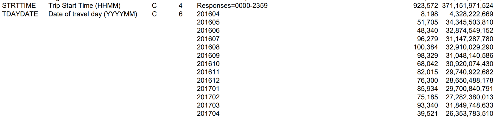

Annika created this code doc on 10/21/2023. Last compiled on 2023-11-16

- [Description and Overview](#description-and-overview)
- [Setup](#setup)
- [DATA - Open and Clean](#data---open-and-clean)
- [DATA - Merge](#data---merge)

# Description and Overview

This code opens raw datasets from NHTS data in 2017, cleans them,
possibly merges them, gives super basic summary tables of new stats that
are a result of the new vars, and then saves as new datasets. Another
code will then use the cleaned dataset from here to make more fancy
summary stats.

These data sets are from the NHST 2017 survey. Documentation is
[here](https://nhts.ornl.gov/documentation), with useful [user’s
guide](https://nhts.ornl.gov/assets/NHTS2017_UsersGuide_04232019_1.pdf),
and [codebook](https://nhts.ornl.gov/assets/codebook_v1.2.pdf), and very
simple [data
dictionary](https://nhts.ornl.gov/assets/dictionary_v1_2.xlsx) that is
also saved in Github
[here](https://github.com/annitodd/GEMS-data/blob/main/gems-mode-choice/dictionary_v1_2.csv).

Data Dictionary: I’m taking the results from this code, and also putting
it into the GEMS master data dictionary. They are in NEW TABs including
“clean_mode_choice_data_ATB” and other tabs:
<https://docs.google.com/spreadsheets/d/1RVxqALDAE1u4SC569Cq373_fafaE1nZiZBJJMiRTYu8/edit?usp=sharing>

GitHub: This .Rmd code (possibly qmd if I have to change it with the new
update to R Studio) is synced to Github, and when this code is knit,
it’s also synced to GitHub, as a .md file, which makes the knitted code
easy to read (kind of like python code.) Currently in a FORK:
<https://github.com/annitodd/GEMS-data/blob/main/gems-mode-choice/10_mode-choice-cleaning.md>

## datasets description

- trippub: each row is household-person-trip, without geo IDs, with lots
  of descriptions of the trips. It’s public dataset.

- tripsct: each row is a household-person-trip, with only geo IDs for
  *each* trip, like, trip origin geoID and trip destination geoID. The
  geo IDs are: 2 didget state code, county code, and 6 didget tract
  code.

- hhct.csv: each row is a household, with a geo ID for the household.

Data file structure screen shot:


{width=“180”,height=“344”}

## steps in this code

Open datasets, clean merge datasets save resulting datasets \## result
merged dataset, full joined:
10-mode-choice-cleaning_output-full-merged.parquet smaller dataset with
fewer vars: (TBD)

Merge tripspub to ctTripspub, maybe merge to ct. Need to merge to
county. Take the raw trips, have the county / fips codes, then look at
how many trips by county do we have per trips tract IDs, then the
microgeotypes – crosswalk of tract to geotype

# Setup

``` r
#rm(list=ls()) # Clear RStudio environment
#cat("\014") # Clear console
```

## libraries

``` r
library(arrow)
library(tidyverse)
library(readxl)
library(rstudioapi)
library(scales)
library(writexl)
```

## file path directories

``` r
# get current root directory of the user's Github repo
root <- getwd() # Saves current WD 
while ((basename(root) != "GEMS-data")) {
  root <- dirname(root)
} # Sets root equal to the location of the Github repo
source(file.path(root, "paths.R")) # Runs paths.R file found in users Github repo
```

``` r
data_path <- 'C:/FHWA/For FHWA folks/Mode_choice_estimation/Data'
data_results <- 'C:/FHWA_R2/mode_choice_estimation/data'
```

# DATA - Open and Clean

## Dataset - trippub: Person-Trips

This has all of the trip information for every trip a household took in
the survey, each row is a trip for each person that answered the survey

``` r
df_trippub <- read_csv(file=file.path(data_path, 'trippub.csv'))
names(df_trippub)
```

    ##   [1] "HOUSEID"   "PERSONID"  "TDTRPNUM"  "STRTTIME"  "ENDTIME"   "TRVLCMIN" 
    ##   [7] "TRPMILES"  "TRPTRANS"  "TRPACCMP"  "TRPHHACC"  "VEHID"     "TRWAITTM" 
    ##  [13] "NUMTRANS"  "TRACCTM"   "DROP_PRK"  "TREGRTM"   "WHODROVE"  "WHYFROM"  
    ##  [19] "LOOP_TRIP" "TRPHHVEH"  "HHMEMDRV"  "HH_ONTD"   "NONHHCNT"  "NUMONTRP" 
    ##  [25] "PSGR_FLG"  "PUBTRANS"  "TRIPPURP"  "DWELTIME"  "TDWKND"    "VMT_MILE" 
    ##  [31] "DRVR_FLG"  "WHYTRP1S"  "ONTD_P1"   "ONTD_P2"   "ONTD_P3"   "ONTD_P4"  
    ##  [37] "ONTD_P5"   "ONTD_P6"   "ONTD_P7"   "ONTD_P8"   "ONTD_P9"   "ONTD_P10" 
    ##  [43] "ONTD_P11"  "ONTD_P12"  "ONTD_P13"  "TDCASEID"  "TRACC_WLK" "TRACC_POV"
    ##  [49] "TRACC_BUS" "TRACC_CRL" "TRACC_SUB" "TRACC_OTH" "TREGR_WLK" "TREGR_POV"
    ##  [55] "TREGR_BUS" "TREGR_CRL" "TREGR_SUB" "TREGR_OTH" "WHYTO"     "TRAVDAY"  
    ##  [61] "HOMEOWN"   "HHSIZE"    "HHVEHCNT"  "HHFAMINC"  "DRVRCNT"   "HHSTATE"  
    ##  [67] "HHSTFIPS"  "NUMADLT"   "WRKCOUNT"  "TDAYDATE"  "HHRESP"    "LIF_CYC"  
    ##  [73] "MSACAT"    "MSASIZE"   "RAIL"      "URBAN"     "URBANSIZE" "URBRUR"   
    ##  [79] "GASPRICE"  "CENSUS_D"  "CENSUS_R"  "CDIVMSAR"  "HH_RACE"   "HH_HISP"  
    ##  [85] "HH_CBSA"   "SMPLSRCE"  "R_AGE"     "EDUC"      "R_SEX"     "PRMACT"   
    ##  [91] "PROXY"     "WORKER"    "DRIVER"    "WTTRDFIN"  "WHYTRP90"  "R_AGE_IMP"
    ##  [97] "R_SEX_IMP" "HBHUR"     "HTHTNRNT"  "HTPPOPDN"  "HTRESDN"   "HTEEMPDN" 
    ## [103] "HBHTNRNT"  "HBPPOPDN"  "HBRESDN"

``` r
#saveRDS(trippub, "df_trippub.rds")
#rm(trippub)
# View(df_trippub)
names(df_trippub)
```

    ##   [1] "HOUSEID"   "PERSONID"  "TDTRPNUM"  "STRTTIME"  "ENDTIME"   "TRVLCMIN" 
    ##   [7] "TRPMILES"  "TRPTRANS"  "TRPACCMP"  "TRPHHACC"  "VEHID"     "TRWAITTM" 
    ##  [13] "NUMTRANS"  "TRACCTM"   "DROP_PRK"  "TREGRTM"   "WHODROVE"  "WHYFROM"  
    ##  [19] "LOOP_TRIP" "TRPHHVEH"  "HHMEMDRV"  "HH_ONTD"   "NONHHCNT"  "NUMONTRP" 
    ##  [25] "PSGR_FLG"  "PUBTRANS"  "TRIPPURP"  "DWELTIME"  "TDWKND"    "VMT_MILE" 
    ##  [31] "DRVR_FLG"  "WHYTRP1S"  "ONTD_P1"   "ONTD_P2"   "ONTD_P3"   "ONTD_P4"  
    ##  [37] "ONTD_P5"   "ONTD_P6"   "ONTD_P7"   "ONTD_P8"   "ONTD_P9"   "ONTD_P10" 
    ##  [43] "ONTD_P11"  "ONTD_P12"  "ONTD_P13"  "TDCASEID"  "TRACC_WLK" "TRACC_POV"
    ##  [49] "TRACC_BUS" "TRACC_CRL" "TRACC_SUB" "TRACC_OTH" "TREGR_WLK" "TREGR_POV"
    ##  [55] "TREGR_BUS" "TREGR_CRL" "TREGR_SUB" "TREGR_OTH" "WHYTO"     "TRAVDAY"  
    ##  [61] "HOMEOWN"   "HHSIZE"    "HHVEHCNT"  "HHFAMINC"  "DRVRCNT"   "HHSTATE"  
    ##  [67] "HHSTFIPS"  "NUMADLT"   "WRKCOUNT"  "TDAYDATE"  "HHRESP"    "LIF_CYC"  
    ##  [73] "MSACAT"    "MSASIZE"   "RAIL"      "URBAN"     "URBANSIZE" "URBRUR"   
    ##  [79] "GASPRICE"  "CENSUS_D"  "CENSUS_R"  "CDIVMSAR"  "HH_RACE"   "HH_HISP"  
    ##  [85] "HH_CBSA"   "SMPLSRCE"  "R_AGE"     "EDUC"      "R_SEX"     "PRMACT"   
    ##  [91] "PROXY"     "WORKER"    "DRIVER"    "WTTRDFIN"  "WHYTRP90"  "R_AGE_IMP"
    ##  [97] "R_SEX_IMP" "HBHUR"     "HTHTNRNT"  "HTPPOPDN"  "HTRESDN"   "HTEEMPDN" 
    ## [103] "HBHTNRNT"  "HBPPOPDN"  "HBRESDN"

### create key and ID vars

``` r
df_trippub <- df_trippub  %>%
  mutate(rawdatafrom_trippub = 1)
```

### define modes

Uses TRPTRANS from NHTS

First I’m going to create smaller bins of modes because there are too
many, there are like 17 or more The definitions are here: GEMS master
data dictionary, in the clean_mode_choice_data tab:
<https://docs.google.com/spreadsheets/d/1RVxqALDAE1u4SC569Cq373_fafaE1nZiZBJJMiRTYu8/edit#gid=81250909>


``` r
df_trippub <- df_trippub  %>%
  mutate(mode = 
      case_when(TRPTRANS %in% c("01") ~ 'walk',
                TRPTRANS %in% c("02") ~ 'bike',
                TRPTRANS %in% c(10,11,12,13,14) ~ 'bus', 
                TRPTRANS %in% c(15, 16)~ 'rail',
                TRPTRANS %in% c(17) ~ 'taxi',
                TRPTRANS %in% c("03","04","05","06","08","09","18") ~ 'hv', 
                TRUE ~ "other")
      )
summary <- df_trippub |>
    group_by(TRPTRANS, mode) |>
  summarise(countN = n() ,
            Nmissing = sum(is.na(mode)),
    .groups = "drop") |> 
  arrange(TRPTRANS)   
summary
```

<div class="kable-table">

| TRPTRANS | mode  | countN | Nmissing |
|:---------|:------|-------:|---------:|
| -7       | other |      2 |        0 |
| -8       | other |     13 |        0 |
| -9       | other |      1 |        0 |
| 01       | walk  |  81288 |        0 |
| 02       | bike  |   8034 |        0 |
| 03       | hv    | 396931 |        0 |
| 04       | hv    | 229466 |        0 |
| 05       | hv    |  60463 |        0 |
| 06       | hv    | 108303 |        0 |
| 07       | other |    826 |        0 |
| 08       | hv    |   2088 |        0 |
| 09       | hv    |    814 |        0 |
| 10       | bus   |  11313 |        0 |
| 11       | bus   |   6616 |        0 |
| 12       | bus   |    624 |        0 |
| 13       | bus   |   1581 |        0 |
| 14       | bus   |    120 |        0 |
| 15       | rail  |   1148 |        0 |
| 16       | rail  |   3326 |        0 |
| 17       | taxi  |   2813 |        0 |
| 18       | hv    |   2006 |        0 |
| 19       | other |   1823 |        0 |
| 20       | other |    458 |        0 |
| 97       | other |   3515 |        0 |

</div>

``` r
summary <- df_trippub |>
    group_by(mode) |>
  summarise(countN = n() ,
            Nmissing = sum(is.na(mode)),
    .groups = "drop") |> 
  arrange(-countN)   
summary
```

<div class="kable-table">

| mode  | countN | Nmissing |
|:------|-------:|---------:|
| hv    | 800071 |        0 |
| walk  |  81288 |        0 |
| bus   |  20254 |        0 |
| bike  |   8034 |        0 |
| other |   6638 |        0 |
| rail  |   4474 |        0 |
| taxi  |   2813 |        0 |

</div>

### define trip purpose

trip_purpose generated from NHTS field ‘whytrp1s’


``` r
df_trippub <- df_trippub  %>%
  mutate(trip_purpose = 
      case_when(WHYTRP1S %in% c("01") ~ 'home',
                WHYTRP1S %in% c("10") ~ 'work',
                WHYTRP1S %in% c("20") ~ 'school',
                WHYTRP1S %in% c("30") ~ 'medical',
                WHYTRP1S %in% c("40") ~ 'shopping',
                WHYTRP1S %in% c("50") ~ 'social',
                WHYTRP1S %in% c("70") ~ 'transp_someone',
                WHYTRP1S %in% c("80") ~ 'meals',
                TRUE ~ "other")
      )
summary <- df_trippub |>
    group_by(WHYTRP1S, trip_purpose) |>
  summarise(countN = n() ,
            Nmissing = sum(is.na(mode)),
    .groups = "drop") |> 
  arrange(WHYTRP1S)   
summary
```

<div class="kable-table">

| WHYTRP1S | trip_purpose   | countN | Nmissing |
|:---------|:---------------|-------:|---------:|
| 01       | home           | 318777 |        0 |
| 10       | work           | 110590 |        0 |
| 20       | school         |  43397 |        0 |
| 30       | medical        |  16784 |        0 |
| 40       | shopping       | 184126 |        0 |
| 50       | social         | 100284 |        0 |
| 70       | transp_someone |  56377 |        0 |
| 80       | meals          |  72327 |        0 |
| 97       | other          |  20910 |        0 |

</div>

### define time bins

trip_purpose generated from NHTS field ‘STRTTIME’


``` r
# convert to numeric
df_trippub <- df_trippub  %>%
  mutate(STRTTIME_num = as.numeric(STRTTIME))
```

``` r
df_trippub <- df_trippub  %>%
  mutate(start_time_bin = 
      case_when(STRTTIME_num <=  600 ~ 'morning_rush',
                STRTTIME_num >= 1600 ~ 'evening_rush',
                is.na(STRTTIME_num)  ~ 'missing time',
                TRUE ~ "other_time")
      )
summary <- df_trippub |>
    group_by(start_time_bin) |>
  summarise(countN = n() ,
            "Min start time" = min(STRTTIME_num),
            "Max start time" = max(STRTTIME_num),
            Nmissing = sum(is.na(mode)),
    .groups = "drop") |> 
  arrange(start_time_bin)   
summary
```

<div class="kable-table">

| start_time_bin | countN | Min start time | Max start time | Nmissing |
|:---------------|-------:|---------------:|---------------:|---------:|
| evening_rush   | 298139 |           1600 |           2359 |        0 |
| morning_rush   |  20909 |              0 |            600 |        0 |
| other_time     | 604524 |            601 |           1559 |        0 |

</div>

## Dataset - tripsct: County-Tract Crosswalk

Read in tripsct because it has the county fips codes and census tract to
crosswalk it is possibly the raw trip with od – only has tract trip path
with distance

``` r
df_tripct <- read_csv(file=file.path(data_path, 'tripct.csv'))
names(df_tripct)
```

    ##  [1] "HOUSEID"      "PERSONID"     "TDTRPNUM"     "ORIG_COUNTRY" "ORIG_ST"     
    ##  [6] "ORIG_CNTY"    "ORIG_CT"      "DEST_COUNTRY" "DEST_ST"      "DEST_CNTY"   
    ## [11] "DEST_CT"

### create key and ID vars

``` r
df_tripct <- df_tripct  %>%
  mutate(rawdatafrom_tripct = 1)
```

## Dataset - hhct.csv: Household GEOIDs

hhct is restricted data. maps households to trips. hhpub has public info
for household information demographics location of household info from
survey

``` r
df_hhct <- read_csv(file=file.path(data_path, 'hhct.csv'))
names(df_hhct)
```

    ## [1] "HOUSEID"  "HHSTFIPS" "HHCNTYFP" "HHCT"

``` r
names(df_hhct)
```

    ## [1] "HOUSEID"  "HHSTFIPS" "HHCNTYFP" "HHCT"

### create key and ID vars

``` r
df_hhct <- df_hhct  %>%
  mutate(rawdatafrom_hhct = 1)
```

# DATA - Merge

Examine the unique primary keys to make sure they’re unique. These
should be 0, meaning that these uniquely identify the observations:

``` r
df_trippub |>  
  group_by(HOUSEID,PERSONID,TDTRPNUM) |>  
  summarise(n = n()) |>  
  filter(n > 1)
```

<div class="kable-table">

| HOUSEID | PERSONID | TDTRPNUM |   n |
|--------:|:---------|:---------|----:|

</div>

``` r
df_tripct |>  
  group_by(HOUSEID,PERSONID,TDTRPNUM) |>  
  summarise(n = n()) |>  
  filter(n > 1)
```

<div class="kable-table">

| HOUSEID | PERSONID | TDTRPNUM |   n |
|--------:|:---------|:---------|----:|

</div>

``` r
df_hhct |>  
  group_by(HOUSEID) |>  
  summarise(n = n()) |>  
  filter(n > 1)
```

<div class="kable-table">

| HOUSEID |   n |
|--------:|----:|

</div>

This will tell us the relationship between the files. It looks like hhct
has more observations of households than trippub has households:

``` r
#can't keep this in memory?
knitr::knit_exit()
```
