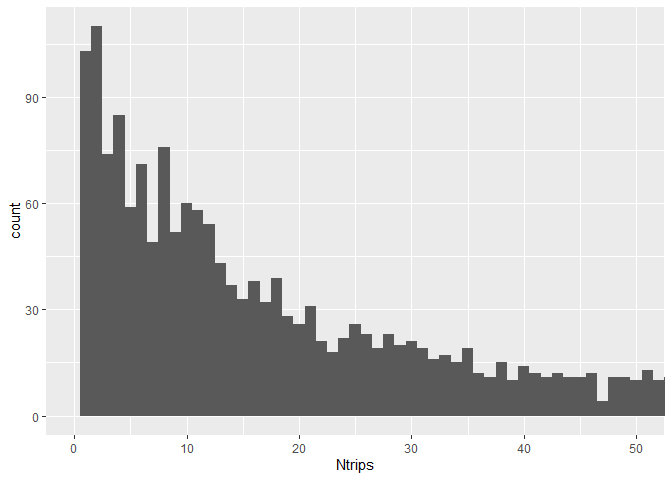
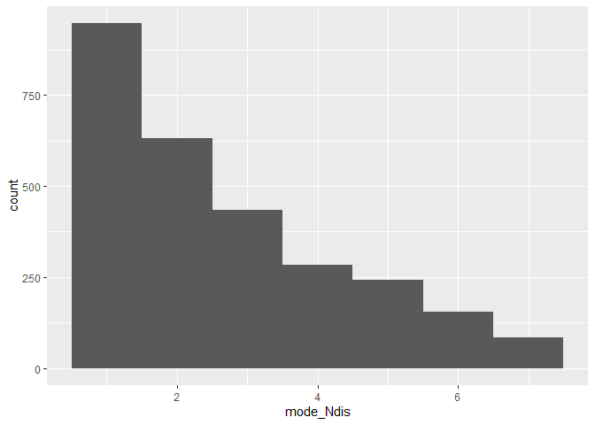

# Summary Stats

## Description and Overview

This code summarizes the dataset that is a result of this script:
10_mode-choice-cleaning

GitHub: This .Rmd code (possibly qmd if I have to change it with the new
update to R Studio) is synced to Github, and when this code is knit,
it’s also synced to GitHub, as a .md file, which makes the knitted code
easy to read (kind of like python code.) Currently in a FORK:
<https://github.com/annitodd/GEMS-data/blob/main/gems-mode-choice>

## Setup

### libraries

``` r
library(arrow)
```


    Attaching package: 'arrow'

    The following object is masked from 'package:utils':

        timestamp

``` r
library(tidyverse)
```

    ── Attaching core tidyverse packages ──────────────────────── tidyverse 2.0.0 ──
    ✔ dplyr     1.1.3     ✔ readr     2.1.4
    ✔ forcats   1.0.0     ✔ stringr   1.5.0
    ✔ ggplot2   3.4.4     ✔ tibble    3.2.1
    ✔ lubridate 1.9.3     ✔ tidyr     1.3.0
    ✔ purrr     1.0.2     

    ── Conflicts ────────────────────────────────────────── tidyverse_conflicts() ──
    ✖ lubridate::duration() masks arrow::duration()
    ✖ dplyr::filter()       masks stats::filter()
    ✖ dplyr::lag()          masks stats::lag()
    ℹ Use the conflicted package (<http://conflicted.r-lib.org/>) to force all conflicts to become errors

``` r
library(readxl)
library(rstudioapi)
library(scales)
```


    Attaching package: 'scales'

    The following object is masked from 'package:purrr':

        discard

    The following object is masked from 'package:readr':

        col_factor

``` r
library(writexl)
```

### file path directories

``` r
# get current root directory of the user's Github repo
root <- getwd() # Saves current WD 
#while ((basename(root) != "GEMS-data")) {
#  root <- dirname(root)
#} # Sets root equal to the location of the Github repo
#source(file.path(root, "paths.R")) # Runs paths.R file found in users Github repo
```

``` r
data_path <- 'C:/FHWA/For FHWA folks/Mode_choice_estimation/Data'
data_results <- 'C:/FHWA_R2/mode_choice_estimation/data'
```

## Load Data

### read in big dataset

full merged dataset

``` r
df_temp <- read_parquet(file.path(data_results, "10-mode-choice-cleaning_output-full-merged.parquet"))
names(df_temp)
```

      [1] "HOUSEID"             "PERSONID"            "TDTRPNUM"           
      [4] "STRTTIME"            "ENDTIME"             "TRVLCMIN"           
      [7] "TRPMILES"            "TRPTRANS"            "TRPACCMP"           
     [10] "TRPHHACC"            "VEHID"               "TRWAITTM"           
     [13] "NUMTRANS"            "TRACCTM"             "DROP_PRK"           
     [16] "TREGRTM"             "WHODROVE"            "WHYFROM"            
     [19] "LOOP_TRIP"           "TRPHHVEH"            "HHMEMDRV"           
     [22] "HH_ONTD"             "NONHHCNT"            "NUMONTRP"           
     [25] "PSGR_FLG"            "PUBTRANS"            "TRIPPURP"           
     [28] "DWELTIME"            "TDWKND"              "VMT_MILE"           
     [31] "DRVR_FLG"            "WHYTRP1S"            "ONTD_P1"            
     [34] "ONTD_P2"             "ONTD_P3"             "ONTD_P4"            
     [37] "ONTD_P5"             "ONTD_P6"             "ONTD_P7"            
     [40] "ONTD_P8"             "ONTD_P9"             "ONTD_P10"           
     [43] "ONTD_P11"            "ONTD_P12"            "ONTD_P13"           
     [46] "TDCASEID"            "TRACC_WLK"           "TRACC_POV"          
     [49] "TRACC_BUS"           "TRACC_CRL"           "TRACC_SUB"          
     [52] "TRACC_OTH"           "TREGR_WLK"           "TREGR_POV"          
     [55] "TREGR_BUS"           "TREGR_CRL"           "TREGR_SUB"          
     [58] "TREGR_OTH"           "WHYTO"               "TRAVDAY"            
     [61] "HOMEOWN"             "HHSIZE"              "HHVEHCNT"           
     [64] "HHFAMINC"            "DRVRCNT"             "HHSTATE"            
     [67] "HHSTFIPS.x"          "NUMADLT"             "WRKCOUNT"           
     [70] "TDAYDATE"            "HHRESP"              "LIF_CYC"            
     [73] "MSACAT"              "MSASIZE"             "RAIL"               
     [76] "URBAN"               "URBANSIZE"           "URBRUR"             
     [79] "GASPRICE"            "CENSUS_D"            "CENSUS_R"           
     [82] "CDIVMSAR"            "HH_RACE"             "HH_HISP"            
     [85] "HH_CBSA"             "SMPLSRCE"            "R_AGE"              
     [88] "EDUC"                "R_SEX"               "PRMACT"             
     [91] "PROXY"               "WORKER"              "DRIVER"             
     [94] "WTTRDFIN"            "WHYTRP90"            "R_AGE_IMP"          
     [97] "R_SEX_IMP"           "HBHUR"               "HTHTNRNT"           
    [100] "HTPPOPDN"            "HTRESDN"             "HTEEMPDN"           
    [103] "HBHTNRNT"            "HBPPOPDN"            "HBRESDN"            
    [106] "rawdatafrom_trippub" "mode"                "trip_purpose"       
    [109] "STRTTIME_num"        "start_time_bin"      "ORIG_COUNTRY"       
    [112] "ORIG_ST"             "ORIG_CNTY"           "ORIG_CT"            
    [115] "DEST_COUNTRY"        "DEST_ST"             "DEST_CNTY"          
    [118] "DEST_CT"             "rawdatafrom_tripct"  "HHSTFIPS.y"         
    [121] "HHCNTYFP"            "HHCT"                "rawdatafrom_hhct"   

Recall that they don’t equally merge, as we saw before (hhct has more
households on file). Anna notes that this is likely because lots of
households took the survey but only some of them filled out the trips
diary part.

``` r
df_temp |>
  count(rawdatafrom_trippub,rawdatafrom_tripct,rawdatafrom_hhct)
```

    # A tibble: 2 × 4
      rawdatafrom_trippub rawdatafrom_tripct rawdatafrom_hhct      n
                    <dbl>              <dbl>            <dbl>  <int>
    1                   1                  1                1 923572
    2                  NA                 NA                1  12474

``` r
df_temp <- ungroup(df_temp)
df_trips_only <- df_temp |> 
  filter(rawdatafrom_trippub==1,rawdatafrom_tripct==1,rawdatafrom_hhct==1)

df_trips_only |> 
  count(rawdatafrom_trippub,rawdatafrom_tripct,rawdatafrom_hhct)
```

    # A tibble: 1 × 4
      rawdatafrom_trippub rawdatafrom_tripct rawdatafrom_hhct      n
                    <dbl>              <dbl>            <dbl>  <int>
    1                   1                  1                1 923572

``` r
df_trips_only <- ungroup(df_trips_only)
```

### make or read in smaller dataset

choose only some vars:

``` r
df_trips_only_small <- df_trips_only |> 
  select(mode, trip_purpose, ORIG_COUNTRY,ORIG_ST,ORIG_CNTY)
df_trips_only_small %>% 
  distinct(mode,trip_purpose)
```

    # A tibble: 63 × 2
       mode  trip_purpose
       <chr> <chr>       
     1 hv    school      
     2 hv    home        
     3 hv    work        
     4 hv    social      
     5 hv    medical     
     6 hv    other       
     7 hv    shopping    
     8 hv    meals       
     9 walk  home        
    10 walk  social      
    # ℹ 53 more rows

then use the smaller to make wider dataset:

``` r
df_trips_only_small <- df_trips_only_small |>
  mutate(onePerObs = 1)
df_trips_only_small_wide <- df_trips_only_small  |>
  pivot_wider(
    names_from = mode,
    values_from = onePerObs,
    values_fn = sum
  )
df_trips_only_small_wide
```

    # A tibble: 17,277 × 11
       trip_purpose ORIG_COUNTRY ORIG_ST ORIG_CNTY    hv  walk other   bus  bike
       <chr>        <chr>        <chr>   <chr>     <dbl> <dbl> <dbl> <dbl> <dbl>
     1 school       USA          37      191          52     2     1    16     1
     2 home         USA          37      191         403    19    NA     9     2
     3 home         USA          37      183        1335   122     4    41     4
     4 work         USA          37      191         162     1     1    NA    NA
     5 work         USA          55      109         117     2    NA    NA     1
     6 home         USA          55      109         247    29     3    11    10
     7 social       USA          36      001         294    63     3     2     1
     8 home         USA          36      001         999   126     3    46     8
     9 work         USA          36      001         370    47     3    11     3
    10 work         USA          36      083         169    11     4    10    NA
    # ℹ 17,267 more rows
    # ℹ 2 more variables: taxi <dbl>, rail <dbl>

### make county level dataset

``` r
df_county_origin <- df_trips_only_small |>
  group_by(ORIG_ST,ORIG_CNTY) |>
  summarise(Ntrips = n(),
            across(contains("mode"),~n_distinct(.x),.names = "{.col}_Ndis"),
    .groups = "drop")
df_county_origin
```

    # A tibble: 2,776 × 4
       ORIG_ST ORIG_CNTY Ntrips mode_Ndis
       <chr>   <chr>      <int>     <int>
     1 -9      -9             4         2
     2 01      001           39         2
     3 01      003          173         3
     4 01      005            7         2
     5 01      007            1         1
     6 01      009            4         1
     7 01      013           18         2
     8 01      015           35         2
     9 01      017           20         2
    10 01      019            2         1
    # ℹ 2,766 more rows

``` r
df_county_origin_wide <- df_trips_only_small_wide |>
  group_by(ORIG_ST,ORIG_CNTY) |>
  summarise(Ntrips = n(),
            across(contains("mode"),~n_distinct(.x),.names = "{.col}_Ndis"),
    .groups = "drop")
df_county_origin_wide
```

    # A tibble: 2,776 × 3
       ORIG_ST ORIG_CNTY Ntrips
       <chr>   <chr>      <int>
     1 -9      -9             4
     2 01      001            7
     3 01      003            9
     4 01      005            4
     5 01      007            1
     6 01      009            4
     7 01      013            6
     8 01      015            7
     9 01      017            5
    10 01      019            1
    # ℹ 2,766 more rows

### new dataset

- county
- user class (income variation) use xiaodan’s
- trip purpose – which may or may not. Mandatory versus non-mandatory.
  Work and School
- trip distance bin
- departure time bin

Micro-geotype – merge this into the dataset, and then use micro type.
Break up by micro geo Replace county by microtype. There are 6
microtypes. Use Origin and destination microtypes – could do that, then
there would be

Need to ask Xiaodan to how to merge microtype and geo type IDs to FIPS
blocks.

Then Combinatorials of

## Summary stats by coumty

### basic

how many trips in each state

``` r
summary_table <- df_trips_only |> 
  group_by(ORIG_ST) |>
  summarise(   
    Ntrips = n(),
    .groups = "drop")
summary_table
```

    # A tibble: 55 × 2
       ORIG_ST Ntrips
       <chr>    <int>
     1 -9           4
     2 01        2446
     3 02        1784
     4 04       19568
     5 05        1497
     6 06      183392
     7 08        4285
     8 09        2318
     9 10        1978
    10 11        2099
    # ℹ 45 more rows

how many trips for each mode

``` r
summary_table <- df_trips_only |> 
  group_by(mode) |>
  summarise(   
    Ntrips = n(),
    .groups = "drop") |>
  arrange(-Ntrips)   
summary_table
```

    # A tibble: 7 × 2
      mode  Ntrips
      <chr>  <int>
    1 hv    800071
    2 walk   81288
    3 bus    20254
    4 bike    8034
    5 other   6638
    6 rail    4474
    7 taxi    2813

### by county

how many trips in each county

``` r
ggplot(df_county_origin,aes(x=Ntrips)) +
  geom_histogram(binwidth=1) +
  coord_cartesian(xlim = c(0, 50))
```



### by mode type by

``` r
ggplot(df_county_origin,aes(x=mode_Ndis)) +
  geom_histogram(binwidth=1) 
```



``` r
#  coord_cartesian(xlim = c(0, 50))
```

### by purpose

``` r
df_county_origin <- df_trips_only_small |>
  group_by(mode,trip_purpose) |>
  summarise(Ntrips = n(),
            #across(contains("mode"),~n_distinct(.x),.names = "{.col}_Ndis"),
    .groups = "drop")
#df_county_origin
df_county_origin
```

    # A tibble: 63 × 3
       mode  trip_purpose   Ntrips
       <chr> <chr>           <int>
     1 bike  home             3420
     2 bike  meals             349
     3 bike  medical            39
     4 bike  other             199
     5 bike  school            395
     6 bike  shopping          851
     7 bike  social           1754
     8 bike  transp_someone    122
     9 bike  work              905
    10 bus   home             7493
    # ℹ 53 more rows

          across(where(is.numeric),~mean(.x),.names = "{.col}_avg"),
            across(where(is.factor ),~n_distinct(.x),.names = "{.col}_Ndis"),
