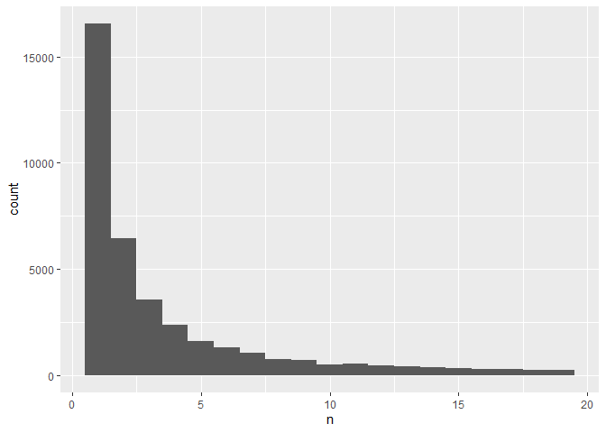
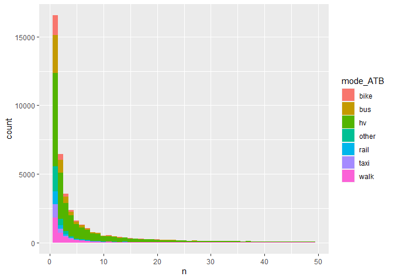
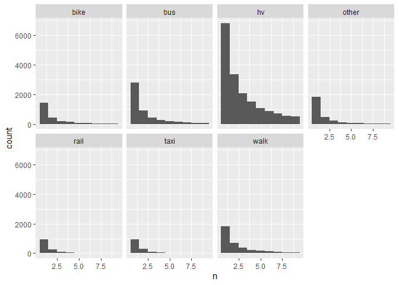

# Summary Stats

## Description and Overview

This code summarizes the dataset that is a result of this script:
10_mode-choice-cleaning

GitHub: This .Rmd code (possibly qmd if I have to change it with the new
update to R Studio) is synced to Github, and when this code is knit,
it’s also synced to GitHub, as a .md file, which makes the knitted code
easy to read (kind of like python code.) Currently in a FORK:
<https://github.com/annitodd/GEMS-data/blob/main/gems-mode-choice>

### Latest Updates

11/17/2023: the next step is to go back to the 10\_ code, and merge with
geotype, and then instead of collapsing by county, collapse by geotype

ALSO use the raw raw data in the folder that I found

## Setup

### libraries

``` r
library(arrow)
```


    Attaching package: 'arrow'

    The following object is masked from 'package:utils':

        timestamp

``` r
library(tidyverse)
```

    ── Attaching core tidyverse packages ──────────────────────── tidyverse 2.0.0 ──
    ✔ dplyr     1.1.3     ✔ readr     2.1.4
    ✔ forcats   1.0.0     ✔ stringr   1.5.0
    ✔ ggplot2   3.4.4     ✔ tibble    3.2.1
    ✔ lubridate 1.9.3     ✔ tidyr     1.3.0
    ✔ purrr     1.0.2     

    ── Conflicts ────────────────────────────────────────── tidyverse_conflicts() ──
    ✖ lubridate::duration() masks arrow::duration()
    ✖ dplyr::filter()       masks stats::filter()
    ✖ dplyr::lag()          masks stats::lag()
    ℹ Use the conflicted package (<http://conflicted.r-lib.org/>) to force all conflicts to become errors

``` r
library(readxl)
library(rstudioapi)
library(scales)
```


    Attaching package: 'scales'

    The following object is masked from 'package:purrr':

        discard

    The following object is masked from 'package:readr':

        col_factor

``` r
library(writexl)
library(sjmisc)
```

    Learn more about sjmisc with 'browseVignettes("sjmisc")'.

    Attaching package: 'sjmisc'

    The following object is masked from 'package:purrr':

        is_empty

    The following object is masked from 'package:tidyr':

        replace_na

    The following object is masked from 'package:tibble':

        add_case

``` r
library(fmlogit)
```

    Loading required package: maxLik
    Loading required package: miscTools

    Please cite the 'maxLik' package as:
    Henningsen, Arne and Toomet, Ott (2011). maxLik: A package for maximum likelihood estimation in R. Computational Statistics 26(3), 443-458. DOI 10.1007/s00180-010-0217-1.

    If you have questions, suggestions, or comments regarding the 'maxLik' package, please use a forum or 'tracker' at maxLik's R-Forge site:
    https://r-forge.r-project.org/projects/maxlik/

``` r
library(tidyverse) # use this last
```

### file path directories

``` r
# get current root directory of the user's Github repo
root <- getwd() # Saves current WD 
#while ((basename(root) != "GEMS-data")) {
#  root <- dirname(root)
#} # Sets root equal to the location of the Github repo
#source(file.path(root, "paths.R")) # Runs paths.R file found in users Github repo
```

``` r
data_path <- 'C:/FHWA/For FHWA folks/Mode_choice_estimation/Data'
data_results <- 'C:/FHWA_R2/mode_choice_estimation/data'
```

## Data: open and slim down

### read in big dataset

full merged dataset

``` r
df_temp <- read_parquet(file.path(data_results, "10-mode-choice-cleaning_output-full-merged.parquet"))
names(df_temp)
```

      [1] "rawdatafrom_trippub_ATB"  "mode_ATB"                
      [3] "trip_purpose_ATB"         "start_time_bin_ATB"      
      [5] "orig_fips11_ATB"          "dest_fips11_ATB"         
      [7] "rawdatafrom_tripct_ATB"   "hh_fips11_ATB"           
      [9] "rawdatafrom_hhct_ATB"     "origin_geotype_ATB"      
     [11] "origin_microtype_ATB"     "origin_geoXmicrotype_ATB"
     [13] "dest_geotype_ATB"         "dest_microtype_ATB"      
     [15] "dest_geoXmicrotype_ATB"   "hh_geotype_ATB"          
     [17] "hh_microtype_ATB"         "hh_geoXmicrotype_ATB"    
     [19] "HOUSEID"                  "PERSONID"                
     [21] "TDTRPNUM"                 "STRTTIME"                
     [23] "ENDTIME"                  "TRVLCMIN"                
     [25] "TRPMILES"                 "TRPTRANS"                
     [27] "TRPACCMP"                 "TRPHHACC"                
     [29] "VEHID"                    "TRWAITTM"                
     [31] "NUMTRANS"                 "TRACCTM"                 
     [33] "DROP_PRK"                 "TREGRTM"                 
     [35] "WHODROVE"                 "WHYFROM"                 
     [37] "LOOP_TRIP"                "TRPHHVEH"                
     [39] "HHMEMDRV"                 "HH_ONTD"                 
     [41] "NONHHCNT"                 "NUMONTRP"                
     [43] "PSGR_FLG"                 "PUBTRANS"                
     [45] "TRIPPURP"                 "DWELTIME"                
     [47] "TDWKND"                   "VMT_MILE"                
     [49] "DRVR_FLG"                 "WHYTRP1S"                
     [51] "ONTD_P1"                  "ONTD_P2"                 
     [53] "ONTD_P3"                  "ONTD_P4"                 
     [55] "ONTD_P5"                  "ONTD_P6"                 
     [57] "ONTD_P7"                  "ONTD_P8"                 
     [59] "ONTD_P9"                  "ONTD_P10"                
     [61] "ONTD_P11"                 "ONTD_P12"                
     [63] "ONTD_P13"                 "TDCASEID"                
     [65] "TRACC_WLK"                "TRACC_POV"               
     [67] "TRACC_BUS"                "TRACC_CRL"               
     [69] "TRACC_SUB"                "TRACC_OTH"               
     [71] "TREGR_WLK"                "TREGR_POV"               
     [73] "TREGR_BUS"                "TREGR_CRL"               
     [75] "TREGR_SUB"                "TREGR_OTH"               
     [77] "WHYTO"                    "TRAVDAY"                 
     [79] "HOMEOWN"                  "HHSIZE"                  
     [81] "HHVEHCNT"                 "HHFAMINC"                
     [83] "DRVRCNT"                  "HHSTATE"                 
     [85] "HHSTFIPS.x"               "NUMADLT"                 
     [87] "WRKCOUNT"                 "TDAYDATE"                
     [89] "HHRESP"                   "LIF_CYC"                 
     [91] "MSACAT"                   "MSASIZE"                 
     [93] "RAIL"                     "URBAN"                   
     [95] "URBANSIZE"                "URBRUR"                  
     [97] "GASPRICE"                 "CENSUS_D"                
     [99] "CENSUS_R"                 "CDIVMSAR"                
    [101] "HH_RACE"                  "HH_HISP"                 
    [103] "HH_CBSA"                  "SMPLSRCE"                
    [105] "R_AGE"                    "EDUC"                    
    [107] "R_SEX"                    "PRMACT"                  
    [109] "PROXY"                    "WORKER"                  
    [111] "DRIVER"                   "WTTRDFIN"                
    [113] "WHYTRP90"                 "R_AGE_IMP"               
    [115] "R_SEX_IMP"                "HBHUR"                   
    [117] "HTHTNRNT"                 "HTPPOPDN"                
    [119] "HTRESDN"                  "HTEEMPDN"                
    [121] "HBHTNRNT"                 "HBPPOPDN"                
    [123] "HBRESDN"                  "STRTTIME_num"            
    [125] "ORIG_COUNTRY"             "ORIG_ST"                 
    [127] "ORIG_CNTY"                "ORIG_CT"                 
    [129] "DEST_COUNTRY"             "DEST_ST"                 
    [131] "DEST_CNTY"                "DEST_CT"                 
    [133] "HHSTFIPS.y"               "HHCNTYFP"                
    [135] "HHCT"                    

Recall that they don’t equally merge, as we saw before (hhct has more
households on file). Anna notes that this is likely because lots of
households took the survey but only some of them filled out the trips
diary part. \## START HERE AFTER TGIVING

``` r
df_temp |>
  count(rawdatafrom_trippub_ATB,rawdatafrom_tripct_ATB,rawdatafrom_hhct_ATB)
```

    # A tibble: 2 × 4
      rawdatafrom_trippub_ATB rawdatafrom_tripct_ATB rawdatafrom_hhct_ATB      n
                        <dbl>                  <dbl>                <dbl>  <int>
    1                       1                      1                    1 923572
    2                      NA                     NA                    1  12474

``` r
df_temp <- ungroup(df_temp)
```

The number of **observations** in the dataset (these should give the
same answer):

``` r
df_temp |> summarise(n())
```

    # A tibble: 1 × 1
       `n()`
       <int>
    1 936046

``` r
df_temp |> summarise(n_distinct(HOUSEID,PERSONID,TDTRPNUM))
```

    # A tibble: 1 × 1
      `n_distinct(HOUSEID, PERSONID, TDTRPNUM)`
                                          <int>
    1                                    936046

number of **people** in the dataset:

``` r
df_temp |> summarise(n_distinct(HOUSEID,PERSONID))
```

    # A tibble: 1 × 1
      `n_distinct(HOUSEID, PERSONID)`
                                <int>
    1                          231668

number of **people** in the dataset **with trips** (there are FEWER
people with trips than there are total people:

``` r
df_temp |> 
  filter(rawdatafrom_trippub_ATB==1,rawdatafrom_tripct_ATB==1,rawdatafrom_hhct_ATB==1) |> summarise(n_distinct(HOUSEID,PERSONID))
```

    # A tibble: 1 × 1
      `n_distinct(HOUSEID, PERSONID)`
                                <int>
    1                          219194

The number of **households** in the dataset:

``` r
df_temp |> summarise(n_distinct(HOUSEID))
```

    # A tibble: 1 × 1
      `n_distinct(HOUSEID)`
                      <int>
    1                129696

The number of **households** in the dataset **with trips**:

``` r
df_temp |> 
  filter(rawdatafrom_trippub_ATB==1,rawdatafrom_tripct_ATB==1,rawdatafrom_hhct_ATB==1) |> summarise(n_distinct(HOUSEID))
```

    # A tibble: 1 × 1
      `n_distinct(HOUSEID)`
                      <int>
    1                117222

``` r
df_trips_only <- df_temp |> 
  filter(rawdatafrom_trippub_ATB==1,rawdatafrom_tripct_ATB==1,rawdatafrom_hhct_ATB==1)

df_trips_only |> 
  count(rawdatafrom_trippub_ATB,rawdatafrom_tripct_ATB,rawdatafrom_hhct_ATB)
```

# A tibble: 1 × 4

rawdatafrom_trippub_ATB rawdatafrom_tripct_ATB rawdatafrom_hhct_ATB n
<dbl> <dbl> <dbl> <int> 1 1 1 1 923572

``` r
df_trips_only <- ungroup(df_trips_only)
```

### list of variables and descriptions

``` r
names(df_trips_only)
```

      [1] "rawdatafrom_trippub_ATB"  "mode_ATB"                
      [3] "trip_purpose_ATB"         "start_time_bin_ATB"      
      [5] "orig_fips11_ATB"          "dest_fips11_ATB"         
      [7] "rawdatafrom_tripct_ATB"   "hh_fips11_ATB"           
      [9] "rawdatafrom_hhct_ATB"     "origin_geotype_ATB"      
     [11] "origin_microtype_ATB"     "origin_geoXmicrotype_ATB"
     [13] "dest_geotype_ATB"         "dest_microtype_ATB"      
     [15] "dest_geoXmicrotype_ATB"   "hh_geotype_ATB"          
     [17] "hh_microtype_ATB"         "hh_geoXmicrotype_ATB"    
     [19] "HOUSEID"                  "PERSONID"                
     [21] "TDTRPNUM"                 "STRTTIME"                
     [23] "ENDTIME"                  "TRVLCMIN"                
     [25] "TRPMILES"                 "TRPTRANS"                
     [27] "TRPACCMP"                 "TRPHHACC"                
     [29] "VEHID"                    "TRWAITTM"                
     [31] "NUMTRANS"                 "TRACCTM"                 
     [33] "DROP_PRK"                 "TREGRTM"                 
     [35] "WHODROVE"                 "WHYFROM"                 
     [37] "LOOP_TRIP"                "TRPHHVEH"                
     [39] "HHMEMDRV"                 "HH_ONTD"                 
     [41] "NONHHCNT"                 "NUMONTRP"                
     [43] "PSGR_FLG"                 "PUBTRANS"                
     [45] "TRIPPURP"                 "DWELTIME"                
     [47] "TDWKND"                   "VMT_MILE"                
     [49] "DRVR_FLG"                 "WHYTRP1S"                
     [51] "ONTD_P1"                  "ONTD_P2"                 
     [53] "ONTD_P3"                  "ONTD_P4"                 
     [55] "ONTD_P5"                  "ONTD_P6"                 
     [57] "ONTD_P7"                  "ONTD_P8"                 
     [59] "ONTD_P9"                  "ONTD_P10"                
     [61] "ONTD_P11"                 "ONTD_P12"                
     [63] "ONTD_P13"                 "TDCASEID"                
     [65] "TRACC_WLK"                "TRACC_POV"               
     [67] "TRACC_BUS"                "TRACC_CRL"               
     [69] "TRACC_SUB"                "TRACC_OTH"               
     [71] "TREGR_WLK"                "TREGR_POV"               
     [73] "TREGR_BUS"                "TREGR_CRL"               
     [75] "TREGR_SUB"                "TREGR_OTH"               
     [77] "WHYTO"                    "TRAVDAY"                 
     [79] "HOMEOWN"                  "HHSIZE"                  
     [81] "HHVEHCNT"                 "HHFAMINC"                
     [83] "DRVRCNT"                  "HHSTATE"                 
     [85] "HHSTFIPS.x"               "NUMADLT"                 
     [87] "WRKCOUNT"                 "TDAYDATE"                
     [89] "HHRESP"                   "LIF_CYC"                 
     [91] "MSACAT"                   "MSASIZE"                 
     [93] "RAIL"                     "URBAN"                   
     [95] "URBANSIZE"                "URBRUR"                  
     [97] "GASPRICE"                 "CENSUS_D"                
     [99] "CENSUS_R"                 "CDIVMSAR"                
    [101] "HH_RACE"                  "HH_HISP"                 
    [103] "HH_CBSA"                  "SMPLSRCE"                
    [105] "R_AGE"                    "EDUC"                    
    [107] "R_SEX"                    "PRMACT"                  
    [109] "PROXY"                    "WORKER"                  
    [111] "DRIVER"                   "WTTRDFIN"                
    [113] "WHYTRP90"                 "R_AGE_IMP"               
    [115] "R_SEX_IMP"                "HBHUR"                   
    [117] "HTHTNRNT"                 "HTPPOPDN"                
    [119] "HTRESDN"                  "HTEEMPDN"                
    [121] "HBHTNRNT"                 "HBPPOPDN"                
    [123] "HBRESDN"                  "STRTTIME_num"            
    [125] "ORIG_COUNTRY"             "ORIG_ST"                 
    [127] "ORIG_CNTY"                "ORIG_CT"                 
    [129] "DEST_COUNTRY"             "DEST_ST"                 
    [131] "DEST_CNTY"                "DEST_CT"                 
    [133] "HHSTFIPS.y"               "HHCNTYFP"                
    [135] "HHCT"                    

This is the data dictionary from NHTS:

``` r
dictionary_v1_2 <- read_csv("dictionary_v1_2.csv") %>% 
  relocate ("Label","Name")
```

    Rows: 244 Columns: 8
    ── Column specification ────────────────────────────────────────────────────────
    Delimiter: ","
    chr (6): Name, Type, Label, HH, PER, VEH
    dbl (1): Length
    lgl (1): TRIP

    ℹ Use `spec()` to retrieve the full column specification for this data.
    ℹ Specify the column types or set `show_col_types = FALSE` to quiet this message.

``` r
dictionary_v1_2 
```

    # A tibble: 244 × 8
       Label                              Name  Type  Length HH    PER   VEH   TRIP 
       <chr>                              <chr> <chr>  <dbl> <chr> <chr> <chr> <lgl>
     1 Alternative Mode of Transportatio… ALT_… C          2 <NA>  P     <NA>  NA   
     2 Alternative Mode of Transportatio… ALT_… C          2 <NA>  P     <NA>  NA   
     3 Alternative Mode of Transportatio… ALT_… C          2 <NA>  P     <NA>  NA   
     4 Self-reported annualized mile est… ANNM… N          6 <NA>  <NA>  V     NA   
     5 Best estimate of annual miles      BEST… N          8 <NA>  <NA>  V     NA   
     6 Flag any edits/adjustments to BES… BEST… C          2 <NA>  <NA>  V     NA   
     7 How BESTMILE was computed          BEST… C          2 <NA>  <NA>  V     NA   
     8 Flag identifying BESTMILE outlier… BEST… C          2 <NA>  <NA>  V     NA   
     9 Frequency of Bicycle Use for Trav… BIKE  C          2 H     <NA>  <NA>  NA   
    10 Bicycle to Reduce Financial Burde… BIKE… C          2 H     <NA>  <NA>  NA   
    # ℹ 234 more rows

### make smaller dataset

choose only some vars: keep all of the ones that we made. These all end
in “\_ATB”

``` r
names(df_trips_only)
```

      [1] "rawdatafrom_trippub_ATB"  "mode_ATB"                
      [3] "trip_purpose_ATB"         "start_time_bin_ATB"      
      [5] "orig_fips11_ATB"          "dest_fips11_ATB"         
      [7] "rawdatafrom_tripct_ATB"   "hh_fips11_ATB"           
      [9] "rawdatafrom_hhct_ATB"     "origin_geotype_ATB"      
     [11] "origin_microtype_ATB"     "origin_geoXmicrotype_ATB"
     [13] "dest_geotype_ATB"         "dest_microtype_ATB"      
     [15] "dest_geoXmicrotype_ATB"   "hh_geotype_ATB"          
     [17] "hh_microtype_ATB"         "hh_geoXmicrotype_ATB"    
     [19] "HOUSEID"                  "PERSONID"                
     [21] "TDTRPNUM"                 "STRTTIME"                
     [23] "ENDTIME"                  "TRVLCMIN"                
     [25] "TRPMILES"                 "TRPTRANS"                
     [27] "TRPACCMP"                 "TRPHHACC"                
     [29] "VEHID"                    "TRWAITTM"                
     [31] "NUMTRANS"                 "TRACCTM"                 
     [33] "DROP_PRK"                 "TREGRTM"                 
     [35] "WHODROVE"                 "WHYFROM"                 
     [37] "LOOP_TRIP"                "TRPHHVEH"                
     [39] "HHMEMDRV"                 "HH_ONTD"                 
     [41] "NONHHCNT"                 "NUMONTRP"                
     [43] "PSGR_FLG"                 "PUBTRANS"                
     [45] "TRIPPURP"                 "DWELTIME"                
     [47] "TDWKND"                   "VMT_MILE"                
     [49] "DRVR_FLG"                 "WHYTRP1S"                
     [51] "ONTD_P1"                  "ONTD_P2"                 
     [53] "ONTD_P3"                  "ONTD_P4"                 
     [55] "ONTD_P5"                  "ONTD_P6"                 
     [57] "ONTD_P7"                  "ONTD_P8"                 
     [59] "ONTD_P9"                  "ONTD_P10"                
     [61] "ONTD_P11"                 "ONTD_P12"                
     [63] "ONTD_P13"                 "TDCASEID"                
     [65] "TRACC_WLK"                "TRACC_POV"               
     [67] "TRACC_BUS"                "TRACC_CRL"               
     [69] "TRACC_SUB"                "TRACC_OTH"               
     [71] "TREGR_WLK"                "TREGR_POV"               
     [73] "TREGR_BUS"                "TREGR_CRL"               
     [75] "TREGR_SUB"                "TREGR_OTH"               
     [77] "WHYTO"                    "TRAVDAY"                 
     [79] "HOMEOWN"                  "HHSIZE"                  
     [81] "HHVEHCNT"                 "HHFAMINC"                
     [83] "DRVRCNT"                  "HHSTATE"                 
     [85] "HHSTFIPS.x"               "NUMADLT"                 
     [87] "WRKCOUNT"                 "TDAYDATE"                
     [89] "HHRESP"                   "LIF_CYC"                 
     [91] "MSACAT"                   "MSASIZE"                 
     [93] "RAIL"                     "URBAN"                   
     [95] "URBANSIZE"                "URBRUR"                  
     [97] "GASPRICE"                 "CENSUS_D"                
     [99] "CENSUS_R"                 "CDIVMSAR"                
    [101] "HH_RACE"                  "HH_HISP"                 
    [103] "HH_CBSA"                  "SMPLSRCE"                
    [105] "R_AGE"                    "EDUC"                    
    [107] "R_SEX"                    "PRMACT"                  
    [109] "PROXY"                    "WORKER"                  
    [111] "DRIVER"                   "WTTRDFIN"                
    [113] "WHYTRP90"                 "R_AGE_IMP"               
    [115] "R_SEX_IMP"                "HBHUR"                   
    [117] "HTHTNRNT"                 "HTPPOPDN"                
    [119] "HTRESDN"                  "HTEEMPDN"                
    [121] "HBHTNRNT"                 "HBPPOPDN"                
    [123] "HBRESDN"                  "STRTTIME_num"            
    [125] "ORIG_COUNTRY"             "ORIG_ST"                 
    [127] "ORIG_CNTY"                "ORIG_CT"                 
    [129] "DEST_COUNTRY"             "DEST_ST"                 
    [131] "DEST_CNTY"                "DEST_CT"                 
    [133] "HHSTFIPS.y"               "HHCNTYFP"                
    [135] "HHCT"                    

``` r
df_trips_only_small <- df_trips_only |> 
  select(contains("_ATB")) %>% 
  select(-contains("rawdatafrom"))
```

``` r
names(df_trips_only_small)
```

     [1] "mode_ATB"                 "trip_purpose_ATB"        
     [3] "start_time_bin_ATB"       "orig_fips11_ATB"         
     [5] "dest_fips11_ATB"          "hh_fips11_ATB"           
     [7] "origin_geotype_ATB"       "origin_microtype_ATB"    
     [9] "origin_geoXmicrotype_ATB" "dest_geotype_ATB"        
    [11] "dest_microtype_ATB"       "dest_geoXmicrotype_ATB"  
    [13] "hh_geotype_ATB"           "hh_microtype_ATB"        
    [15] "hh_geoXmicrotype_ATB"    

### Examine:

#### the key vars

``` r
names(df_trips_only_small)
```

     [1] "mode_ATB"                 "trip_purpose_ATB"        
     [3] "start_time_bin_ATB"       "orig_fips11_ATB"         
     [5] "dest_fips11_ATB"          "hh_fips11_ATB"           
     [7] "origin_geotype_ATB"       "origin_microtype_ATB"    
     [9] "origin_geoXmicrotype_ATB" "dest_geotype_ATB"        
    [11] "dest_microtype_ATB"       "dest_geoXmicrotype_ATB"  
    [13] "hh_geotype_ATB"           "hh_microtype_ATB"        
    [15] "hh_geoXmicrotype_ATB"    

#### Number of distinct in each group

``` r
summary <- df_trips_only_small |>
  summarise("Number Obs" = n(),
            across(contains("_ATB"),~n_distinct(.x),.names = "{.col} distinct"),
    .groups = "drop")
summary
```

    # A tibble: 1 × 16
      `Number Obs` `mode_ATB distinct` trip_purpose_ATB dis…¹ start_time_bin_ATB d…²
             <int>               <int>                  <int>                  <int>
    1       923572                   7                      9                      3
    # ℹ abbreviated names: ¹​`trip_purpose_ATB distinct`,
    #   ²​`start_time_bin_ATB distinct`
    # ℹ 12 more variables: `orig_fips11_ATB distinct` <int>,
    #   `dest_fips11_ATB distinct` <int>, `hh_fips11_ATB distinct` <int>,
    #   `origin_geotype_ATB distinct` <int>, `origin_microtype_ATB distinct` <int>,
    #   `origin_geoXmicrotype_ATB distinct` <int>,
    #   `dest_geotype_ATB distinct` <int>, `dest_microtype_ATB distinct` <int>, …

``` r
summary %>% sjmisc::rotate_df(rn="N distinct")
```

                              N distinct     V1
    1                         Number Obs 923572
    2                  mode_ATB distinct      7
    3          trip_purpose_ATB distinct      9
    4        start_time_bin_ATB distinct      3
    5           orig_fips11_ATB distinct  52765
    6           dest_fips11_ATB distinct  52783
    7             hh_fips11_ATB distinct  33586
    8        origin_geotype_ATB distinct      7
    9      origin_microtype_ATB distinct      7
    10 origin_geoXmicrotype_ATB distinct     37
    11         dest_geotype_ATB distinct      7
    12       dest_microtype_ATB distinct      7
    13   dest_geoXmicrotype_ATB distinct     37
    14           hh_geotype_ATB distinct      7
    15         hh_microtype_ATB distinct      7
    16     hh_geoXmicrotype_ATB distinct     37

##### the distinct values

``` r
df_trips_only_small %>% 
  distinct(origin_geoXmicrotype_ATB) 
```

    # A tibble: 37 × 1
       origin_geoXmicrotype_ATB
       <chr>                   
     1 E_4                     
     2 C_3                     
     3 E_5                     
     4 A_5                     
     5 A_4                     
     6 B_1                     
     7 B_4                     
     8 B_5                     
     9 B_2                     
    10 F_5                     
    # ℹ 27 more rows

``` r
df_trips_only_small %>% 
  distinct(dest_geoXmicrotype_ATB) 
```

    # A tibble: 37 × 1
       dest_geoXmicrotype_ATB
       <chr>                 
     1 E_4                   
     2 C_3                   
     3 E_5                   
     4 A_4                   
     5 A_5                   
     6 B_4                   
     7 B_1                   
     8 B_2                   
     9 B_5                   
    10 F_5                   
    # ℹ 27 more rows

``` r
df_trips_only_small %>% 
  distinct(hh_geoXmicrotype_ATB) 
```

    # A tibble: 37 × 1
       hh_geoXmicrotype_ATB
       <chr>               
     1 E_4                 
     2 A_5                 
     3 B_1                 
     4 B_5                 
     5 F_5                 
     6 B_2                 
     7 C_6                 
     8 B_4                 
     9 A_1                 
    10 C_5                 
    # ℹ 27 more rows

``` r
df_trips_only_small %>% 
  distinct(start_time_bin_ATB) 
```

    # A tibble: 3 × 1
      start_time_bin_ATB
      <chr>             
    1 other_time        
    2 evening_rush      
    3 morning_rush      

``` r
df_trips_only_small %>% 
  distinct(trip_purpose_ATB) 
```

    # A tibble: 9 × 1
      trip_purpose_ATB
      <chr>           
    1 school          
    2 home            
    3 work            
    4 social          
    5 medical         
    6 other           
    7 shopping        
    8 meals           
    9 transp_someone  

#### how many combinatorials

distinct mode X trip purpose

``` r
summary <- df_trips_only_small |>
  group_by(mode_ATB,trip_purpose_ATB) %>% 
  summarise("Number Obs" = n(),
            across(contains("_ATB"),~n_distinct(.x),.names = "{.col} distinct"),
    .groups = "drop")
summary
```

    # A tibble: 63 × 16
       mode_ATB trip_purpose_ATB `Number Obs` `start_time_bin_ATB distinct`
       <chr>    <chr>                   <int>                         <int>
     1 bike     home                     3420                             3
     2 bike     meals                     349                             3
     3 bike     medical                    39                             2
     4 bike     other                     199                             3
     5 bike     school                    395                             3
     6 bike     shopping                  851                             3
     7 bike     social                   1754                             3
     8 bike     transp_someone            122                             3
     9 bike     work                      905                             3
    10 bus      home                     7493                             3
    # ℹ 53 more rows
    # ℹ 12 more variables: `orig_fips11_ATB distinct` <int>,
    #   `dest_fips11_ATB distinct` <int>, `hh_fips11_ATB distinct` <int>,
    #   `origin_geotype_ATB distinct` <int>, `origin_microtype_ATB distinct` <int>,
    #   `origin_geoXmicrotype_ATB distinct` <int>,
    #   `dest_geotype_ATB distinct` <int>, `dest_microtype_ATB distinct` <int>,
    #   `dest_geoXmicrotype_ATB distinct` <int>, `hh_geotype_ATB distinct` <int>, …

``` r
summary %>% sjmisc::rotate_df(rn="N distinct")
```

                              N distinct     V1     V2      V3     V4     V5
    1                           mode_ATB   bike   bike    bike   bike   bike
    2                   trip_purpose_ATB   home  meals medical  other school
    3                         Number Obs   3420    349      39    199    395
    4        start_time_bin_ATB distinct      3      3       2      3      3
    5           orig_fips11_ATB distinct   2307    268      38    177    306
    6           dest_fips11_ATB distinct   2222    264      38    174    292
    7             hh_fips11_ATB distinct   2199    257      38    159    297
    8        origin_geotype_ATB distinct      6      6       5      6      6
    9      origin_microtype_ATB distinct      6      6       6      6      6
    10 origin_geoXmicrotype_ATB distinct     34     26      16     28     27
    11         dest_geotype_ATB distinct      7      6       5      6      6
    12       dest_microtype_ATB distinct      7      6       6      6      6
    13   dest_geoXmicrotype_ATB distinct     35     23      18     29     27
    14           hh_geotype_ATB distinct      7      6       5      6      6
    15         hh_microtype_ATB distinct      7      6       6      6      6
    16     hh_geoXmicrotype_ATB distinct     35     25      16     28     26
             V6     V7             V8     V9    V10    V11     V12    V13    V14
    1      bike   bike           bike   bike    bus    bus     bus    bus    bus
    2  shopping social transp_someone   work   home  meals medical  other school
    3       851   1754            122    905   7493    375     515   1107   5942
    4         3      3              3      3      3      3       3      3      3
    5       638   1281             79    717   4592    306     467    871   3579
    6       640   1271             78    602   4606    298     437    818   3589
    7       549   1176             76    647   4550    295     440    816   3392
    8         7      6              5      6      6      6       6      7      7
    9         7      6              6      6      6      6       6      7      7
    10       33     34             17     30     35     28      28     35     36
    11        6      6              5      6      6      6       6      6      7
    12        6      6              6      6      6      6       6      6      7
    13       31     34             18     32     36     25      27     32     35
    14        7      6              5      6      6      5       6      6      7
    15        7      6              6      6      6      6       6      6      7
    16       32     33             17     30     36     24      28     31     36
            V15    V16            V17    V18    V19    V20     V21    V22    V23
    1       bus    bus            bus    bus     hv     hv      hv     hv     hv
    2  shopping social transp_someone   work   home  meals medical  other school
    3      1356   1236            524   1706 269360  64586   15628  14926  33661
    4         3      3              3      3      3      3       3      3      3
    5      1102    946            378   1407  38311  20547    8717   8826  13731
    6      1061    922            348   1118  33119  17112    6311   8015  12981
    7       947    875            295   1304  31666  18149    8102   7503  12500
    8         6      6              7      6      7      7       7      7      7
    9         6      6              7      6      7      7       7      7      7
    10       29     34             32     34     37     37      36     37     37
    11        6      7              7      7      7      7       7      7      7
    12        6      7              7      7      7      7       7      7      7
    13       30     35             31     31     37     37      37     37     37
    14        6      6              6      6      7      7       7      7      7
    15        6      6              6      6      7      7       7      7      7
    16       30     29             28     32     37     37      36     37     36
            V24    V25            V26    V27    V28    V29     V30    V31    V32
    1        hv     hv             hv     hv  other  other   other  other  other
    2  shopping social transp_someone   work   home  meals medical  other school
    3    171701  78462          53961  97786   1313    230      85   1605    130
    4         3      3              3      3      3      3       3      3      3
    5     32236  23443          18215  26825    974    191      82    403    108
    6     27855  22980          16136  24427    932    194      76    377    109
    7     25575  19732          13815  22037    922    189      78    968    107
    8         7      7              7      7      7      6       6      7      6
    9         7      7              7      7      7      6       6      7      6
    10       37     37             37     37     35     27      23     32     24
    11        7      7              7      7      7      6       6      7      7
    12        7      7              7      7      7      6       6      7      7
    13       37     37             37     37     34     32      22     32     25
    14        7      7              7      7      6      6       6      6      6
    15        7      7              7      7      6      6       6      6      6
    16       37     37             36     37     33     28      23     32     20
            V33    V34            V35    V36    V37    V38     V39    V40    V41
    1     other  other          other  other   rail   rail    rail   rail   rail
    2  shopping social transp_someone   work   home  meals medical  other school
    3       448    875            125   1827   1563    233      54    189    164
    4         3      3              3      3      3      3       2      3      3
    5       384    548            103   1178    681    176      52    146    141
    6       384    555            103   1149   1156    173      49    140    130
    7       322    553             92    750   1154    189      53    153    134
    8         6      7              7      7      5      4       3      5      4
    9         6      7              7      7      6      6       5      6      6
    10       32     33             27     34     23     13       7     16     14
    11        6      7              6      7      5      4       4      5      4
    12        6      7              6      7      6      5       5      6      5
    13       31     34             27     33     21     16       9     15     13
    14        6      6              6      6      5      5       4      4      4
    15        6      6              6      6      6      6       5      5      5
    16       28     30             24     32     24     19      10     18     15
            V42    V43            V44    V45    V46    V47     V48    V49    V50
    1      rail   rail           rail   rail   taxi   taxi    taxi   taxi   taxi
    2  shopping social transp_someone   work   home  meals medical  other school
    3       315    479             93   1384   1033    228     122    275     75
    4         2      3              3      3      3      3       3      3      3
    5       249    341             70   1089    701    168     100    190     56
    6       245    311             81    540    749    159      97    102     57
    7       266    343             79   1072    761    165      96    196     53
    8         5      5              4      4      6      5       5      5      5
    9         6      6              7      6      6      6       6      6      5
    10       15     19             11     22     29     23      21     21     17
    11        5      5              4      4      6      5       5      6      5
    12        6      6              5      6      6      6       6      7      5
    13       19     20             11     19     28     20      22     21     17
    14        4      6              4      5      6      6       5      5      5
    15        6      6              5      6      6      6       6      6      6
    16       19     25             11     22     29     24      21     22     17
            V51    V52            V53    V54    V55    V56     V57    V58    V59
    1      taxi   taxi           taxi   taxi   walk   walk    walk   walk   walk
    2  shopping social transp_someone   work   home  meals medical  other school
    3       200    453             42    385  34595   6326     341   2609   3030
    4         3      3              2      3      3      3       3      3      3
    5       163    320             36    314  13656   3119     285   1720   1864
    6       162    314             34    297  13146   3022     281   1730   1831
    7       143    300             25    297  12907   3757     292   1828   1856
    8         5      7              5      6      7      6       6      6      6
    9         6      7              6      6      7      6       6      6      6
    10       21     28             14     24     37     36      27     35     34
    11        5      6              5      6      7      6       6      7      6
    12        6      6              6      6      7      6       6      7      6
    13       20     24             15     26     37     36      27     35     33
    14        5      6              4      6      7      6       6      6      6
    15        6      6              5      6      7      6       6      6      6
    16       20     25             11     23     37     35      27     34     33
            V60    V61            V62    V63
    1      walk   walk           walk   walk
    2  shopping social transp_someone   work
    3      9255  17025           1510   6597
    4         3      3              3      3
    5      4979   8071            989   3112
    6      4833   8047            973   2970
    7      4937   7810            960   3851
    8         6      7              6      6
    9         6      7              6      6
    10       35     37             29     35
    11        6      7              6      6
    12        6      7              6      6
    13       36     37             28     36
    14        7      6              6      6
    15        7      6              6      6
    16       36     36             28     33

##### distinct origin destination

``` r
df_trips_only_small %>% 
  count(origin_geoXmicrotype_ATB,dest_geoXmicrotype_ATB) %>% 
  pivot_wider(names_from = dest_geoXmicrotype_ATB,values_from = n)
```

    # A tibble: 37 × 38
       origin_geoXmicrotype_…¹   A_1   A_2   A_3   A_4   A_5   A_6   B_1   B_2   B_3
       <chr>                   <int> <int> <int> <int> <int> <int> <int> <int> <int>
     1 A_1                     23776  6717  5960   827  1367   147    33    89    80
     2 A_2                      6786 43551 16508  3862  9385   237    51   138   155
     3 A_3                      5854 16606 26128  3125  7765   202    46   159   244
     4 A_4                       842  3853  3154  7346  3177    91    15    25    96
     5 A_5                      1415  9397  7695  3202 21109   361    40   122   117
     6 A_6                       152   221   184    91   371   645     5    18    28
     7 B_1                        36    61    38    15    24     5 11327  7891  4330
     8 B_2                        81   125   185    30   130    14  7841 48307 14409
     9 B_3                        97   121   249    95   151    25  4301 14517 23096
    10 B_4                        36    79   135   117    63     9  1038  3817  3351
    # ℹ 27 more rows
    # ℹ abbreviated name: ¹​origin_geoXmicrotype_ATB
    # ℹ 28 more variables: B_4 <int>, B_5 <int>, B_6 <int>, C_1 <int>, C_2 <int>,
    #   C_3 <int>, C_4 <int>, C_5 <int>, C_6 <int>, D_5 <int>, D_6 <int>,
    #   E_2 <int>, E_6 <int>, F_1 <int>, F_2 <int>, F_3 <int>, F_4 <int>,
    #   F_5 <int>, F_6 <int>, `NA` <int>, D_2 <int>, D_3 <int>, D_4 <int>,
    #   E_4 <int>, E_5 <int>, D_1 <int>, E_3 <int>, E_1 <int>

``` r
ggplot() +
  geom_count(data=df_trips_only_small,
             mapping=aes(x = origin_geoXmicrotype_ATB, y = dest_geoXmicrotype_ATB)) +
  scale_size_area(max_size = 10)
```


``` r
df_trips_only_small %>% 
  count(origin_geoXmicrotype_ATB,dest_geoXmicrotype_ATB) 
```

    # A tibble: 1,094 × 3
       origin_geoXmicrotype_ATB dest_geoXmicrotype_ATB     n
       <chr>                    <chr>                  <int>
     1 A_1                      A_1                    23776
     2 A_1                      A_2                     6717
     3 A_1                      A_3                     5960
     4 A_1                      A_4                      827
     5 A_1                      A_5                     1367
     6 A_1                      A_6                      147
     7 A_1                      B_1                       33
     8 A_1                      B_2                       89
     9 A_1                      B_3                       80
    10 A_1                      B_4                       38
    # ℹ 1,084 more rows

``` r
df_trips_only_small %>% 
  count(origin_geoXmicrotype_ATB,dest_geoXmicrotype_ATB) %>% 
  filter(n<100) %>% 
  ggplot( aes(x = n)) +
  geom_histogram(binwidth = 5)
```


``` r
temp_count <- df_trips_only_small %>% 
  count(origin_geoXmicrotype_ATB,dest_geoXmicrotype_ATB)

ggplot() +
  geom_tile(data=temp_count,
            mapping=aes(x = origin_geoXmicrotype_ATB, 
                        y = dest_geoXmicrotype_ATB,
                        fill = log(n)))
```



``` r
ggplot() +
  geom_tile(data=temp_count,
            mapping=aes(x = origin_geoXmicrotype_ATB, 
                        y = dest_geoXmicrotype_ATB,
                        fill = log(n))) +
  geom_point(data=temp_count %>% filter(n<8),
            mapping=aes(x = origin_geoXmicrotype_ATB, 
                        y = dest_geoXmicrotype_ATB,
                        size = -n),
            color = "red",
            alpha = .5) 
```



``` r
ggplot(df_trips_only_small, 
       aes(x = origin_geoXmicrotype_ATB, 
           y = dest_geoXmicrotype_ATB,
           color = start_time_bin_ATB,
           shape = trip_purpose_ATB)) +
  geom_count()
```

    Warning: The shape palette can deal with a maximum of 6 discrete values because
    more than 6 becomes difficult to discriminate; you have 9. Consider
    specifying shapes manually if you must have them.

    Warning: Removed 4301 rows containing missing values (`geom_point()`).



``` r
summary <- df_trips_only_small |>
  group_by(origin_geoXmicrotype_ATB) %>% 
  summarise("Number Obs" = n(),
            across(contains("_ATB"),~n_distinct(.x),.names = "{.col} distinct"),
    .groups = "drop")
36*36
```

    [1] 1296

``` r
summary
```

    # A tibble: 37 × 16
       origin_geoXmicrotype_ATB `Number Obs` `mode_ATB distinct`
       <chr>                           <int>               <int>
     1 A_1                             39466                   7
     2 A_2                             81593                   7
     3 A_3                             61463                   7
     4 A_4                             19131                   7
     5 A_5                             44675                   7
     6 A_6                              1961                   7
     7 B_1                             28130                   7
     8 B_2                             89951                   7
     9 B_3                             56005                   7
    10 B_4                             25133                   7
    # ℹ 27 more rows
    # ℹ 13 more variables: `trip_purpose_ATB distinct` <int>,
    #   `start_time_bin_ATB distinct` <int>, `orig_fips11_ATB distinct` <int>,
    #   `dest_fips11_ATB distinct` <int>, `hh_fips11_ATB distinct` <int>,
    #   `origin_geotype_ATB distinct` <int>, `origin_microtype_ATB distinct` <int>,
    #   `dest_geotype_ATB distinct` <int>, `dest_microtype_ATB distinct` <int>,
    #   `dest_geoXmicrotype_ATB distinct` <int>, `hh_geotype_ATB distinct` <int>, …

``` r
summary %>% sjmisc::rotate_df(rn="N distinct")
```

                            N distinct     V1     V2     V3     V4     V5     V6
    1         origin_geoXmicrotype_ATB    A_1    A_2    A_3    A_4    A_5    A_6
    2                       Number Obs  39466  81593  61463  19131  44675   1961
    3                mode_ATB distinct      7      7      7      7      7      7
    4        trip_purpose_ATB distinct      9      9      9      9      9      9
    5      start_time_bin_ATB distinct      3      3      3      3      3      3
    6         orig_fips11_ATB distinct   4297   5353   3467   1508   2338    149
    7         dest_fips11_ATB distinct   8937  11652  10989   5284   7537    808
    8           hh_fips11_ATB distinct   6755   8567   8689   3518   5308    604
    9      origin_geotype_ATB distinct      1      1      1      1      1      1
    10   origin_microtype_ATB distinct      1      1      1      1      1      1
    11       dest_geotype_ATB distinct      7      7      7      6      7      7
    12     dest_microtype_ATB distinct      7      7      7      7      7      7
    13 dest_geoXmicrotype_ATB distinct     29     33     32     25     32     27
    14         hh_geotype_ATB distinct      7      7      6      6      6      6
    15       hh_microtype_ATB distinct      7      7      6      6      6      6
    16   hh_geoXmicrotype_ATB distinct     34     35     34     29     32     26
           V7     V8     V9    V10    V11    V12    V13    V14    V15    V16    V17
    1     B_1    B_2    B_3    B_4    B_5    B_6    C_1    C_2    C_3    C_4    C_5
    2   28130  89951  56005  25133  53836  17087   5311  72027  52328  20920 132725
    3       7      7      7      7      7      7      7      7      7      7      7
    4       9      9      9      9      9      9      9      9      9      9      9
    5       3      3      3      3      3      3      3      3      3      3      3
    6    1793   5243   3454   1321   3048   1258    120   2607   2118   1029   5453
    7    6326  12083  10906   4780   9097   4341   1565   7797   7721   4314  12619
    8    5208   8876   8386   3523   6343   2938   1497   6352   5989   3241   9305
    9       1      1      1      1      1      1      1      1      1      1      1
    10      1      1      1      1      1      1      1      1      1      1      1
    11      7      7      7      7      7      7      6      7      7      7      7
    12      7      7      7      7      7      7      6      7      7      7      7
    13     34     35     34     33     35     32     25     35     35     36     36
    14      7      7      7      7      7      7      6      6      6      6      6
    15      7      7      7      7      7      7      6      6      6      6      6
    16     34     35     35     31     34     33     28     34     34     34     35
          V18    V19    V20    V21    V22    V23    V24    V25    V26    V27    V28
    1     C_6    D_1    D_2    D_3    D_4    D_5    D_6    E_1    E_2    E_3    E_4
    2   33068     98   2880   1689   1411  11809   5514    122   2544   2012    905
    3       7      4      6      6      7      7      5      3      7      7      6
    4       9      9      9      9      9      9      9      8      9      9      9
    5       3      3      3      3      3      3      3      3      3      3      3
    6    2293     16    353    220    155    778    571     18    206    142     81
    7    6501     56    731    587    427   1887   1375     57    472    487    245
    8    4416     44    512    439    311   1318   1016     41    356    348    216
    9       1      1      1      1      1      1      1      1      1      1      1
    10      1      1      1      1      1      1      1      1      1      1      1
    11      7      3      7      6      6      6      6      3      6      6      6
    12      7      6      7      6      6      6      6      6      6      6      6
    13     37     10     33     30     27     35     31      9     26     24     23
    14      6      4      6      6      6      6      6      4      6      6      6
    15      6      5      6      6      6      6      6      6      6      6      5
    16     33      9     32     26     28     32     30     12     26     26     23
          V29    V30    V31    V32    V33    V34    V35    V36    V37
    1     E_5    E_6    F_1    F_2    F_3    F_4    F_5    F_6   <NA>
    2    5660   2001   1915  11479  11639   4753  20263   1825    243
    3       7      6      7      7      7      7      7      6      7
    4       9      9      9      9      9      9      9      9      9
    5       3      3      3      3      3      3      3      3      3
    6     275    178     47    702    530    242   1240    155      7
    7     756    501    358   1947   2245   1108   2863    481    115
    8     508    338    337   1540   1889    922   2264    345    128
    9       1      1      1      1      1      1      1      1      1
    10      1      1      1      1      1      1      1      1      1
    11      6      6      6      6      7      7      6      6      6
    12      6      6      6      6      7      7      6      6      7
    13     31     32     26     29     34     29     32     29     19
    14      6      6      6      6      6      6      6      6      7
    15      6      6      6      6      6      6      6      6      7
    16     30     28     24     30     30     28     32     28     23

``` r
summary <- df_trips_only_small |>
  group_by(origin_geoXmicrotype_ATB,dest_geoXmicrotype_ATB) %>% 
  summarise("Number Obs" = n(),
            across(contains("_ATB"),~n_distinct(.x),.names = "{.col} distinct"),
    .groups = "drop")
36*36
```

    [1] 1296

``` r
summary
```

    # A tibble: 1,094 × 16
       origin_geoXmicrotype_ATB dest_geoXmicrotype_ATB `Number Obs`
       <chr>                    <chr>                         <int>
     1 A_1                      A_1                           23776
     2 A_1                      A_2                            6717
     3 A_1                      A_3                            5960
     4 A_1                      A_4                             827
     5 A_1                      A_5                            1367
     6 A_1                      A_6                             147
     7 A_1                      B_1                              33
     8 A_1                      B_2                              89
     9 A_1                      B_3                              80
    10 A_1                      B_4                              38
    # ℹ 1,084 more rows
    # ℹ 13 more variables: `mode_ATB distinct` <int>,
    #   `trip_purpose_ATB distinct` <int>, `start_time_bin_ATB distinct` <int>,
    #   `orig_fips11_ATB distinct` <int>, `dest_fips11_ATB distinct` <int>,
    #   `hh_fips11_ATB distinct` <int>, `origin_geotype_ATB distinct` <int>,
    #   `origin_microtype_ATB distinct` <int>, `dest_geotype_ATB distinct` <int>,
    #   `dest_microtype_ATB distinct` <int>, `hh_geotype_ATB distinct` <int>, …

``` r
summary %>% sjmisc::rotate_df(rn="N distinct")
```

                          N distinct    V1    V2    V3    V4    V5    V6    V7
    1       origin_geoXmicrotype_ATB   A_1   A_1   A_1   A_1   A_1   A_1   A_1
    2         dest_geoXmicrotype_ATB   A_1   A_2   A_3   A_4   A_5   A_6   B_1
    3                     Number Obs 23776  6717  5960   827  1367   147    33
    4              mode_ATB distinct     7     7     7     7     7     6     4
    5      trip_purpose_ATB distinct     9     9     9     9     9     9     8
    6    start_time_bin_ATB distinct     3     3     3     3     3     3     3
    7       orig_fips11_ATB distinct  3636  1854  1929   434   557    80    25
    8       dest_fips11_ATB distinct  3632  2234  1647   357   616    18    23
    9         hh_fips11_ATB distinct  3756  3055  2853   514   848   104    26
    10   origin_geotype_ATB distinct     1     1     1     1     1     1     1
    11 origin_microtype_ATB distinct     1     1     1     1     1     1     1
    12     dest_geotype_ATB distinct     1     1     1     1     1     1     1
    13   dest_microtype_ATB distinct     1     1     1     1     1     1     1
    14       hh_geotype_ATB distinct     6     7     6     5     5     4     3
    15     hh_microtype_ATB distinct     6     7     6     6     6     6     6
    16 hh_geoXmicrotype_ATB distinct    30    27    30    19    19    18     8
          V8    V9   V10   V11   V12   V13   V14   V15   V16   V17   V18   V19
    1    A_1   A_1   A_1   A_1   A_1   A_1   A_1   A_1   A_1   A_1   A_1   A_1
    2    B_2   B_3   B_4   B_5   B_6   C_1   C_2   C_3   C_4   C_5   C_6   D_5
    3     89    80    38    93    23     1    30    26    11    79    10     4
    4      5     4     4     5     2     1     3     4     2     4     4     1
    5      9     8     7     7     5     1     6     5     5     8     3     3
    6      3     3     3     3     2     1     2     2     1     3     3     1
    7     60    53    30    60    14     1    18    21     9    54    10     3
    8     60    52    30    56    13     1    19    18     8    56    10     3
    9     64    61    30    58    14     1    19    19     9    57    10     3
    10     1     1     1     1     1     1     1     1     1     1     1     1
    11     1     1     1     1     1     1     1     1     1     1     1     1
    12     1     1     1     1     1     1     1     1     1     1     1     1
    13     1     1     1     1     1     1     1     1     1     1     1     1
    14     2     5     3     3     3     1     3     3     2     5     3     1
    15     5     6     5     6     5     1     4     6     4     6     3     2
    16     9    12     9    10     6     1     5     9     5    12     4     2
         V20   V21   V22   V23   V24   V25   V26   V27   V28   V29   V30   V31
    1    A_1   A_1   A_1   A_1   A_1   A_1   A_1   A_1   A_1   A_1   A_2   A_2
    2    D_6   E_2   E_6   F_1   F_2   F_3   F_4   F_5   F_6  <NA>   A_1   A_2
    3      2     7     1     5    34    39     4    40     6    17  6786 43551
    4      1     1     1     3     3     2     1     2     1     2     7     7
    5      2     4     1     4     5     8     1     6     1     4     9     9
    6      1     1     1     2     3     3     1     2     1     2     3     3
    7      2     2     1     5    28    24     1    26     1     7  2256  4352
    8      2     3     1     4    26    21     1    23     1     2  1828  4371
    9      2     3     1     4    29    27     1    25     1     6  3032  4957
    10     1     1     1     1     1     1     1     1     1     1     1     1
    11     1     1     1     1     1     1     1     1     1     1     1     1
    12     1     1     1     1     1     1     1     1     1     1     1     1
    13     1     1     1     1     1     1     1     1     1     1     1     1
    14     1     2     1     3     5     4     1     4     1     2     7     7
    15     2     3     1     3     5     5     1     4     1     3     7     7
    16     2     3     1     4     9    12     1     9     1     3    28    31
         V32   V33   V34   V35   V36   V37   V38   V39   V40   V41   V42   V43
    1    A_2   A_2   A_2   A_2   A_2   A_2   A_2   A_2   A_2   A_2   A_2   A_2
    2    A_3   A_4   A_5   A_6   B_1   B_2   B_3   B_4   B_5   B_6   C_1   C_2
    3  16508  3862  9385   237    51   138   155    73   162    49     7    46
    4      7     7     7     5     3     5     4     2     2     4     1     2
    5      9     9     9     8     8     9     8     9     9     6     5     6
    6      3     3     3     3     3     3     3     3     3     3     2     3
    7   3267  1475  2201   145    33    87    97    46   106    34     5    38
    8   2326   850  1471    57    32    82    89    41    81    29     5    35
    9   4695  1587  2778   146    35    88   110    48    92    34     5    37
    10     1     1     1     1     1     1     1     1     1     1     1     1
    11     1     1     1     1     1     1     1     1     1     1     1     1
    12     1     1     1     1     1     1     1     1     1     1     1     1
    13     1     1     1     1     1     1     1     1     1     1     1     1
    14     6     6     6     4     4     3     4     4     5     3     2     3
    15     6     6     6     6     5     6     5     5     6     6     2     3
    16    32    27    26    14     9    12    13    10    11    11     3     5
         V44   V45   V46   V47   V48   V49   V50   V51   V52   V53   V54   V55
    1    A_2   A_2   A_2   A_2   A_2   A_2   A_2   A_2   A_2   A_2   A_2   A_2
    2    C_3   C_4   C_5   C_6   D_2   D_3   D_4   D_5   D_6   E_4   E_5   E_6
    3     54    31   158    80     2    11     5     9    22     1     1     2
    4      2     4     4     2     1     3     2     2     3     1     1     1
    5      7     7     8     8     1     4     2     5     6     1     1     1
    6      3     3     3     3     1     2     2     2     2     1     1     1
    7     39    23    99    54     1     7     4     8    12     1     1     2
    8     36    23    95    51     1     4     4     8    12     1     1     2
    9     37    23   109    53     1     7     4     8    12     1     1     2
    10     1     1     1     1     1     1     1     1     1     1     1     1
    11     1     1     1     1     1     1     1     1     1     1     1     1
    12     1     1     1     1     1     1     1     1     1     1     1     1
    13     1     1     1     1     1     1     1     1     1     1     1     1
    14     4     3     3     3     1     3     3     2     4     1     1     2
    15     6     5     6     6     1     2     3     4     4     1     1     1
    16    12     7    12    10     1     4     4     5     6     1     1     2
         V56   V57   V58   V59   V60   V61   V62   V63   V64   V65   V66   V67
    1    A_2   A_2   A_2   A_2   A_2   A_2   A_2   A_3   A_3   A_3   A_3   A_3
    2    F_1   F_2   F_3   F_4   F_5   F_6  <NA>   A_1   A_2   A_3   A_4   A_5
    3      4    61    78     4    49     5     6  5854 16606 26128  3125  7765
    4      1     2     3     1     1     1     2     7     7     7     7     7
    5      3     6     8     2     6     3     3     9     9     9     9     9
    6      2     3     3     1     3     2     3     3     3     3     3     3
    7      4    36    50     3    31     3     4  1622  2309  2647  1051  1435
    8      4    38    41     3    25     3     3  1934  3244  2635   789  1363
    9      4    39    53     3    29     3     4  2785  4678  4235  1321  2316
    10     1     1     1     1     1     1     1     1     1     1     1     1
    11     1     1     1     1     1     1     1     1     1     1     1     1
    12     1     1     1     1     1     1     1     1     1     1     1     1
    13     1     1     1     1     1     1     1     1     1     1     1     1
    14     3     3     5     2     3     2     1     6     6     6     6     6
    15     4     4     5     2     4     2     1     6     6     6     6     6
    16     4     7    13     2     6     2     1    31    32    31    26    24
         V68   V69   V70   V71   V72   V73   V74   V75   V76   V77   V78   V79
    1    A_3   A_3   A_3   A_3   A_3   A_3   A_3   A_3   A_3   A_3   A_3   A_3
    2    A_6   B_1   B_2   B_3   B_4   B_5   B_6   C_1   C_2   C_3   C_4   C_5
    3    202    46   159   244   127   217    43    10    55   161    46   233
    4      7     4     5     4     3     5     2     1     3     4     3     4
    5      8     8     8     8     9     9     7     6     8     8     7     8
    6      3     3     3     3     3     3     3     2     2     3     3     3
    7    124    33    98   116    72   112    33     7    38    72    31   120
    8     51    30   106   125    67   110    32     5    40    64    27   126
    9    136    32   119   168    78   130    36     7    43    86    33   146
    10     1     1     1     1     1     1     1     1     1     1     1     1
    11     1     1     1     1     1     1     1     1     1     1     1     1
    12     1     1     1     1     1     1     1     1     1     1     1     1
    13     1     1     1     1     1     1     1     1     1     1     1     1
    14     4     3     5     5     4     6     3     1     3     3     6     5
    15     5     6     6     6     6     6     6     4     5     6     4     6
    16    14    11    17    23    13    19    12     4    11    12    13    14
         V80   V81   V82   V83   V84   V85   V86   V87   V88   V89   V90   V91
    1    A_3   A_3   A_3   A_3   A_3   A_3   A_3   A_3   A_3   A_3   A_3   A_3
    2    C_6   D_1   D_3   D_4   D_5   D_6   E_5   E_6   F_1   F_2   F_3   F_4
    3     78     1     8     4    11    12     4     3     1   107    80     4
    4      2     1     2     2     2     2     3     1     1     4     3     2
    5      7     1     4     2     4     5     3     2     1     7     7     4
    6      2     1     2     2     2     3     2     1     1     3     3     2
    7     57     1     6     2     9    10     4     2     1    66    53     4
    8     53     1     4     2     9     9     4     2     1    58    37     4
    9     55     1     7     3     9    10     4     2     1    72    58     4
    10     1     1     1     1     1     1     1     1     1     1     1     1
    11     1     1     1     1     1     1     1     1     1     1     1     1
    12     1     1     1     1     1     1     1     1     1     1     1     1
    13     1     1     1     1     1     1     1     1     1     1     1     1
    14     4     1     3     3     3     3     3     1     1     4     4     2
    15     6     1     3     3     3     4     3     2     1     5     5     3
    16    12     1     5     3     6     5     4     2     1    11    14     3
         V92   V93   V94   V95   V96   V97   V98   V99  V100  V101  V102  V103
    1    A_3   A_3   A_3   A_4   A_4   A_4   A_4   A_4   A_4   A_4   A_4   A_4
    2    F_5   F_6  <NA>   A_1   A_2   A_3   A_4   A_5   A_6   B_1   B_2   B_3
    3     82     8    39   842  3853  3154  7346  3177    91    15    25    96
    4      4     2     2     7     7     7     7     6     6     2     1     2
    5      8     3     6     9     9     9     9     9     8     4     6     9
    6      3     2     2     3     3     3     3     3     2     2     2     3
    7     52     5    16   365   839   791  1017   675    49    12    17    62
    8     49     4     4   432  1473  1069  1033   865    41    12    17    59
    9     57     5    30   519  1605  1310  1172  1070    52    12    17    64
    10     1     1     1     1     1     1     1     1     1     1     1     1
    11     1     1     1     1     1     1     1     1     1     1     1     1
    12     1     1     1     1     1     1     1     1     1     1     1     1
    13     1     1     1     1     1     1     1     1     1     1     1     1
    14     5     4     4     4     6     6     6     5     3     2     2     2
    15     5     4     5     6     6     6     6     6     5     5     4     5
    16    12     5    11    16    25    26    25    20     7     5     4     9
        V104  V105  V106  V107  V108  V109  V110  V111  V112  V113  V114  V115
    1    A_4   A_4   A_4   A_4   A_4   A_4   A_4   A_4   A_4   A_4   A_4   A_4
    2    B_4   B_5   B_6   C_2   C_3   C_4   C_5   C_6   D_2   D_4   D_5   D_6
    3    117    67    15    24    53    27   160    28     3     7     6     6
    4      2     2     2     2     3     2     2     2     1     1     1     2
    5      9     8     6     7     8     7     7     2     2     3     3     5
    6      3     3     2     3     3     2     3     3     2     3     2     3
    7     65    42     8    14    27    17    69    18     2     5     4     5
    8     61    41     8    15    26    12    68    20     2     6     4     5
    9     68    42     8    16    30    22    84    19     2     6     4     6
    10     1     1     1     1     1     1     1     1     1     1     1     1
    11     1     1     1     1     1     1     1     1     1     1     1     1
    12     1     1     1     1     1     1     1     1     1     1     1     1
    13     1     1     1     1     1     1     1     1     1     1     1     1
    14     2     3     2     3     2     3     3     3     1     2     2     2
    15     5     5     4     4     4     4     4     4     2     2     3     4
    16     9    10     4     6     7     7     7     5     2     3     3     4
        V116  V117  V118  V119  V120  V121  V122  V123  V124  V125  V126  V127
    1    A_4   A_4   A_4   A_4   A_5   A_5   A_5   A_5   A_5   A_5   A_5   A_5
    2    F_2   F_3   F_5  <NA>   A_1   A_2   A_3   A_4   A_5   A_6   B_1   B_2
    3      5     7     4     3  1415  9397  7695  3202 21109   361    40   122
    4      1     2     1     1     7     7     7     7     7     5     3     4
    5      4     4     3     2     9     9     9     9     9     9     8     9
    6      1     2     2     2     3     3     3     3     3     3     3     3
    7      3     6     4     2   652  1456  1335   878  1808   165    30    69
    8      4     6     4     1   584  2181  1392   687  1795    84    30    82
    9      4     6     4     2   877  2785  2282  1089  2375   159    32    88
    10     1     1     1     1     1     1     1     1     1     1     1     1
    11     1     1     1     1     1     1     1     1     1     1     1     1
    12     1     1     1     1     1     1     1     1     1     1     1     1
    13     1     1     1     1     1     1     1     1     1     1     1     1
    14     2     2     2     1     5     6     6     5     6     4     3     3
    15     3     4     3     2     6     6     6     6     6     5     6     5
    16     3     5     3     2    21    27    23    20    29    12     9    10
        V128  V129  V130  V131  V132  V133  V134  V135  V136  V137  V138  V139
    1    A_5   A_5   A_5   A_5   A_5   A_5   A_5   A_5   A_5   A_5   A_5   A_5
    2    B_3   B_4   B_5   B_6   C_1   C_2   C_3   C_4   C_5   C_6   D_2   D_3
    3    117    74   157    64     8    66   114    51   356   139     5    11
    4      3     2     4     2     2     3     2     2     6     3     2     2
    5      9     8     8     8     5     8     9     7     9     7     2     2
    6      3     3     3     3     3     3     3     3     3     3     2     2
    7     82    43    85    37     7    31    62    33   159    77     4     7
    8     88    43    99    35     6    36    52    25   146    66     3     3
    9     94    49   108    42     7    41    68    34   191    76     3     7
    10     1     1     1     1     1     1     1     1     1     1     1     1
    11     1     1     1     1     1     1     1     1     1     1     1     1
    12     1     1     1     1     1     1     1     1     1     1     1     1
    13     1     1     1     1     1     1     1     1     1     1     1     1
    14     3     3     4     3     2     5     3     4     4     3     1     1
    15     6     5     5     5     3     4     5     5     6     5     1     2
    16    13     8    12     8     3     9    11     8    17     8     1     2
        V140  V141  V142  V143  V144  V145  V146  V147  V148  V149  V150  V151
    1    A_5   A_5   A_5   A_5   A_5   A_5   A_5   A_5   A_5   A_5   A_5   A_5
    2    D_4   D_5   D_6   E_2   E_3   E_5   E_6   F_2   F_3   F_5   F_6  <NA>
    3      5    30    20     1     1     1    11    25    31    38     4     5
    4      1     1     2     1     1     1     1     1     2     2     1     2
    5      2     6     5     1     1     1     3     6     8     6     2     4
    6      2     3     3     1     1     1     2     2     2     2     3     2
    7      2    16    16     1     1     1     5    13    19    23     3     3
    8      2    15    14     1     1     1     3    14    18    27     3     1
    9      2    18    16     1     1     1     4    14    21    24     3     4
    10     1     1     1     1     1     1     1     1     1     1     1     1
    11     1     1     1     1     1     1     1     1     1     1     1     1
    12     1     1     1     1     1     1     1     1     1     1     1     1
    13     1     1     1     1     1     1     1     1     1     1     1     1
    14     2     2     4     1     1     1     3     2     5     3     3     1
    15     2     2     4     1     1     1     2     3     4     3     1     3
    16     2     3     6     1     1     1     4     4    10     6     3     3
        V152  V153  V154  V155  V156  V157  V158  V159  V160  V161  V162  V163
    1    A_6   A_6   A_6   A_6   A_6   A_6   A_6   A_6   A_6   A_6   A_6   A_6
    2    A_1   A_2   A_3   A_4   A_5   A_6   B_1   B_2   B_3   B_4   B_5   B_6
    3    152   221   184    91   371   645     5    18    28    15    18    11
    4      7     7     7     7     5     7     1     1     2     3     3     3
    5      9     9     9     9     9     9     4     5     4     8     6     4
    6      3     3     3     3     3     3     2     2     3     2     2     2
    7     19    61    46    38    91    79     2     7    11     6    11     9
    8     88   143   114    48   178    80     4     9    18    10    15     8
    9    112   141   114    48   165   107     4    11    18    10    15     8
    10     1     1     1     1     1     1     1     1     1     1     1     1
    11     1     1     1     1     1     1     1     1     1     1     1     1
    12     1     1     1     1     1     1     1     1     1     1     1     1
    13     1     1     1     1     1     1     1     1     1     1     1     1
    14     4     5     3     3     5     6     1     3     3     2     2     2
    15     6     6     6     5     6     6     2     3     6     6     6     2
    16    19    13    11     7    11    16     2     5    11     6     6     3
        V164  V165  V166  V167  V168  V169  V170  V171  V172  V173  V174  V175
    1    A_6   A_6   A_6   A_6   A_6   A_6   A_6   A_6   A_6   A_6   A_6   A_6
    2    C_1   C_2   C_3   C_4   C_5   C_6   D_2   D_4   D_5   D_6   E_6   F_2
    3      1     7    21     4    86    43     5     3     2    11     5     1
    4      1     2     2     1     4     2     1     1     1     2     1     1
    5      1     6     6     2     9     7     1     2     2     4     3     1
    6      1     2     2     1     3     3     1     1     1     2     2     1
    7      1     5    10     2    25    21     1     1     2     4     2     1
    8      1     5    10     2    35    25     1     1     1     4     3     1
    9      1     5    13     2    39    27     1     1     2     5     2     1
    10     1     1     1     1     1     1     1     1     1     1     1     1
    11     1     1     1     1     1     1     1     1     1     1     1     1
    12     1     1     1     1     1     1     1     1     1     1     1     1
    13     1     1     1     1     1     1     1     1     1     1     1     1
    14     1     2     3     2     3     4     1     1     1     2     2     1
    15     1     4     5     2     5     4     1     1     2     1     1     1
    16     1     5     8     2     9     7     1     1     2     2     2     1
        V176  V177  V178  V179  V180  V181  V182  V183  V184  V185  V186  V187
    1    A_6   A_6   A_6   B_1   B_1   B_1   B_1   B_1   B_1   B_1   B_1   B_1
    2    F_3   F_6  <NA>   A_1   A_2   A_3   A_4   A_5   A_6   B_1   B_2   B_3
    3      8     3     2    36    61    38    15    24     5 11327  7891  4330
    4      1     2     1     3     3     3     2     1     1     7     7     7
    5      2     2     2     7     9     7     8     6     3     9     9     9
    6      2     1     1     2     3     3     3     3     2     3     3     3
    7      2     2     1    22    39    27    11    20     4  1331  1285  1037
    8      1     2     1    23    42    28    13    19     2  1326  2013  1177
    9      6     2     2    25    45    30    13    23     4  2143  2882  2022
    10     1     1     1     1     1     1     1     1     1     1     1     1
    11     1     1     1     1     1     1     1     1     1     1     1     1
    12     1     1     1     1     1     1     1     1     1     1     1     1
    13     1     1     1     1     1     1     1     1     1     1     1     1
    14     2     2     2     3     4     3     3     2     1     6     7     6
    15     4     2     2     6     5     5     3     5     2     6     7     6
    16     5     2     2     8    10     8     4     7     2    28    27    27
        V188  V189  V190  V191  V192  V193  V194  V195  V196  V197  V198  V199
    1    B_1   B_1   B_1   B_1   B_1   B_1   B_1   B_1   B_1   B_1   B_1   B_1
    2    B_4   B_5   B_6   C_1   C_2   C_3   C_4   C_5   C_6   D_1   D_2   D_3
    3   1053  2083   723     1    75    48    20   145    96     2     4     2
    4      6     7     6     1     3     2     1     4     3     2     1     1
    5      9     9     9     1     7     7     5     9     8     2     2     1
    6      3     3     3     1     3     3     2     3     3     1     2     1
    7    360   568   296     1    42    33    14   100    57     1     1     1
    8    347   704   299     1    42    27    15    98    59     2     1     1
    9    542   982   402     1    48    37    15   110    63     2     2     1
    10     1     1     1     1     1     1     1     1     1     1     1     1
    11     1     1     1     1     1     1     1     1     1     1     1     1
    12     1     1     1     1     1     1     1     1     1     1     1     1
    13     1     1     1     1     1     1     1     1     1     1     1     1
    14     5     5     6     1     4     3     4     5     4     1     2     1
    15     6     6     6     1     6     5     4     6     5     2     1     1
    16    15    22    19     1    12    10     6    17    10     2     2     1
        V200  V201  V202  V203  V204  V205  V206  V207  V208  V209  V210  V211
    1    B_1   B_1   B_1   B_1   B_1   B_1   B_1   B_1   B_1   B_1   B_1   B_1
    2    D_4   D_5   D_6   E_2   E_3   E_5   E_6   F_1   F_2   F_4   F_5   F_6
    3      8    33    23     4    15     7    10     1     6     4    12    16
    4      3     1     2     1     2     1     1     1     1     1     1     2
    5      4     6     6     1     5     2     3     1     4     1     5     5
    6      2     2     3     2     2     2     2     1     3     1     1     2
    7      5    21    17     2    10     3     7     1     4     1     7     8
    8      5    24    15     2     8     4     7     1     4     1     7     8
    9      6    22    16     2     8     4     7     1     4     1     7     8
    10     1     1     1     1     1     1     1     1     1     1     1     1
    11     1     1     1     1     1     1     1     1     1     1     1     1
    12     1     1     1     1     1     1     1     1     1     1     1     1
    13     1     1     1     1     1     1     1     1     1     1     1     1
    14     2     3     3     1     2     2     2     1     2     1     3     3
    15     3     5     4     1     4     2     3     1     2     1     3     4
    16     4     6     6     1     4     2     4     1     3     1     4     5
        V212  V213  V214  V215  V216  V217  V218  V219  V220  V221  V222  V223
    1    B_1   B_2   B_2   B_2   B_2   B_2   B_2   B_2   B_2   B_2   B_2   B_2
    2   <NA>   A_1   A_2   A_3   A_4   A_5   A_6   B_1   B_2   B_3   B_4   B_5
    3     12    81   125   185    30   130    14  7841 48307 14409  3879 10373
    4      2     4     5     4     2     4     1     7     7     7     6     6
    5      4     9     9     9     5     9     2     9     9     9     9     9
    6      2     3     3     3     2     3     3     3     3     3     3     3
    7      7    61    84   111    19    91     7  1988  4293  3073  1067  2209
    8      1    55    85   103    19    83     6  1291  4252  2237   715  1707
    9      7    63    90   125    19    98     7  2806  5309  4407  1453  3061
    10     1     1     1     1     1     1     1     1     1     1     1     1
    11     1     1     1     1     1     1     1     1     1     1     1     1
    12     1     1     1     1     1     1     1     1     1     1     1     1
    13     1     1     1     1     1     1     1     1     1     1     1     1
    14     3     3     4     5     3     3     3     7     7     7     6     7
    15     4     5     5     6     3     6     2     7     7     7     6     7
    16     4     7    12    17     5    13     3    28    33    32    23    32
        V224  V225  V226  V227  V228  V229  V230  V231  V232  V233  V234  V235
    1    B_2   B_2   B_2   B_2   B_2   B_2   B_2   B_2   B_2   B_2   B_2   B_2
    2    B_6   C_1   C_2   C_3   C_4   C_5   C_6   D_2   D_3   D_4   D_5   D_6
    3   2826    11   254   210    75   511   290    19     5    10    87    65
    4      7     1     3     4     1     5     4     2     1     1     2     3
    5      9     4     9     9     9     9     8     8     5     3     9     6
    6      3     3     3     3     3     3     3     2     2     3     3     3
    7    929    10   129   116    43   283   163    15     4     8    59    48
    8    627     7   121    90    40   252   171    12     4     7    50    40
    9   1068    10   158   120    49   317   194    15     4     8    55    50
    10     1     1     1     1     1     1     1     1     1     1     1     1
    11     1     1     1     1     1     1     1     1     1     1     1     1
    12     1     1     1     1     1     1     1     1     1     1     1     1
    13     1     1     1     1     1     1     1     1     1     1     1     1
    14     6     2     4     4     5     6     5     5     2     2     3     5
    15     6     3     6     5     6     6     6     3     2     2     5     5
    16    21     4    13    14    13    19    14     7     2     2     8    12
        V236  V237  V238  V239  V240  V241  V242  V243  V244  V245  V246  V247
    1    B_2   B_2   B_2   B_2   B_2   B_2   B_2   B_2   B_2   B_2   B_2   B_2
    2    E_2   E_3   E_4   E_5   E_6   F_1   F_2   F_3   F_4   F_5   F_6  <NA>
    3      9    15     1    34    19     4    20    28     5    47    10    22
    4      3     2     1     1     1     1     1     2     1     2     1     1
    5      4     5     1     7     4     3     8     8     1     8     5     7
    6      2     2     1     2     3     2     3     3     1     3     3     3
    7      6     8     1    22    14     3    17    24     1    35     8    14
    8      4     7     1    16    11     3    15    14     1    26     8     3
    9      6     8     1    19    12     3    17    23     1    33     9    14
    10     1     1     1     1     1     1     1     1     1     1     1     1
    11     1     1     1     1     1     1     1     1     1     1     1     1
    12     1     1     1     1     1     1     1     1     1     1     1     1
    13     1     1     1     1     1     1     1     1     1     1     1     1
    14     3     3     1     3     2     2     2     4     1     3     3     2
    15     2     3     1     2     3     3     3     4     1     5     2     4
    16     4     4     1     3     4     3     4     8     1     8     3     5
        V248  V249  V250  V251  V252  V253  V254  V255  V256  V257  V258  V259
    1    B_3   B_3   B_3   B_3   B_3   B_3   B_3   B_3   B_3   B_3   B_3   B_3
    2    A_1   A_2   A_3   A_4   A_5   A_6   B_1   B_2   B_3   B_4   B_5   B_6
    3     97   121   249    95   151    25  4301 14517 23096  3195  6732  1683
    4      4     5     4     2     2     3     7     7     7     7     7     6
    5      8     9     9     8     8     7     9     9     9     9     9     9
    6      3     3     3     3     3     3     3     3     3     3     3     3
    7     63    80   107    53    93    17  1169  2234  2638   884  1468   572
    8     61    82   114    59    92    11  1043  3117  2634   755  1512   491
    9     70    86   171    62   105    19  1983  4436  4091  1292  2373   740
    10     1     1     1     1     1     1     1     1     1     1     1     1
    11     1     1     1     1     1     1     1     1     1     1     1     1
    12     1     1     1     1     1     1     1     1     1     1     1     1
    13     1     1     1     1     1     1     1     1     1     1     1     1
    14     4     4     6     3     3     4     6     6     7     7     6     6
    15     6     6     6     6     6     5     6     6     7     7     6     6
    16    13    14    22     9    13    10    27    32    33    24    26    23
        V260  V261  V262  V263  V264  V265  V266  V267  V268  V269  V270  V271
    1    B_3   B_3   B_3   B_3   B_3   B_3   B_3   B_3   B_3   B_3   B_3   B_3
    2    C_1   C_2   C_3   C_4   C_5   C_6   D_2   D_3   D_4   D_5   D_6   E_2
    3      9   171   286    63   540   295     9    23     7    65    37    12
    4      2     4     4     3     4     3     1     2     2     2     1     1
    5      6     9     9     8     9     9     3     7     3     7     6     5
    6      3     3     3     2     3     3     2     3     2     3     3     2
    7      8   105   150    41   260   157     5    17     6    47    28     9
    8      6   111   128    37   292   156     4    16     6    44    27     7
    9      8   124   169    44   343   179     4    17     6    46    28     8
    10     1     1     1     1     1     1     1     1     1     1     1     1
    11     1     1     1     1     1     1     1     1     1     1     1     1
    12     1     1     1     1     1     1     1     1     1     1     1     1
    13     1     1     1     1     1     1     1     1     1     1     1     1
    14     4     4     6     3     5     6     3     4     4     3     4     2
    15     4     6     6     5     6     6     2     6     4     5     5     3
    16     7    13    21    10    19    18     3    12     4    10     8     4
        V272  V273  V274  V275  V276  V277  V278  V279  V280  V281  V282  V283
    1    B_3   B_3   B_3   B_3   B_3   B_3   B_3   B_3   B_3   B_3   B_4   B_4
    2    E_3   E_5   E_6   F_1   F_2   F_3   F_4   F_5   F_6  <NA>   A_1   A_2
    3     34    43     7     2    24    51     4    28     9    24    36    79
    4      2     2     2     1     2     2     2     2     2     2     3     2
    5      8     9     3     2     8     7     2     8     3     6     8     7
    6      2     2     2     2     3     3     1     3     2     3     3     3
    7     15    21     4     2    17    29     3    22     8    16    27    45
    8     12    18     4     2    16    16     3    21     7     2    26    49
    9     19    23     4     2    18    41     3    23     8    14    27    48
    10     1     1     1     1     1     1     1     1     1     1     1     1
    11     1     1     1     1     1     1     1     1     1     1     1     1
    12     1     1     1     1     1     1     1     1     1     1     1     1
    13     1     1     1     1     1     1     1     1     1     1     1     1
    14     3     4     3     2     3     5     1     3     2     3     3     2
    15     4     5     2     2     5     6     2     3     3     7     5     5
    16     9     8     3     2     7    15     2     6     3     8     8     8
        V284  V285  V286  V287  V288  V289  V290  V291  V292  V293  V294  V295
    1    B_4   B_4   B_4   B_4   B_4   B_4   B_4   B_4   B_4   B_4   B_4   B_4
    2    A_3   A_4   A_5   A_6   B_1   B_2   B_3   B_4   B_5   B_6   C_2   C_3
    3    135   117    63     9  1038  3817  3351 11532  3412   700    94   100
    4      4     2     1     3     6     7     6     6     7     5     2     3
    5      9     9     7     5     9     9     9     9     9     9     9     8
    6      3     3     3     2     3     3     3     3     3     3     3     2
    7     77    60    37     7   326   700   768   955   614   188    46    51
    8     79    62    36     6   333  1055   920   949   689   182    47    42
    9     88    72    42     7   507  1397  1358  1371  1003   277    60    63
    10     1     1     1     1     1     1     1     1     1     1     1     1
    11     1     1     1     1     1     1     1     1     1     1     1     1
    12     1     1     1     1     1     1     1     1     1     1     1     1
    13     1     1     1     1     1     1     1     1     1     1     1     1
    14     4     3     2     2     4     6     6     6     6     4     4     3
    15     6     6     3     3     6     6     6     6     6     6     5     6
    16    14    10     6     4    13    24    23    25    25    14    11    12
        V296  V297  V298  V299  V300  V301  V302  V303  V304  V305  V306  V307
    1    B_4   B_4   B_4   B_4   B_4   B_4   B_4   B_4   B_4   B_4   B_4   B_4
    2    C_4   C_5   C_6   D_1   D_2   D_3   D_4   D_5   D_6   E_3   E_4   E_5
    3    113   289   154     1     1     2    12    12    12    16     1     2
    4      2     3     1     1     1     2     1     2     1     2     1     1
    5      7     9     8     1     1     2     3     5     4     6     1     2
    6      3     3     3     1     1     2     3     2     2     2     1     1
    7     43   139    69     1     1     2     8     9     9     4     1     2
    8     36   138    75     1     1     2     8     8     7     4     1     2
    9     52   169    85     1     1     2     8     9     8     5     1     2
    10     1     1     1     1     1     1     1     1     1     1     1     1
    11     1     1     1     1     1     1     1     1     1     1     1     1
    12     1     1     1     1     1     1     1     1     1     1     1     1
    13     1     1     1     1     1     1     1     1     1     1     1     1
    14     3     4     4     1     1     1     2     3     4     2     1     1
    15     6     6     6     1     1     2     2     5     3     3     1     1
    16    10    13    12     1     1     2     3     6     5     3     1     1
        V308  V309  V310  V311  V312  V313  V314  V315  V316  V317  V318  V319
    1    B_4   B_4   B_4   B_4   B_4   B_4   B_4   B_5   B_5   B_5   B_5   B_5
    2    E_6   F_1   F_2   F_3   F_5   F_6  <NA>   A_1   A_2   A_3   A_4   A_5
    3      1     6     6     4    10     2     6    91   162   213    71   160
    4      1     2     1     1     1     1     3     4     3     4     4     4
    5      1     3     4     3     5     1     4     7     9     9     7     9
    6      1     2     2     2     2     1     3     3     3     3     3     3
    7      1     5     4     4     7     1     5    59    87    98    48    96
    8      1     4     4     4     6     1     2    61   103   105    46    93
    9      1     5     4     4     7     1     3    62    96   112    48   106
    10     1     1     1     1     1     1     1     1     1     1     1     1
    11     1     1     1     1     1     1     1     1     1     1     1     1
    12     1     1     1     1     1     1     1     1     1     1     1     1
    13     1     1     1     1     1     1     1     1     1     1     1     1
    14     1     1     2     2     1     1     2     2     5     6     3     4
    15     1     2     2     3     3     1     3     5     6     6     5     6
    16     1     2     3     3     3     1     3     9    15    17    10    12
        V320  V321  V322  V323  V324  V325  V326  V327  V328  V329  V330  V331
    1    B_5   B_5   B_5   B_5   B_5   B_5   B_5   B_5   B_5   B_5   B_5   B_5
    2    A_6   B_1   B_2   B_3   B_4   B_5   B_6   C_1   C_2   C_3   C_4   C_5
    3     16  2089 10237  6710  3481 25789  2646     8   182   204    78   737
    4      3     7     7     7     6     7     6     1     4     3     2     5
    5      6     9     9     9     9     9     9     4     9     9     9     9
    6      3     3     3     3     3     3     3     2     3     3     3     3
    7     14   724  1701  1514   703  2273   733     6   109   115    51   310
    8     11   580  2188  1476   618  2259   606     6   102    88    41   319
    9     13   995  3011  2370  1018  3023   969     6   115   120    50   398
    10     1     1     1     1     1     1     1     1     1     1     1     1
    11     1     1     1     1     1     1     1     1     1     1     1     1
    12     1     1     1     1     1     1     1     1     1     1     1     1
    13     1     1     1     1     1     1     1     1     1     1     1     1
    14     2     6     7     6     6     6     6     2     5     5     3     6
    15     5     6     7     6     6     6     6     3     6     6     5     6
    16     5    21    31    27    21    31    23     3    13    12     8    21
        V332  V333  V334  V335  V336  V337  V338  V339  V340  V341  V342  V343
    1    B_5   B_5   B_5   B_5   B_5   B_5   B_5   B_5   B_5   B_5   B_5   B_5
    2    C_6   D_2   D_3   D_4   D_5   D_6   E_2   E_3   E_4   E_5   E_6   F_1
    3    504    10     9     9    59    89    14    19     2    87    28     5
    4      5     1     1     1     3     2     1     2     1     3     2     1
    5      9     2     5     4     9     7     6     6     1     6     6     3
    6      3     2     3     2     3     3     2     3     1     2     3     1
    7    225     7     6     3    33    58     9    11     1    22    13     4
    8    196     4     7     3    34    46     4     7     1    16    11     3
    9    246     5     7     4    37    59     9    12     1    20    13     4
    10     1     1     1     1     1     1     1     1     1     1     1     1
    11     1     1     1     1     1     1     1     1     1     1     1     1
    12     1     1     1     1     1     1     1     1     1     1     1     1
    13     1     1     1     1     1     1     1     1     1     1     1     1
    14     4     2     3     2     4     4     3     3     1     2     3     3
    15     6     3     5     2     4     5     3     2     1     2     4     2
    16    15     3     5     3    10    10     5     4     1     3     6     3
        V344  V345  V346  V347  V348  V349  V350  V351  V352  V353  V354  V355
    1    B_5   B_5   B_5   B_5   B_5   B_5   B_6   B_6   B_6   B_6   B_6   B_6
    2    F_2   F_3   F_4   F_5   F_6  <NA>   A_1   A_2   A_3   A_4   A_5   A_6
    3      7    31     3    52    18    16    11    49    53    16    29    14
    4      2     3     1     2     1     3     2     2     3     1     2     1
    5      5     7     2     7     6     4     6     9     8     4     7     6
    6      2     3     1     3     2     2     2     3     3     3     3     2
    7      6    23     2    30    10    10     7    22    33     8    18     9
    8      6    16     2    27     9     3     7    27    36     8    22     9
    9      6    24     2    33    11     9     7    28    38     8    23     9
    10     1     1     1     1     1     1     1     1     1     1     1     1
    11     1     1     1     1     1     1     1     1     1     1     1     1
    12     1     1     1     1     1     1     1     1     1     1     1     1
    13     1     1     1     1     1     1     1     1     1     1     1     1
    14     4     4     2     4     4     3     3     3     3     2     2     2
    15     2     5     2     4     4     3     5     6     5     3     6     3
    16     4     9     2     7     6     5     5    10    11     3     6     5
        V356  V357  V358  V359  V360  V361  V362  V363  V364  V365  V366  V367
    1    B_6   B_6   B_6   B_6   B_6   B_6   B_6   B_6   B_6   B_6   B_6   B_6
    2    B_1   B_2   B_3   B_4   B_5   B_6   C_1   C_2   C_3   C_4   C_5   C_6
    3    801  2820  1652   728  2645  6996     5   138   112    22   379   349
    4      7     6     6     5     6     6     1     3     4     2     4     5
    5      9     9     9     9     9     9     4     9     9     6     9     9
    6      3     3     3     3     3     3     2     3     3     3     3     3
    7    323   614   486   194   616   814     3    72    58    14   153   162
    8    310   942   575   200   742   806     3    76    57    13   173   183
    9    421  1078   740   288   966   972     3    82    67    16   186   195
    10     1     1     1     1     1     1     1     1     1     1     1     1
    11     1     1     1     1     1     1     1     1     1     1     1     1
    12     1     1     1     1     1     1     1     1     1     1     1     1
    13     1     1     1     1     1     1     1     1     1     1     1     1
    14     5     6     6     3     5     6     2     3     3     3     5     5
    15     6     6     6     6     6     6     2     5     6     4     6     5
    16    18    19    25    13    19    22     2    11    13     5    16    14
        V368  V369  V370  V371  V372  V373  V374  V375  V376  V377  V378  V379
    1    B_6   B_6   B_6   B_6   B_6   B_6   B_6   B_6   B_6   B_6   B_6   B_6
    2    D_2   D_3   D_4   D_5   D_6   E_2   E_4   E_5   E_6   F_2   F_3   F_5
    3      8     6     7    59    89     2     1     8    13     9    10    31
    4      1     1     1     3     4     1     1     2     1     1     2     3
    5      3     4     3     9     8     2     1     4     5     3     3     5
    6      2     3     2     2     3     1     1     2     3     2     2     3
    7      6     4     4    33    45     2     1     7     8     5     6    22
    8      6     4     4    32    50     2     1     6     8     5     5    19
    9      5     4     4    37    51     2     1     7     9     5     7    23
    10     1     1     1     1     1     1     1     1     1     1     1     1
    11     1     1     1     1     1     1     1     1     1     1     1     1
    12     1     1     1     1     1     1     1     1     1     1     1     1
    13     1     1     1     1     1     1     1     1     1     1     1     1
    14     2     2     2     4     5     1     1     2     3     4     3     4
    15     3     2     1     4     5     2     1     3     1     3     3     5
    16     3     2     2     8    10     2     1     3     3     4     7     8
        V380  V381  V382  V383  V384  V385  V386  V387  V388  V389  V390  V391
    1    B_6   B_6   C_1   C_1   C_1   C_1   C_1   C_1   C_1   C_1   C_1   C_1
    2    F_6  <NA>   A_1   A_2   A_3   A_4   A_5   A_6   B_1   B_2   B_3   B_4
    3     16     9     3     2     7     6     4     1     4     8     7     1
    4      1     3     1     1     1     1     2     1     1     1     2     1
    5      6     4     3     2     3     3     4     1     3     1     5     1
    6      2     2     1     2     2     1     3     1     2     2     2     1
    7      9     6     2     2     3     3     4     1     3     5     7     1
    8      8     2     3     2     5     3     4     1     3     7     7     1
    9      9     6     3     2     5     3     4     1     3     7     7     1
    10     1     1     1     1     1     1     1     1     1     1     1     1
    11     1     1     1     1     1     1     1     1     1     1     1     1
    12     1     1     1     1     1     1     1     1     1     1     1     1
    13     1     1     1     1     1     1     1     1     1     1     1     1
    14     4     3     3     2     1     3     1     1     2     1     3     1
    15     3     4     2     1     2     2     2     1     2     1     4     1
    16     6     5     3     2     2     3     2     1     2     1     6     1
        V392  V393  V394  V395  V396  V397  V398  V399  V400  V401  V402  V403
    1    C_1   C_1   C_1   C_1   C_1   C_1   C_1   C_1   C_1   C_1   C_1   C_1
    2    B_5   B_6   C_1   C_2   C_3   C_4   C_5   C_6   D_5   D_6   E_6   F_2
    3     12     3  1299  1870   789   218   897   156     3     5     2     3
    4      1     1     6     7     7     4     7     3     1     1     1     1
    5      5     2     9     9     9     9     9     8     3     2     1     3
    6      2     2     3     3     3     3     3     3     2     2     2     3
    7      8     2    76    84    76    39    80    35     3     3     1     2
    8      8     2    75   522   294   101   429    79     3     3     2     3
    9      8     2   404   754   441   136   521    97     3     3     2     3
    10     1     1     1     1     1     1     1     1     1     1     1     1
    11     1     1     1     1     1     1     1     1     1     1     1     1
    12     1     1     1     1     1     1     1     1     1     1     1     1
    13     1     1     1     1     1     1     1     1     1     1     1     1
    14     3     2     6     6     4     3     6     3     2     2     1     1
    15     4     2     6     6     6     6     6     6     3     2     1     2
    16     5     2    19    21    13    10    19     8     3     2     1     2
        V404  V405  V406  V407  V408  V409  V410  V411  V412  V413  V414  V415
    1    C_1   C_1   C_1   C_2   C_2   C_2   C_2   C_2   C_2   C_2   C_2   C_2
    2    F_3   F_4   F_5   A_1   A_2   A_3   A_4   A_5   A_6   B_1   B_2   B_3
    3      5     1     5    25    43    47    16    82     6    77   235   180
    4      1     1     1     3     3     4     1     3     2     3     3     4
    5      2     1     3     6     7     8     7     8     4     9     9     9
    6      1     1     2     3     3     3     2     3     3     3     3     3
    7      2     1     3    19    34    29    13    39     5    47   115   112
    8      2     1     5    21    35    29    13    36     5    43   120   102
    9      3     1     5    20    34    29    13    47     5    50   148   132
    10     1     1     1     1     1     1     1     1     1     1     1     1
    11     1     1     1     1     1     1     1     1     1     1     1     1
    12     1     1     1     1     1     1     1     1     1     1     1     1
    13     1     1     1     1     1     1     1     1     1     1     1     1
    14     2     1     2     3     3     3     2     4     3     4     4     5
    15     2     1     2     4     4     5     3     6     4     5     6     5
    16     3     1     3     6     8     8     4    11     4    10    15    13
        V416  V417  V418  V419  V420  V421  V422  V423  V424  V425  V426  V427
    1    C_2   C_2   C_2   C_2   C_2   C_2   C_2   C_2   C_2   C_2   C_2   C_2
    2    B_4   B_5   B_6   C_1   C_2   C_3   C_4   C_5   C_6   D_2   D_3   D_4
    3    100   170   155  1821 37160  9310  3338 15486  3198    19    24     7
    4      3     3     3     7     7     6     6     6     6     1     1     2
    5      8     8     9     9     9     9     9     9     9     5     5     2
    6      3     3     3     3     3     3     3     3     3     2     2     2
    7     49    99    76   517  2131  1409   808  1722   737    12    15     3
    8     42    97    68    86  2123  1145   486  2351   684    11    12     3
    9     64   116    88   723  3547  2480  1167  3587  1096    15    15     3
    10     1     1     1     1     1     1     1     1     1     1     1     1
    11     1     1     1     1     1     1     1     1     1     1     1     1
    12     1     1     1     1     1     1     1     1     1     1     1     1
    13     1     1     1     1     1     1     1     1     1     1     1     1
    14     2     5     4     6     6     6     6     6     6     3     5     3
    15     5     6     6     6     6     6     6     6     6     3     4     1
    16     9    14    13    22    31    26    26    31    23     6     8     3
        V428  V429  V430  V431  V432  V433  V434  V435  V436  V437  V438  V439
    1    C_2   C_2   C_2   C_2   C_2   C_2   C_2   C_2   C_2   C_2   C_2   C_2
    2    D_5   D_6   E_2   E_3   E_4   E_5   E_6   F_1   F_2   F_3   F_4   F_5
    3     64    92    12    12     7    46    33     5    32    69    14   121
    4      3     1     1     2     1     1     1     2     2     3     1     1
    5      9     8     6     5     3     6     5     2     9     7     6     8
    6      3     3     2     2     2     3     3     3     3     3     2     3
    7     46    65     8     9     5    19    23     3    18    41    11    60
    8     45    54     8     8     5    23    19     3    20    29     7    53
    9     48    63     8    10     5    24    20     3    19    37    10    64
    10     1     1     1     1     1     1     1     1     1     1     1     1
    11     1     1     1     1     1     1     1     1     1     1     1     1
    12     1     1     1     1     1     1     1     1     1     1     1     1
    13     1     1     1     1     1     1     1     1     1     1     1     1
    14     4     4     2     3     2     3     2     1     3     4     2     3
    15     5     5     2     4     3     4     3     1     4     5     3     6
    16     6     9     4     6     3     6     4     1     5    11     4    10
        V440  V441  V442  V443  V444  V445  V446  V447  V448  V449  V450  V451
    1    C_2   C_2   C_3   C_3   C_3   C_3   C_3   C_3   C_3   C_3   C_3   C_3
    2    F_6  <NA>   A_1   A_2   A_3   A_4   A_5   A_6   B_1   B_2   B_3   B_4
    3     12     9    34    61   128    44    96    21    65   215   249    85
    4      1     2     4     3     3     3     2     2     3     4     3     2
    5      4     6     8     9     9     7     9     5     9     9     9     9
    6      3     2     3     3     3     3     3     2     3     3     3     3
    7     12     3    18    43    51    23    42    11    35    94   117    40
    8     10     1    20    48    60    27    55    11    38   116   138    50
    9     11     4    18    45    73    29    52    12    40   126   154    56
    10     1     1     1     1     1     1     1     1     1     1     1     1
    11     1     1     1     1     1     1     1     1     1     1     1     1
    12     1     1     1     1     1     1     1     1     1     1     1     1
    13     1     1     1     1     1     1     1     1     1     1     1     1
    14     2     2     4     5     4     2     3     3     4     3     3     4
    15     3     3     5     6     6     3     4     4     5     6     6     6
    16     5     3     9    14    14     6     8     7     8    14    14    11
        V452  V453  V454  V455  V456  V457  V458  V459  V460  V461  V462  V463
    1    C_3   C_3   C_3   C_3   C_3   C_3   C_3   C_3   C_3   C_3   C_3   C_3
    2    B_5   B_6   C_1   C_2   C_3   C_4   C_5   C_6   D_2   D_3   D_4   D_5
    3    198   113   795  9236 23555  2430 12380  2090     8    34    11    80
    4      3     3     7     7     6     7     7     6     1     2     1     2
    5      9     8     9     9     9     9     9     9     5     6     3     9
    6      3     3     3     3     3     3     3     3     2     3     2     3
    7     90    56   306  1132  1713   626  1443   554     5    20     5    49
    8    118    70    74  1418  1697   449  2374   641     5    19     5    45
    9    116    72   425  2449  3144   911  3217   854     5    22     5    55
    10     1     1     1     1     1     1     1     1     1     1     1     1
    11     1     1     1     1     1     1     1     1     1     1     1     1
    12     1     1     1     1     1     1     1     1     1     1     1     1
    13     1     1     1     1     1     1     1     1     1     1     1     1
    14     4     4     5     6     6     6     6     6     3     5     3     6
    15     5     6     6     6     6     6     6     6     3     5     4     5
    16    12    11    17    25    31    26    28    25     4    13     4    11
        V464  V465  V466  V467  V468  V469  V470  V471  V472  V473  V474  V475
    1    C_3   C_3   C_3   C_3   C_3   C_3   C_3   C_3   C_3   C_3   C_3   C_3
    2    D_6   E_2   E_3   E_4   E_5   E_6   F_1   F_2   F_3   F_4   F_5   F_6
    3     89    13    17     4    38    18     3    20    53    16   105    16
    4      2     1     1     1     1     1     1     2     3     2     2     2
    5      7     6     7     2     6     4     2     5     8     6     8     5
    6      2     3     2     2     3     3     3     3     3     3     3     3
    7     55     8    14     3    24    10     3    11    33    13    36    14
    8     54    10    11     2    22    11     2    15    33    13    55    14
    9     61     9    14     3    21    12     3    15    39    12    57    15
    10     1     1     1     1     1     1     1     1     1     1     1     1
    11     1     1     1     1     1     1     1     1     1     1     1     1
    12     1     1     1     1     1     1     1     1     1     1     1     1
    13     1     1     1     1     1     1     1     1     1     1     1     1
    14     4     3     4     2     5     2     1     2     5     2     4     4
    15     6     3     6     3     4     2     2     4     5     3     5     4
    16    10     4     8     3     7     2     2     6    11     4    12     7
        V476  V477  V478  V479  V480  V481  V482  V483  V484  V485  V486  V487
    1    C_3   C_4   C_4   C_4   C_4   C_4   C_4   C_4   C_4   C_4   C_4   C_4
    2   <NA>   A_1   A_2   A_3   A_4   A_5   A_6   B_1   B_2   B_3   B_4   B_5
    3      8     9    19    46    51    49     5    25    60    65    98    75
    4      3     3     3     3     2     1     2     2     1     4     2     2
    5      4     5     6     9     7     7     3     6     8     8     7     9
    6      1     3     2     3     3     2     2     3     3     3     3     3
    7      2     7    12    23    25    22     3    18    29    33    32    42
    8      1     6    14    26    34    32     3    16    30    36    44    45
    9      5     7    14    31    37    30     3    18    37    40    50    49
    10     1     1     1     1     1     1     1     1     1     1     1     1
    11     1     1     1     1     1     1     1     1     1     1     1     1
    12     1     1     1     1     1     1     1     1     1     1     1     1
    13     1     1     1     1     1     1     1     1     1     1     1     1
    14     2     3     4     4     4     2     2     3     3     5     3     4
    15     3     3     3     5     4     5     3     4     5     5     6     6
    16     3     4     4    11    10     7     3     6     9    13    11    10
        V488  V489  V490  V491  V492  V493  V494  V495  V496  V497  V498  V499
    1    C_4   C_4   C_4   C_4   C_4   C_4   C_4   C_4   C_4   C_4   C_4   C_4
    2    B_6   C_1   C_2   C_3   C_4   C_5   C_6   D_1   D_2   D_3   D_4   D_5
    3     21   233  3224  2430  8068  5573   546     1     7    12     4    59
    4      2     5     6     7     6     6     6     1     1     1     1     1
    5      6     9     9     9     9     9     9     1     3     5     4     9
    6      3     3     3     3     3     3     3     1     2     1     2     2
    7     10   100   491   450   755   654   197     1     3     7     4    28
    8     13    40   789   631   759  1372   237     1     3     7     4    32
    9     15   133  1130   940  1249  1646   280     1     3     7     4    38
    10     1     1     1     1     1     1     1     1     1     1     1     1
    11     1     1     1     1     1     1     1     1     1     1     1     1
    12     1     1     1     1     1     1     1     1     1     1     1     1
    13     1     1     1     1     1     1     1     1     1     1     1     1
    14     2     3     6     6     6     6     5     1     2     4     3     5
    15     4     6     6     6     6     6     6     1     3     4     2     5
    16     4    10    27    25    27    29    13     1     3     6     3    11
        V500  V501  V502  V503  V504  V505  V506  V507  V508  V509  V510  V511
    1    C_4   C_4   C_4   C_4   C_4   C_4   C_4   C_4   C_4   C_4   C_4   C_4
    2    D_6   E_2   E_3   E_4   E_5   E_6   F_1   F_2   F_3   F_4   F_5   F_6
    3     29     4     6     8    10     2     4    20    37    43    67     6
    4      1     1     1     2     1     1     1     1     2     1     2     1
    5      5     3     3     2     2     1     2     7     7     6     9     1
    6      3     2     3     2     2     2     2     3     3     3     3     1
    7     15     3     4     4     5     2     2    10    23    24    31     2
    8     14     3     4     3     6     2     3    12    21    22    46     2
    9     14     3     4     3     6     2     2    13    25    28    41     2
    10     1     1     1     1     1     1     1     1     1     1     1     1
    11     1     1     1     1     1     1     1     1     1     1     1     1
    12     1     1     1     1     1     1     1     1     1     1     1     1
    13     1     1     1     1     1     1     1     1     1     1     1     1
    14     4     2     2     2     3     1     1     4     3     6     4     2
    15     4     2     4     1     2     1     1     3     3     5     5     2
    16     7     2     4     2     3     1     1     6     5    10     8     2
        V512  V513  V514  V515  V516  V517  V518  V519  V520  V521  V522  V523
    1    C_4   C_5   C_5   C_5   C_5   C_5   C_5   C_5   C_5   C_5   C_5   C_5
    2   <NA>   A_1   A_2   A_3   A_4   A_5   A_6   B_1   B_2   B_3   B_4   B_5
    3      4    72   163   236   165   340    84   152   540   495   293   784
    4      2     4     5     3     4     4     5     4     5     4     3     5
    5      1     9     9     9     9     9     8     9     9     9     9     9
    6      2     3     3     3     3     3     3     3     3     3     3     3
    7      3    51    97   120    63   140    39   102   273   290   142   321
    8      2    51   102   117    62   158    28    96   283   269   130   330
    9      3    56   107   135    81   186    42   113   323   322   173   410
    10     1     1     1     1     1     1     1     1     1     1     1     1
    11     1     1     1     1     1     1     1     1     1     1     1     1
    12     1     1     1     1     1     1     1     1     1     1     1     1
    13     1     1     1     1     1     1     1     1     1     1     1     1
    14     1     3     3     5     3     3     4     5     6     6     5     6
    15     2     6     6     6     6     6     5     6     6     6     6     6
    16     2     9    13    15    12    15     9    15    20    21    17    20
        V524  V525  V526  V527  V528  V529  V530  V531  V532  V533  V534  V535
    1    C_5   C_5   C_5   C_5   C_5   C_5   C_5   C_5   C_5   C_5   C_5   C_5
    2    B_6   C_1   C_2   C_3   C_4   C_5   C_6   D_2   D_3   D_4   D_5   D_6
    3    376   921 15526 12314  5496 84728  8073    17    37    20   412   249
    4      4     7     6     6     6     6     6     1     2     2     4     3
    5      9     9     9     9     9     9     9     6     9     8     9     9
    6      3     3     3     3     3     3     3     2     3     3     3     3
    7    175   443  2388  2382  1386  4679  1799    14    24    13   206   148
    8    158    75  1739  1449   651  4694  1395    10    22    12   143   113
    9    195   507  3597  3240  1636  6037  2332    15    26    17   216   149
    10     1     1     1     1     1     1     1     1     1     1     1     1
    11     1     1     1     1     1     1     1     1     1     1     1     1
    12     1     1     1     1     1     1     1     1     1     1     1     1
    13     1     1     1     1     1     1     1     1     1     1     1     1
    14     5     4     6     6     6     6     6     3     5     3     6     6
    15     6     6     6     6     6     6     6     5     6     4     6     5
    16    16    13    33    28    30    35    28     7    10     5    22    20
        V536  V537  V538  V539  V540  V541  V542  V543  V544  V545  V546  V547
    1    C_5   C_5   C_5   C_5   C_5   C_5   C_5   C_5   C_5   C_5   C_5   C_5
    2    E_1   E_2   E_3   E_4   E_5   E_6   F_1   F_2   F_3   F_4   F_5   F_6
    3      2    28    32    22   136   115    12   117   241    77   390    42
    4      1     1     2     1     2     4     2     2     4     1     2     2
    5      1     7     6     5     8     7     6     9     9     9     9     7
    6      1     3     3     2     3     3     3     3     3     3     3     3
    7      1    20    26    18    73    60    11    70   112    47   171    27
    8      1    16    19    11    59    42     9    65    85    34   168    22
    9      1    20    23    17    79    61    11    88   123    51   211    29
    10     1     1     1     1     1     1     1     1     1     1     1     1
    11     1     1     1     1     1     1     1     1     1     1     1     1
    12     1     1     1     1     1     1     1     1     1     1     1     1
    13     1     1     1     1     1     1     1     1     1     1     1     1
    14     1     2     3     3     5     2     3     3     4     2     5     4
    15     1     3     3     4     6     4     3     5     5     4     6     4
    16     1     4     6     7    11     6     5    10    14     6    15    10
        V548  V549  V550  V551  V552  V553  V554  V555  V556  V557  V558  V559
    1    C_5   C_6   C_6   C_6   C_6   C_6   C_6   C_6   C_6   C_6   C_6   C_6
    2   <NA>   A_1   A_2   A_3   A_4   A_5   A_6   B_1   B_2   B_3   B_4   B_5
    3     18    24    76    79    17   135    39    97   322   299   147   457
    4      2     3     2     2     2     1     2     3     4     3     2     5
    5      4     7     9     9     5     9     8     9     9     9     9     9
    6      2     3     3     3     3     3     3     3     3     3     3     3
    7     12    17    48    54    13    59    21    61   177   165    71   182
    8      1    16    53    56    10    80    18    63   192   161    73   204
    9     10    17    53    55    12    78    22    68   210   187    86   233
    10     1     1     1     1     1     1     1     1     1     1     1     1
    11     1     1     1     1     1     1     1     1     1     1     1     1
    12     1     1     1     1     1     1     1     1     1     1     1     1
    13     1     1     1     1     1     1     1     1     1     1     1     1
    14     2     3     4     5     3     4     2     3     6     5     2     5
    15     3     4     4     6     4     5     3     6     6     6     6     6
    16     4     6     7    11     6     9     4    10    20    16     9    18
        V560  V561  V562  V563  V564  V565  V566  V567  V568  V569  V570  V571
    1    C_6   C_6   C_6   C_6   C_6   C_6   C_6   C_6   C_6   C_6   C_6   C_6
    2    B_6   C_1   C_2   C_3   C_4   C_5   C_6   D_1   D_2   D_3   D_4   D_5
    3    335   162  3306  2029   523  7991 16096     1    17     9    28   183
    4      5     3     6     7     5     6     6     1     1     2     1     3
    5      9     9     9     9     9     9     9     1     6     5     5     9
    6      3     3     3     3     3     3     3     1     2     2     2     3
    7    172    84   676   627   231  1385  1621     1    12     7    14    92
    8    151    30   737   531   197  1836  1626     1    10     7    11    76
    9    186   100  1098   846   270  2320  1946     1    12     7    15   102
    10     1     1     1     1     1     1     1     1     1     1     1     1
    11     1     1     1     1     1     1     1     1     1     1     1     1
    12     1     1     1     1     1     1     1     1     1     1     1     1
    13     1     1     1     1     1     1     1     1     1     1     1     1
    14     4     1     6     6     5     6     6     1     4     2     4     5
    15     6     5     6     6     5     6     6     1     3     4     5     5
    16    14     5    22    23    13    28    30     1     6     5     7    15
        V572  V573  V574  V575  V576  V577  V578  V579  V580  V581  V582  V583
    1    C_6   C_6   C_6   C_6   C_6   C_6   C_6   C_6   C_6   C_6   C_6   C_6
    2    D_6   E_1   E_2   E_3   E_4   E_5   E_6   F_1   F_2   F_3   F_4   F_5
    3    208     2    13    22    13    48    89     7    38    38    17   130
    4      3     1     1     2     1     3     3     1     1     3     1     2
    5      9     1     4     7     4     8     9     4     7     8     8     8
    6      3     1     3     3     2     3     3     3     3     3     2     3
    7    120     1     9    15     7    27    45     6    24    27     9    72
    8    111     1    10    14     7    26    34     5    22    24    13    66
    9    122     1     9    15     7    30    49     6    27    28    10    82
    10     1     1     1     1     1     1     1     1     1     1     1     1
    11     1     1     1     1     1     1     1     1     1     1     1     1
    12     1     1     1     1     1     1     1     1     1     1     1     1
    13     1     1     1     1     1     1     1     1     1     1     1     1
    14     4     1     1     4     2     3     3     3     3     4     2     4
    15     6     1     2     3     2     3     4     2     4     4     3     5
    16    12     1     2     4     3     5     6     3     6     8     3     9
        V584  V585  V586  V587  V588  V589  V590  V591  V592  V593  V594  V595
    1    C_6   C_6   D_1   D_1   D_1   D_1   D_1   D_1   D_1   D_1   D_1   D_1
    2    F_6  <NA>   A_2   B_1   B_2   B_3   D_1   D_2   D_3   D_4   D_5   D_6
    3     65     6     1     1     1     1    26    21    21    13    12     1
    4      2     2     1     1     1     1     3     2     1     1     3     1
    5      8     3     1     1     1     1     7     6     5     5     4     1
    6      3     2     1     1     1     1     2     3     2     2     2     1
    7     33     4     1     1     1     1     9     9     6     3     7     1
    8     28     1     1     1     1     1     8    15    12     6    10     1
    9     37     4     1     1     1     1    10    17    16     6     9     1
    10     1     1     1     1     1     1     1     1     1     1     1     1
    11     1     1     1     1     1     1     1     1     1     1     1     1
    12     1     1     1     1     1     1     1     1     1     1     1     1
    13     1     1     1     1     1     1     1     1     1     1     1     1
    14     4     2     1     1     1     1     3     3     3     1     1     1
    15     5     2     1     1     1     1     4     4     5     2     3     1
    16     8     3     1     1     1     1     6     5     7     2     3     1
        V596  V597  V598  V599  V600  V601  V602  V603  V604  V605  V606  V607
    1    D_2   D_2   D_2   D_2   D_2   D_2   D_2   D_2   D_2   D_2   D_2   D_2
    2    A_1   A_2   A_4   A_5   B_1   B_2   B_3   B_4   B_5   B_6   C_2   C_3
    3      7     9     1     3     7    12    12     1     5    12    10    10
    4      1     2     1     1     2     1     1     1     2     1     1     1
    5      3     6     1     2     4     6     6     1     3     3     4     5
    6      2     2     1     1     3     2     3     1     2     3     2     2
    7      3     6     1     2     3     6     7     1     3     6     8     7
    8      3     6     1     2     3     8     8     1     4     6     8     7
    9      3     6     1     2     4     7     7     1     3     6     9     7
    10     1     1     1     1     1     1     1     1     1     1     1     1
    11     1     1     1     1     1     1     1     1     1     1     1     1
    12     1     1     1     1     1     1     1     1     1     1     1     1
    13     1     1     1     1     1     1     1     1     1     1     1     1
    14     2     3     1     1     2     2     2     1     2     2     4     3
    15     1     3     1     2     2     2     2     1     2     2     2     3
    16     2     5     1     2     3     3     3     1     3     2     4     4
        V608  V609  V610  V611  V612  V613  V614  V615  V616  V617  V618  V619
    1    D_2   D_2   D_2   D_2   D_2   D_2   D_2   D_2   D_2   D_2   D_2   D_2
    2    C_4   C_5   C_6   D_1   D_2   D_3   D_4   D_5   D_6   E_2   E_3   E_4
    3      8    21    25    25  1539   205   109   608   210     1     4     2
    4      1     1     1     2     6     3     4     5     5     1     1     1
    5      5     7     6     7     9     9     9     9     9     1     2     2
    6      2     3     2     2     3     3     3     3     3     1     2     1
    7      6    11    14    18   275    89    60   112    50     1     3     1
    8      5    17    17     9   276    78    45   134    63     1     3     2
    9      6    16    18    19   266   107    63   176    84     1     3     2
    10     1     1     1     1     1     1     1     1     1     1     1     1
    11     1     1     1     1     1     1     1     1     1     1     1     1
    12     1     1     1     1     1     1     1     1     1     1     1     1
    13     1     1     1     1     1     1     1     1     1     1     1     1
    14     2     2     5     4     6     5     4     6     3     1     2     2
    15     4     4     5     5     6     6     5     6     3     1     2     2
    16     4     5    12     7    23    19     9    18     7     1     2     2
        V620  V621  V622  V623  V624  V625  V626  V627  V628  V629  V630  V631
    1    D_2   D_2   D_2   D_2   D_2   D_2   D_2   D_2   D_2   D_3   D_3   D_3
    2    E_5   E_6   F_1   F_2   F_3   F_4   F_5   F_6  <NA>   A_2   A_3   A_4
    3      4     6     1     4     4     6     2     4     3     7    13     2
    4      1     2     1     1     1     1     1     2     1     3     2     1
    5      2     4     1     3     3     3     2     3     2     3     6     1
    6      2     2     1     1     1     2     1     2     1     3     3     1
    7      1     4     1     2     2     4     2     2     1     4     7     1
    8      2     4     1     3     4     4     2     3     1     7     9     1
    9      2     4     1     3     2     4     2     3     2     7    11     1
    10     1     1     1     1     1     1     1     1     1     1     1     1
    11     1     1     1     1     1     1     1     1     1     1     1     1
    12     1     1     1     1     1     1     1     1     1     1     1     1
    13     1     1     1     1     1     1     1     1     1     1     1     1
    14     1     4     1     3     2     2     2     2     1     3     4     1
    15     1     2     1     1     1     2     2     2     2     2     4     1
    16     1     4     1     3     2     2     2     2     2     4     7     1
        V632  V633  V634  V635  V636  V637  V638  V639  V640  V641  V642  V643
    1    D_3   D_3   D_3   D_3   D_3   D_3   D_3   D_3   D_3   D_3   D_3   D_3
    2    A_5   B_1   B_2   B_3   B_4   B_5   B_6   C_1   C_2   C_3   C_4   C_5
    3     12     2     9    21     2    18     5     1    11    28     5    32
    4      1     1     2     2     1     2     1     1     1     2     1     3
    5      4     1     5     7     1     7     2     1     6     8     2     6
    6      2     1     2     3     1     3     2     1     2     2     2     3
    7      5     1     5    14     1     9     4     1     6    16     3    20
    8      8     1     5    15     1    12     4     1     7    17     3    24
    9      8     1     5    15     2    13     4     1     8    18     3    25
    10     1     1     1     1     1     1     1     1     1     1     1     1
    11     1     1     1     1     1     1     1     1     1     1     1     1
    12     1     1     1     1     1     1     1     1     1     1     1     1
    13     1     1     1     1     1     1     1     1     1     1     1     1
    14     3     1     3     4     2     4     3     1     2     3     1     3
    15     3     1     4     4     1     4     3     1     3     5     1     4
    16     5     1     4     8     2     8     3     1     4     8     1     5
        V644  V645  V646  V647  V648  V649  V650  V651  V652  V653  V654  V655
    1    D_3   D_3   D_3   D_3   D_3   D_3   D_3   D_3   D_3   D_3   D_3   D_3
    2    C_6   D_1   D_2   D_3   D_4   D_5   D_6   E_3   E_5   E_6   F_2   F_3
    3     19    16   199   669   107   408    74     2     2     1     7     5
    4      1     1     5     6     3     5     3     1     1     1     1     2
    5      4     5     9     9     9     9     8     1     1     1     3     3
    6      2     2     3     3     3     3     3     1     1     1     3     2
    7      8    12    78   133    50   111    34     1     1     1     5     4
    8      9     6    89   133    41   135    36     1     2     1     5     3
    9     10    13   105   160    54   149    43     1     2     1     5     5
    10     1     1     1     1     1     1     1     1     1     1     1     1
    11     1     1     1     1     1     1     1     1     1     1     1     1
    12     1     1     1     1     1     1     1     1     1     1     1     1
    13     1     1     1     1     1     1     1     1     1     1     1     1
    14     5     3     4     6     3     5     4     1     1     1     3     3
    15     4     5     6     6     6     6     4     1     1     1     3     4
    16     6     6    18    21     9    15     8     1     1     1     3     5
        V656  V657  V658  V659  V660  V661  V662  V663  V664  V665  V666  V667
    1    D_3   D_3   D_3   D_4   D_4   D_4   D_4   D_4   D_4   D_4   D_4   D_4
    2    F_4   F_5   F_6   A_1   A_2   A_3   A_4   A_5   A_6   B_1   B_2   B_3
    3      2     8     2     6     4     3     7    11     1     7    15     5
    4      1     2     2     1     1     1     1     1     1     1     1     2
    5      1     5     2     2     2     2     4     2     1     4     5     3
    6      1     2     1     2     1     2     3     1     1     2     2     2
    7      2     7     2     2     3     2     4     4     1     4     7     4
    8      2     7     2     2     3     2     6     4     1     5     9     5
    9      2     7     2     2     3     2     6     4     1     5     9     5
    10     1     1     1     1     1     1     1     1     1     1     1     1
    11     1     1     1     1     1     1     1     1     1     1     1     1
    12     1     1     1     1     1     1     1     1     1     1     1     1
    13     1     1     1     1     1     1     1     1     1     1     1     1
    14     2     2     2     2     2     2     2     2     1     2     2     3
    15     2     4     2     2     2     2     1     3     1     2     3     3
    16     2     5     2     2     2     2     2     3     1     3     3     3
        V668  V669  V670  V671  V672  V673  V674  V675  V676  V677  V678  V679
    1    D_4   D_4   D_4   D_4   D_4   D_4   D_4   D_4   D_4   D_4   D_4   D_4
    2    B_4   B_5   B_6   C_2   C_3   C_4   C_5   C_6   D_1   D_2   D_3   D_4
    3      8    12     7     4     8    11    30    26    13   111    98   681
    4      1     1     1     1     1     1     1     1     1     4     4     5
    5      3     4     2     3     4     5     6     4     6     9     8     9
    6      2     2     2     1     2     2     2     2     2     2     3     3
    7      7     4     5     3     4     6    15     9     8    46    44   102
    8      7     4     4     3     5     6    17    12     4    57    46   103
    9      7     5     4     3     4     8    19    12     8    65    50   125
    10     1     1     1     1     1     1     1     1     1     1     1     1
    11     1     1     1     1     1     1     1     1     1     1     1     1
    12     1     1     1     1     1     1     1     1     1     1     1     1
    13     1     1     1     1     1     1     1     1     1     1     1     1
    14     2     2     2     3     2     3     5     4     1     4     5     5
    15     1     2     2     3     3     3     5     5     2     6     5     6
    16     2     3     2     3     4     6     9     6     2    10    10    22
        V680  V681  V682  V683  V684  V685  V686  V687  V688  V689  V690  V691
    1    D_4   D_4   D_4   D_4   D_4   D_4   D_5   D_5   D_5   D_5   D_5   D_5
    2    D_5   D_6   E_5   E_6   F_3   F_5   A_1   A_2   A_3   A_4   A_5   A_6
    3    281    56     2     2     1     1     1    14    18     8    20     6
    4      6     1     1     1     1     1     1     1     2     1     2     1
    5      9     7     1     2     1     1     1     4     7     4     6     1
    6      3     3     1     1     1     1     1     1     3     3     3     2
    7     65    15     1     2     1     1     1     7    15     4    10     2
    8     98    19     1     2     1     1     1     8    15     5    14     2
    9    117    21     1     2     1     1     1     8    15     5    13     2
    10     1     1     1     1     1     1     1     1     1     1     1     1
    11     1     1     1     1     1     1     1     1     1     1     1     1
    12     1     1     1     1     1     1     1     1     1     1     1     1
    13     1     1     1     1     1     1     1     1     1     1     1     1
    14     6     3     1     2     1     1     1     2     3     3     2     1
    15     5     3     1     2     1     1     1     3     3     3     1     1
    16    18     5     1     2     1     1     1     3     5     3     2     1
        V692  V693  V694  V695  V696  V697  V698  V699  V700  V701  V702  V703
    1    D_5   D_5   D_5   D_5   D_5   D_5   D_5   D_5   D_5   D_5   D_5   D_5
    2    B_1   B_2   B_3   B_4   B_5   B_6   C_1   C_2   C_3   C_4   C_5   C_6
    3     22   105    69    10    72    58     2    57    82    63   392   162
    4      2     2     1     2     3     3     1     2     3     1     4     2
    5      8     9     9     3     9     8     2     9     9     8     9     8
    6      3     3     3     2     3     3     2     3     3     3     3     3
    7     17    56    39     6    40    35     2    37    57    32   143    60
    8     18    64    44     6    43    35     2    42    59    28   190    74
    9     16    64    45     6    47    39     2    43    61    37   207    85
    10     1     1     1     1     1     1     1     1     1     1     1     1
    11     1     1     1     1     1     1     1     1     1     1     1     1
    12     1     1     1     1     1     1     1     1     1     1     1     1
    13     1     1     1     1     1     1     1     1     1     1     1     1
    14     3     4     4     4     5     3     1     3     6     3     6     6
    15     4     5     6     3     4     5     2     4     5     6     6     5
    16     5    12    13     4    10     8     2     7    14     8    20    14
        V704  V705  V706  V707  V708  V709  V710  V711  V712  V713  V714  V715
    1    D_5   D_5   D_5   D_5   D_5   D_5   D_5   D_5   D_5   D_5   D_5   D_5
    2    D_1   D_2   D_3   D_4   D_5   D_6   E_2   E_3   E_4   E_5   E_6   F_1
    3     11   609   402   285  8210   955    24     8     5    37    31     1
    4      3     6     5     6     6     5     2     1     1     2     1     1
    5      6     9     9     9     9     9     6     3     3     8     6     1
    6      2     3     3     3     3     3     3     3     1     2     2     1
    7      8   141   135    95   616   220     8     8     2    15    16     1
    8      4   115   108    67   615   232     9     6     3    22    15     1
    9      8   184   150   114   791   330    11     6     4    19    17     1
    10     1     1     1     1     1     1     1     1     1     1     1     1
    11     1     1     1     1     1     1     1     1     1     1     1     1
    12     1     1     1     1     1     1     1     1     1     1     1     1
    13     1     1     1     1     1     1     1     1     1     1     1     1
    14     1     5     4     6     6     6     2     3     2     4     5     1
    15     4     6     5     5     6     6     3     2     2     3     4     1
    16     4    20    12    19    29    21     4     4     3     5     8     1
        V716  V717  V718  V719  V720  V721  V722  V723  V724  V725  V726  V727
    1    D_5   D_5   D_5   D_5   D_5   D_6   D_6   D_6   D_6   D_6   D_6   D_6
    2    F_2   F_3   F_4   F_5   F_6   A_1   A_2   A_3   A_4   A_5   A_6   B_1
    3      8    12     4    35    11     3    26    25     3    16    15    22
    4      1     2     1     1     1     1     1     1     1     3     2     1
    5      3     7     2     6     3     2     7     7     2     5     6     9
    6      2     2     1     3     2     1     3     3     3     3     2     3
    7      6     8     2    22     8     3    15    14     3    12     7    14
    8      6     7     2    18     7     3    17    18     2    13     6    14
    9      6     9     2    24     7     3    16    18     3    13     8    15
    10     1     1     1     1     1     1     1     1     1     1     1     1
    11     1     1     1     1     1     1     1     1     1     1     1     1
    12     1     1     1     1     1     1     1     1     1     1     1     1
    13     1     1     1     1     1     1     1     1     1     1     1     1
    14     4     5     1     4     3     2     4     5     2     2     2     4
    15     3     4     1     4     2     3     5     5     2     4     2     3
    16     5     6     1     8     3     3     7    10     2     4     3     5
        V728  V729  V730  V731  V732  V733  V734  V735  V736  V737  V738  V739
    1    D_6   D_6   D_6   D_6   D_6   D_6   D_6   D_6   D_6   D_6   D_6   D_6
    2    B_2   B_3   B_4   B_5   B_6   C_1   C_2   C_3   C_4   C_5   C_6   D_1
    3     76    39    13    73    96     3    93    71    23   230   188     4
    4      2     2     1     3     3     1     1     3     1     3     4     1
    5      9     8     4     8     8     2     9     9     9     9     9     1
    6      2     3     3     3     3     1     3     3     2     3     3     1
    7     46    29     9    38    51     2    51    45    11   111   104     1
    8     55    27    11    45    53     2    59    44    10   145   113     1
    9     55    29    10    46    56     2    58    50    12   143   116     1
    10     1     1     1     1     1     1     1     1     1     1     1     1
    11     1     1     1     1     1     1     1     1     1     1     1     1
    12     1     1     1     1     1     1     1     1     1     1     1     1
    13     1     1     1     1     1     1     1     1     1     1     1     1
    14     4     5     3     4     4     2     4     4     3     6     4     1
    15     5     6     4     4     5     1     3     5     4     4     6     1
    16     9    11     4     8    10     2     6    10     5    15    11     1
        V740  V741  V742  V743  V744  V745  V746  V747  V748  V749  V750  V751
    1    D_6   D_6   D_6   D_6   D_6   D_6   D_6   D_6   D_6   D_6   D_6   D_6
    2    D_2   D_3   D_4   D_5   D_6   E_3   E_5   E_6   F_2   F_3   F_5   F_6
    3    227    69    48   991  3075     2    11    20     5     8    17    22
    4      5     3     1     5     5     1     1     1     1     1     2     2
    5      9     9     7     9     9     1     6     4     2     3     5     5
    6      3     3     3     3     3     1     2     3     3     2     2     3
    7     64    33    16   226   363     1     6    14     4     6     9    14
    8     53    35    12   220   366     1     6    10     3     7     9    15
    9     88    42    20   332   416     1     6    14     4     7     9    16
    10     1     1     1     1     1     1     1     1     1     1     1     1
    11     1     1     1     1     1     1     1     1     1     1     1     1
    12     1     1     1     1     1     1     1     1     1     1     1     1
    13     1     1     1     1     1     1     1     1     1     1     1     1
    14     5     4     4     6     6     1     2     4     3     3     2     4
    15     4     4     4     6     6     1     2     2     2     3     3     3
    16    10     9     6    23    25     1     2     4     3     4     5     6
        V752  V753  V754  V755  V756  V757  V758  V759  V760  V761  V762  V763
    1    E_1   E_1   E_1   E_1   E_1   E_1   E_1   E_1   E_1   E_2   E_2   E_2
    2    B_2   C_5   C_6   E_1   E_2   E_3   E_4   E_5   E_6   A_5   B_1   B_2
    3      1     2     2    43    28    23     3    10    10     1     2    11
    4      1     1     1     2     2     3     1     1     1     1     1     3
    5      1     1     1     8     6     5     2     3     3     1     1     5
    6      1     1     1     2     2     3     2     2     2     1     1     2
    7      1     1     1    11    11    12     1     5     4     1     1     6
    8      1     1     1    11    19    12     3     4     5     1     1     7
    9      1     1     1    14    19    14     2     4     5     1     1     7
    10     1     1     1     1     1     1     1     1     1     1     1     1
    11     1     1     1     1     1     1     1     1     1     1     1     1
    12     1     1     1     1     1     1     1     1     1     1     1     1
    13     1     1     1     1     1     1     1     1     1     1     1     1
    14     1     1     1     4     3     2     1     1     1     1     1     3
    15     1     1     1     4     5     3     2     3     2     1     1     2
    16     1     1     1     7     7     4     2     3     2     1     1     6
        V764  V765  V766  V767  V768  V769  V770  V771  V772  V773  V774  V775
    1    E_2   E_2   E_2   E_2   E_2   E_2   E_2   E_2   E_2   E_2   E_2   E_2
    2    B_3   B_4   B_5   B_6   C_1   C_2   C_3   C_4   C_5   C_6   D_2   D_4
    3     17     2    15     2     1     3     5     6    29     8     1     1
    4      1     1     1     1     1     1     1     1     2     1     1     1
    5      5     2     7     1     1     2     3     4     7     2     1     1
    6      3     1     2     1     1     2     2     2     2     2     1     1
    7      8     2     4     1     1     2     4     5    18     8     1     1
    8     12     2     8     1     1     2     5     5    19     7     1     1
    9     10     2     9     1     1     2     5     5    21     7     1     1
    10     1     1     1     1     1     1     1     1     1     1     1     1
    11     1     1     1     1     1     1     1     1     1     1     1     1
    12     1     1     1     1     1     1     1     1     1     1     1     1
    13     1     1     1     1     1     1     1     1     1     1     1     1
    14     2     2     3     1     1     1     2     2     3     1     1     1
    15     4     2     3     1     1     2     4     3     4     2     1     1
    16     5     2     5     1     1     2     4     3     7     2     1     1
        V776  V777  V778  V779  V780  V781  V782  V783  V784  V785  V786  V787
    1    E_2   E_2   E_2   E_2   E_2   E_2   E_2   E_2   E_2   E_2   E_2   E_3
    2    D_5   E_1   E_2   E_3   E_4   E_5   E_6   F_3   F_4   F_5   F_6   A_2
    3     23    30  1229   231   120   766    32     3     1     4     1     2
    4      2     2     6     4     3     6     1     1     1     1     1     1
    5      5     8     9     9     9     9     6     2     1     2     1     1
    6      2     2     3     3     3     3     3     2     1     1     1     1
    7      7    21   151    93    47    80    13     2     1     2     1     1
    8      6    11   154    72    34   104    12     2     1     2     1     1
    9     10    20   184   116    69   162    16     2     1     2     1     1
    10     1     1     1     1     1     1     1     1     1     1     1     1
    11     1     1     1     1     1     1     1     1     1     1     1     1
    12     1     1     1     1     1     1     1     1     1     1     1     1
    13     1     1     1     1     1     1     1     1     1     1     1     1
    14     3     4     6     5     4     6     1     2     1     2     1     1
    15     3     6     6     6     5     6     4     2     1     2     1     1
    16     5     8    17    12    10    15     4     2     1     2     1     1
        V788  V789  V790  V791  V792  V793  V794  V795  V796  V797  V798  V799
    1    E_3   E_3   E_3   E_3   E_3   E_3   E_3   E_3   E_3   E_3   E_3   E_3
    2    A_3   B_1   B_2   B_3   B_4   B_5   B_6   C_2   C_3   C_4   C_5   C_6
    3      3     6    18    41    13    18     3    13    10     3    38    24
    4      1     2     2     1     2     1     2     2     2     1     1     2
    5      2     2     7     7     5     7     2     6     6     2     7     8
    6      2     2     3     3     2     2     2     2     2     1     3     3
    7      2     5     9    14     3     9     2    10     8     2    20    15
    8      2     5    12    21     2    13     2    12     8     2    33    15
    9      2     5    10    20     4    15     2    11     8     2    30    17
    10     1     1     1     1     1     1     1     1     1     1     1     1
    11     1     1     1     1     1     1     1     1     1     1     1     1
    12     1     1     1     1     1     1     1     1     1     1     1     1
    13     1     1     1     1     1     1     1     1     1     1     1     1
    14     1     2     2     4     2     2     2     3     2     2     4     3
    15     1     2     3     4     2     3     1     4     3     1     4     5
    16     1     2     3     9     2     3     2     6     4     2     9     7
        V800  V801  V802  V803  V804  V805  V806  V807  V808  V809  V810  V811
    1    E_3   E_3   E_3   E_3   E_3   E_3   E_3   E_3   E_3   E_3   E_3   E_4
    2    D_2   D_4   D_5   E_1   E_2   E_3   E_4   E_5   E_6   F_4   F_6   A_1
    3      4     2     4    22   215  1016   110   349    95     1     2     1
    4      1     1     1     2     5     6     3     4     4     1     1     1
    5      3     1     3     8     9     9     9     9     6     1     1     1
    6      2     1     2     2     3     3     3     3     2     1     1     1
    7      3     1     4    12    71   107    32    60    31     1     1     1
    8      3     1     4    11    89   105    34    80    30     1     1     1
    9      3     1     4    13   104   149    59   109    38     1     1     1
    10     1     1     1     1     1     1     1     1     1     1     1     1
    11     1     1     1     1     1     1     1     1     1     1     1     1
    12     1     1     1     1     1     1     1     1     1     1     1     1
    13     1     1     1     1     1     1     1     1     1     1     1     1
    14     1     1     3     1     5     4     3     4     4     1     1     1
    15     1     1     2     4     6     6     5     6     5     1     1     1
    16     1     1     3     4    14    16     9    13    11     1     1     1
        V812  V813  V814  V815  V816  V817  V818  V819  V820  V821  V822  V823
    1    E_4   E_4   E_4   E_4   E_4   E_4   E_4   E_4   E_4   E_4   E_4   E_4
    2    A_3   B_3   B_4   B_5   B_6   C_2   C_3   C_4   C_5   C_6   D_5   E_1
    3      1     2     3     2     1     2     6    10    23     6     1     1
    4      1     1     1     1     1     1     1     2     1     1     1     1
    5      1     2     2     1     1     2     2     4     5     1     1     1
    6      1     1     1     1     1     1     2     2     3     2     1     1
    7      1     1     2     1     1     2     2     4    10     4     1     1
    8      1     1     2     1     1     2     3     5    14     4     1     1
    9      1     1     2     1     1     2     3     4    16     4     1     1
    10     1     1     1     1     1     1     1     1     1     1     1     1
    11     1     1     1     1     1     1     1     1     1     1     1     1
    12     1     1     1     1     1     1     1     1     1     1     1     1
    13     1     1     1     1     1     1     1     1     1     1     1     1
    14     1     1     1     1     1     2     2     2     3     1     1     1
    15     1     1     2     1     1     2     3     1     3     1     1     1
    16     1     1     2     1     1     2     3     2     6     1     1     1
        V824  V825  V826  V827  V828  V829  V830  V831  V832  V833  V834  V835
    1    E_4   E_4   E_4   E_4   E_4   E_4   E_4   E_4   E_4   E_4   E_5   E_5
    2    E_2   E_3   E_4   E_5   E_6   F_2   F_3   F_4   F_5   F_6   A_1   A_2
    3    139   110   256   304    26     1     3     4     1     2     1     1
    4      3     3     5     4     2     1     1     2     1     1     1     1
    5      9     8     9     9     6     1     2     2     1     1     1     1
    6      2     3     2     3     3     1     1     2     1     1     1     1
    7     39    32    48    40     9     1     1     1     1     1     1     1
    8     46    31    41    75    10     1     1     1     1     1     1     1
    9     78    58    72   109    13     1     1     1     1     1     1     1
    10     1     1     1     1     1     1     1     1     1     1     1     1
    11     1     1     1     1     1     1     1     1     1     1     1     1
    12     1     1     1     1     1     1     1     1     1     1     1     1
    13     1     1     1     1     1     1     1     1     1     1     1     1
    14     5     4     4     6     2     1     1     1     1     1     1     1
    15     5     5     5     5     3     1     1     1     1     1     1     1
    16    10    11    12    14     3     1     1     1     1     1     1     1
        V836  V837  V838  V839  V840  V841  V842  V843  V844  V845  V846  V847
    1    E_5   E_5   E_5   E_5   E_5   E_5   E_5   E_5   E_5   E_5   E_5   E_5
    2    A_3   A_5   B_1   B_2   B_3   B_4   B_5   B_6   C_1   C_2   C_3   C_4
    3      6     1     7    35    42     4    85    11     3    45    52    15
    4      2     1     1     1     2     2     3     3     1     1     2     1
    5      3     1     5     9     9     3     9     5     1     8     9     9
    6      2     1     3     3     3     2     3     2     1     3     3     2
    7      6     1     4    16    13     3    17     8     2    19    26     9
    8      6     1     4    21    16     2    20     9     2    22    34     7
    9      6     1     4    18    16     3    23     9     2    23    30     9
    10     1     1     1     1     1     1     1     1     1     1     1     1
    11     1     1     1     1     1     1     1     1     1     1     1     1
    12     1     1     1     1     1     1     1     1     1     1     1     1
    13     1     1     1     1     1     1     1     1     1     1     1     1
    14     2     1     2     2     4     2     3     3     1     2     5     3
    15     3     1     3     2     4     2     3     3     2     4     5     2
    16     4     1     3     3     7     2     6     4     2     5    10     4
        V848  V849  V850  V851  V852  V853  V854  V855  V856  V857  V858  V859
    1    E_5   E_5   E_5   E_5   E_5   E_5   E_5   E_5   E_5   E_5   E_5   E_5
    2    C_5   C_6   D_2   D_3   D_4   D_5   D_6   E_1   E_2   E_3   E_4   E_5
    3    130    53     7     1     5    48    17    11   761   326   300  3483
    4      2     3     1     1     1     2     1     1     5     4     4     5
    5      8     8     3     1     4     8     5     4     9     9     9     9
    6      3     3     2     1     2     3     2     3     3     3     3     3
    7     54    29     3     1     4    23     7     5   106    85    74   229
    8     74    29     3     1     4    17     7     4    81    59    41   227
    9     73    32     3     1     4    23     9     5   160   109   107   290
    10     1     1     1     1     1     1     1     1     1     1     1     1
    11     1     1     1     1     1     1     1     1     1     1     1     1
    12     1     1     1     1     1     1     1     1     1     1     1     1
    13     1     1     1     1     1     1     1     1     1     1     1     1
    14     3     4     1     1     2     4     4     1     5     4     6     6
    15     5     4     1     1     2     3     2     3     5     6     5     6
    16    10     7     1     1     2     5     4     3    12    12    13    21
        V860  V861  V862  V863  V864  V865  V866  V867  V868  V869  V870  V871
    1    E_5   E_5   E_5   E_5   E_5   E_6   E_6   E_6   E_6   E_6   E_6   E_6
    2    E_6   F_3   F_4   F_5   F_6   A_1   A_2   A_3   A_5   A_6   B_1   B_2
    3    194     8     1     6     1     3     1     3     8     6    11    20
    4      4     2     1     1     1     1     1     1     1     1     1     1
    5      9     4     1     4     1     2     1     1     4     2     5     7
    6      3     3     1     1     1     2     1     2     2     2     2     2
    7     63     5     1     5     1     2     1     2     2     3     6    11
    8     49     6     1     6     1     2     1     2     6     2     6    15
    9     79     6     1     6     1     2     1     2     3     3     6    13
    10     1     1     1     1     1     1     1     1     1     1     1     1
    11     1     1     1     1     1     1     1     1     1     1     1     1
    12     1     1     1     1     1     1     1     1     1     1     1     1
    13     1     1     1     1     1     1     1     1     1     1     1     1
    14     5     2     1     4     1     2     1     2     2     2     3     3
    15     6     3     1     2     1     1     1     2     3     1     4     4
    16    15     3     1     5     1     2     1     2     3     2     5     4
        V872  V873  V874  V875  V876  V877  V878  V879  V880  V881  V882  V883
    1    E_6   E_6   E_6   E_6   E_6   E_6   E_6   E_6   E_6   E_6   E_6   E_6
    2    B_3   B_4   B_5   B_6   C_1   C_2   C_3   C_4   C_5   C_6   D_2   D_3
    3     10     1    23    11     5    32    25     3   112    89     3     1
    4      1     1     2     2     1     1     1     1     3     3     1     1
    5      6     1     7     4     3     6     5     3     8     8     2     1
    6      2     1     3     3     2     3     3     1     3     3     2     1
    7      8     1    11     8     4    19    15     3    39    33     2     1
    8      8     1    14     8     3    23    15     3    59    48     2     1
    9      8     1    14     9     4    21    17     3    54    46     2     1
    10     1     1     1     1     1     1     1     1     1     1     1     1
    11     1     1     1     1     1     1     1     1     1     1     1     1
    12     1     1     1     1     1     1     1     1     1     1     1     1
    13     1     1     1     1     1     1     1     1     1     1     1     1
    14     4     1     4     3     2     2     3     2     3     3     1     1
    15     4     1     5     2     2     4     3     2     4     2     1     1
    16     6     1     8     4     2     6     5     2     6     4     1     1
        V884  V885  V886  V887  V888  V889  V890  V891  V892  V893  V894  V895
    1    E_6   E_6   E_6   E_6   E_6   E_6   E_6   E_6   E_6   E_6   E_6   E_6
    2    D_4   D_5   D_6   E_1   E_2   E_3   E_4   E_5   E_6   F_3   F_4   F_5
    3      1    21    22     9    32    84    33   194  1215     1     2     6
    4      1     1     1     1     1     4     2     5     5     1     1     1
    5      1     7     7     5     8     8     6     9     9     1     1     3
    6      1     2     3     2     2     3     3     3     3     1     1     1
    7      1    12    13     4    13    24    10    52   118     1     1     4
    8      1    14    16     4    14    28     8    67   116     1     1     4
    9      1    12    15     3    16    34    12    82   154     1     1     4
    10     1     1     1     1     1     1     1     1     1     1     1     1
    11     1     1     1     1     1     1     1     1     1     1     1     1
    12     1     1     1     1     1     1     1     1     1     1     1     1
    13     1     1     1     1     1     1     1     1     1     1     1     1
    14     1     3     4     1     2     3     2     5     6     1     1     3
    15     1     2     3     2     4     6     4     5     6     1     1     2
    16     1     4     4     2     5    10     4    13    19     1     1     4
        V896  V897  V898  V899  V900  V901  V902  V903  V904  V905  V906  V907
    1    E_6   F_1   F_1   F_1   F_1   F_1   F_1   F_1   F_1   F_1   F_1   F_1
    2    F_6   A_1   A_2   A_3   A_4   B_1   B_2   B_3   B_4   B_5   B_6   C_1
    3     14     4     1     2     1     2     6     4     6     1     1     2
    4      2     3     1     1     1     2     1     1     2     1     1     1
    5      5     3     1     2     1     2     5     4     2     1     1     2
    6      2     2     1     2     1     2     2     3     1     1     1     1
    7      6     4     1     2     1     2     5     4     4     1     1     2
    8      8     4     1     2     1     2     6     4     4     1     1     2
    9      8     4     1     2     1     2     6     4     4     1     1     2
    10     1     1     1     1     1     1     1     1     1     1     1     1
    11     1     1     1     1     1     1     1     1     1     1     1     1
    12     1     1     1     1     1     1     1     1     1     1     1     1
    13     1     1     1     1     1     1     1     1     1     1     1     1
    14     4     3     1     1     1     2     3     2     2     1     1     1
    15     2     2     1     2     1     1     4     4     2     1     1     1
    16     4     3     1     2     1     2     5     4     2     1     1     1
        V908  V909  V910  V911  V912  V913  V914  V915  V916  V917  V918  V919
    1    F_1   F_1   F_1   F_1   F_1   F_1   F_1   F_1   F_1   F_1   F_1   F_1
    2    C_2   C_3   C_4   C_5   C_6   D_3   D_5   E_5   E_6   F_1   F_2   F_3
    3      4     5     6    13     6     1     1     1     1   775   594   241
    4      2     1     1     2     1     1     1     1     1     6     7     7
    5      2     3     2     4     2     1     1     1     1     9     9     9
    6      2     2     2     2     2     1     1     1     1     3     3     3
    7      2     4     4     8     5     1     1     1     1    34    41    39
    8      2     4     2    10     5     1     1     1     1    33   109    71
    9      2     4     3    10     5     1     1     1     1   132   165   120
    10     1     1     1     1     1     1     1     1     1     1     1     1
    11     1     1     1     1     1     1     1     1     1     1     1     1
    12     1     1     1     1     1     1     1     1     1     1     1     1
    13     1     1     1     1     1     1     1     1     1     1     1     1
    14     1     3     1     3     1     1     1     1     1     4     5     4
    15     1     3     2     4     2     1     1     1     1     5     6     6
    16     1     3     2     4     2     1     1     1     1    15    14    12
        V920  V921  V922  V923  V924  V925  V926  V927  V928  V929  V930  V931
    1    F_1   F_1   F_1   F_2   F_2   F_2   F_2   F_2   F_2   F_2   F_2   F_2
    2    F_4   F_5   F_6   A_1   A_2   A_3   A_4   A_5   A_6   B_1   B_2   B_3
    3     68   154    15    42    63    98     6    25     1     4    18    24
    4      3     4     1     4     2     5     1     2     1     2     2     2
    5      7     9     4     7     8     9     5     5     1     4     7     7
    6      2     2     3     3     3     3     2     3     1     1     3     3
    7     22    31     9    27    41    58     4    16     1     4    14    17
    8     23    57    10    28    40    66     4    15     1     4    15    16
    9     39    76    11    29    41    72     4    17     1     4    15    17
    10     1     1     1     1     1     1     1     1     1     1     1     1
    11     1     1     1     1     1     1     1     1     1     1     1     1
    12     1     1     1     1     1     1     1     1     1     1     1     1
    13     1     1     1     1     1     1     1     1     1     1     1     1
    14     2     4     1     4     3     4     2     3     1     2     4     3
    15     5     6     3     4     4     6     3     3     1     2     3     5
    16     6    13     3     7     9    13     3     6     1     3     5     7
        V932  V933  V934  V935  V936  V937  V938  V939  V940  V941  V942  V943
    1    F_2   F_2   F_2   F_2   F_2   F_2   F_2   F_2   F_2   F_2   F_2   F_2
    2    B_4   B_5   B_6   C_2   C_3   C_4   C_5   C_6   D_2   D_3   D_5   D_6
    3      9    14     1    34    30    22   111    38     4     6     4    10
    4      1     2     1     3     1     1     4     1     1     1     1     1
    5      3     6     1     8     7     5     8     5     3     5     2     5
    6      2     3     1     2     3     2     3     3     2     2     2     3
    7      6    11     1    22    20    14    58    21     3     6     3     6
    8      5    11     1    20    20    14    56    23     3     6     3     8
    9      5    11     1    22    23    14    76    26     3     6     3     8
    10     1     1     1     1     1     1     1     1     1     1     1     1
    11     1     1     1     1     1     1     1     1     1     1     1     1
    12     1     1     1     1     1     1     1     1     1     1     1     1
    13     1     1     1     1     1     1     1     1     1     1     1     1
    14     2     4     1     3     3     6     4     2     3     5     2     4
    15     2     5     1     5     3     4     5     4     2     4     2     4
    16     2     9     1     7     6     8    10     5     3     5     2     5
        V944  V945  V946  V947  V948  V949  V950  V951  V952  V953  V954  V955
    1    F_2   F_2   F_2   F_2   F_2   F_2   F_2   F_2   F_3   F_3   F_3   F_3
    2    E_4   E_5   F_1   F_2   F_3   F_4   F_5   F_6   A_1   A_2   A_3   A_4
    3      2     1   613  5780  1776   655  1999    89    37    79   107     9
    4      1     1     7     7     7     5     7     1     3     3     3     2
    5      1     1     9     9     9     9     9     7     6     9     9     4
    6      1     1     3     3     3     3     3     3     3     3     3     2
    7      1     1   113   600   410   192   434    40    20    44    42     6
    8      1     1    41   585   324   127   487    22    21    48    59     5
    9      1     1   165   784   640   274   743    46    21    55    70     7
    10     1     1     1     1     1     1     1     1     1     1     1     1
    11     1     1     1     1     1     1     1     1     1     1     1     1
    12     1     1     1     1     1     1     1     1     1     1     1     1
    13     1     1     1     1     1     1     1     1     1     1     1     1
    14     1     1     4     6     5     5     6     4     4     4     5     3
    15     1     1     6     6     6     6     6     5     5     5     6     3
    16     1     1    14    26    23    18    23     8     8    11    16     4
        V956  V957  V958  V959  V960  V961  V962  V963  V964  V965  V966  V967
    1    F_3   F_3   F_3   F_3   F_3   F_3   F_3   F_3   F_3   F_3   F_3   F_3
    2    A_5   A_6   B_1   B_2   B_3   B_4   B_5   B_6   C_1   C_2   C_3   C_4
    3     24     5    14    40    31     6    23    12     3    68    71    41
    4      2     2     1     2     2     1     3     2     1     3     2     3
    5      5     3     4     6     5     3     6     4     2     9     8     7
    6      3     3     2     3     2     3     2     1     1     3     3     3
    7     13     2     8    19    10     5    14     8     2    29    35    24
    8     13     2     8    28    20     5    17     6     2    41    40    20
    9     13     4     9    28    24     5    17     7     2    36    50    26
    10     1     1     1     1     1     1     1     1     1     1     1     1
    11     1     1     1     1     1     1     1     1     1     1     1     1
    12     1     1     1     1     1     1     1     1     1     1     1     1
    13     1     1     1     1     1     1     1     1     1     1     1     1
    14     3     3     4     3     5     2     2     3     1     4     4     4
    15     3     3     5     3     5     4     4     4     2     5     5     5
    16     4     3     7     7    14     4     6     5     2    10    13     9
        V968  V969  V970  V971  V972  V973  V974  V975  V976  V977  V978  V979
    1    F_3   F_3   F_3   F_3   F_3   F_3   F_3   F_3   F_3   F_3   F_3   F_3
    2    C_5   C_6   D_2   D_3   D_4   D_5   D_6   E_2   E_4   E_5   E_6   F_1
    3    262    44     5     6     2     8     4     3     3     9     1   229
    4      3     2     1     2     1     2     1     1     1     2     1     7
    5      9     7     4     3     2     5     2     2     1     3     1     9
    6      3     3     3     1     1     2     1     1     1     3     1     3
    7     99    24     5     4     1     5     2     2     1     7     1    66
    8    116    28     3     4     2     5     2     2     1     7     1    38
    9    139    32     4     5     1     5     2     2     1     7     1   110
    10     1     1     1     1     1     1     1     1     1     1     1     1
    11     1     1     1     1     1     1     1     1     1     1     1     1
    12     1     1     1     1     1     1     1     1     1     1     1     1
    13     1     1     1     1     1     1     1     1     1     1     1     1
    14     5     4     2     4     1     3     2     2     1     3     1     5
    15     5     5     4     3     1     3     2     2     1     2     1     6
    16    17     7     4     5     1     3     2     2     1     3     1    13
        V980  V981  V982  V983  V984  V985  V986  V987  V988  V989  V990  V991
    1    F_3   F_3   F_3   F_3   F_3   F_3   F_4   F_4   F_4   F_4   F_4   F_4
    2    F_2   F_3   F_4   F_5   F_6  <NA>   A_1   A_2   A_3   A_4   B_2   B_3
    3   1758  4937   862  2845    86     5     2     3     4     1     2     1
    4      7     7     7     7     2     1     2     1     1     1     1     1
    5      9     9     9     9     8     2     2     3     3     1     1     1
    6      3     3     3     3     3     2     1     1     3     1     1     1
    7    322   436   196   419    30     1     2     2     3     1     1     1
    8    404   443   155   668    29     2     2     3     3     1     1     1
    9    607   878   349   925    42     4     2     3     3     1     1     1
    10     1     1     1     1     1     1     1     1     1     1     1     1
    11     1     1     1     1     1     1     1     1     1     1     1     1
    12     1     1     1     1     1     1     1     1     1     1     1     1
    13     1     1     1     1     1     1     1     1     1     1     1     1
    14     5     6     5     5     5     3     2     2     3     1     1     1
    15     6     6     6     6     6     3     2     3     2     1     1     1
    16    23    27    15    23    14     4     2     3     3     1     1     1
        V992  V993  V994  V995  V996  V997  V998  V999 V1000 V1001 V1002 V1003
    1    F_4   F_4   F_4   F_4   F_4   F_4   F_4   F_4   F_4   F_4   F_4   F_4
    2    B_5   B_6   C_1   C_2   C_3   C_4   C_5   C_6   D_2   D_3   D_5   E_2
    3      2     2     1    13    20    40    77    19     4     3     8     1
    4      1     1     1     1     1     2     2     2     1     1     1     1
    5      2     1     1     5     6     8     8     3     2     2     2     1
    6      1     1     1     2     2     3     2     3     2     2     2     1
    7      1     1     1     7    13    23    38    11     2     3     3     1
    8      1     1     1    10    12    23    44    10     2     3     4     1
    9      1     1     1     9    14    25    49    10     2     3     3     1
    10     1     1     1     1     1     1     1     1     1     1     1     1
    11     1     1     1     1     1     1     1     1     1     1     1     1
    12     1     1     1     1     1     1     1     1     1     1     1     1
    13     1     1     1     1     1     1     1     1     1     1     1     1
    14     1     1     1     2     3     3     4     2     2     3     1     1
    15     1     1     1     4     4     4     4     3     2     2     1     1
    16     1     1     1     5     5     6    10     4     2     3     1     1
       V1004 V1005 V1006 V1007 V1008 V1009 V1010 V1011 V1012 V1013 V1014 V1015
    1    F_4   F_4   F_4   F_4   F_4   F_4   F_4   F_4   F_4   F_4   F_4   F_5
    2    E_3   E_4   E_5   E_6   F_1   F_2   F_3   F_4   F_5   F_6  <NA>   A_1
    3      3     6     1     2    67   681   844  1648  1283    14     1    41
    4      2     2     1     1     3     6     7     6     6     1     1     2
    5      2     4     1     1     8     9     9     9     9     4     1     8
    6      1     2     1     1     3     3     3     3     3     2     1     3
    7      2     2     1     1    26   127   152   190   171     7     1    26
    8      2     3     1     1    18   199   190   189   372     9     1    26
    9      2     2     1     1    38   278   355   323   469     9     1    26
    10     1     1     1     1     1     1     1     1     1     1     1     1
    11     1     1     1     1     1     1     1     1     1     1     1     1
    12     1     1     1     1     1     1     1     1     1     1     1     1
    13     1     1     1     1     1     1     1     1     1     1     1     1
    14     1     2     1     1     3     5     5     5     5     1     1     4
    15     2     2     1     1     5     6     6     6     6     3     1     5
    16     2     2     1     1     7    18    18    18    15     3     1     7
       V1016 V1017 V1018 V1019 V1020 V1021 V1022 V1023 V1024 V1025 V1026 V1027
    1    F_5   F_5   F_5   F_5   F_5   F_5   F_5   F_5   F_5   F_5   F_5   F_5
    2    A_2   A_3   A_4   A_5   A_6   B_1   B_2   B_3   B_4   B_5   B_6   C_1
    3     36    88     3    38     2    15    49    27     6    34    17     6
    4      2     4     2     1     1     1     3     2     1     1     3     1
    5      7     9     3     4     1     6     8     7     3     8     5     4
    6      3     3     2     3     2     2     3     3     3     3     3     2
    7     22    53     3    21     2    10    25    18     6    18    13     5
    8     28    57     3    21     2    11    32    19     5    20    11     5
    9     26    62     3    21     2    10    36    19     6    23    12     6
    10     1     1     1     1     1     1     1     1     1     1     1     1
    11     1     1     1     1     1     1     1     1     1     1     1     1
    12     1     1     1     1     1     1     1     1     1     1     1     1
    13     1     1     1     1     1     1     1     1     1     1     1     1
    14     3     4     2     4     2     3     3     4     3     3     3     3
    15     4     6     2     4     2     3     3     5     3     2     4     3
    16     5    13     2     7     2     5     6    10     4     3     7     4
       V1028 V1029 V1030 V1031 V1032 V1033 V1034 V1035 V1036 V1037 V1038 V1039
    1    F_5   F_5   F_5   F_5   F_5   F_5   F_5   F_5   F_5   F_5   F_5   F_5
    2    C_2   C_3   C_4   C_5   C_6   D_2   D_3   D_4   D_5   D_6   E_2   E_5
    3    121   100    70   420   129     5     7     2    27    13     3     8
    4      1     2     2     4     2     1     1     1     1     1     1     1
    5      9     8     8     9     8     3     4     1     7     4     3     4
    6      3     3     3     3     3     2     3     2     3     3     2     3
    7     56    60    41   166    71     4     4     2    20     9     3     6
    8     58    45    30   177    72     4     3     2    19     9     3     6
    9     67    59    42   229    80     4     4     2    23    10     3     6
    10     1     1     1     1     1     1     1     1     1     1     1     1
    11     1     1     1     1     1     1     1     1     1     1     1     1
    12     1     1     1     1     1     1     1     1     1     1     1     1
    13     1     1     1     1     1     1     1     1     1     1     1     1
    14     3     4     5     6     4     2     1     1     4     3     2     3
    15     5     5     4     6     6     3     4     1     5     3     2     1
    16     9    11     8    19    12     3     4     1     8     4     2     3
       V1040 V1041 V1042 V1043 V1044 V1045 V1046 V1047 V1048 V1049 V1050 V1051
    1    F_5   F_5   F_5   F_5   F_5   F_5   F_5   F_6   F_6   F_6   F_6   F_6
    2    E_6   F_1   F_2   F_3   F_4   F_5   F_6   A_1   A_2   A_3   A_5   B_1
    3      4   162  2004  2866  1275 12295   390     3     5    10     5     8
    4      1     5     7     7     7     7     4     1     2     2     1     2
    5      2     9     9     9     9     9     9     2     3     3     2     5
    6      1     3     3     3     3     3     3     2     1     2     1     2
    7      3    65   486   672   361  1088   118     2     3     4     3     5
    8      3    29   427   412   170  1087    67     2     3     4     3     5
    9      3    83   739   957   471  1320   130     2     3     4     3     5
    10     1     1     1     1     1     1     1     1     1     1     1     1
    11     1     1     1     1     1     1     1     1     1     1     1     1
    12     1     1     1     1     1     1     1     1     1     1     1     1
    13     1     1     1     1     1     1     1     1     1     1     1     1
    14     2     4     6     5     4     6     5     2     2     3     1     2
    15     2     6     6     6     6     6     5     2     2     3     2     3
    16     2    13    23    24    13    26    14     2     2     4     2     3
       V1052 V1053 V1054 V1055 V1056 V1057 V1058 V1059 V1060 V1061 V1062 V1063
    1    F_6   F_6   F_6   F_6   F_6   F_6   F_6   F_6   F_6   F_6   F_6   F_6
    2    B_2   B_3   B_5   B_6   C_1   C_2   C_3   C_4   C_5   C_6   D_2   D_5
    3     21    19    12    20     1    17    35     1    35    79     4     8
    4      1     3     2     2     1     2     1     1     1     3     1     1
    5      3     7     6     6     1     6     7     1     8     7     3     4
    6      2     3     3     2     1     3     3     1     3     3     1     2
    7      9    12     7    10     1    12    17     1    20    31     3     5
    8      9    13     8    12     1    13    17     1    22    39     2     6
    9     10    13     9    12     1    13    19     1    27    42     3     5
    10     1     1     1     1     1     1     1     1     1     1     1     1
    11     1     1     1     1     1     1     1     1     1     1     1     1
    12     1     1     1     1     1     1     1     1     1     1     1     1
    13     1     1     1     1     1     1     1     1     1     1     1     1
    14     3     3     4     4     1     3     3     1     3     5     2     4
    15     3     5     4     5     1     4     4     1     3     5     2     4
    16     4     6     5     8     1     9     7     1     7    10     2     4
       V1064 V1065 V1066 V1067 V1068 V1069 V1070 V1071 V1072 V1073 V1074 V1075
    1    F_6   F_6   F_6   F_6   F_6   F_6   F_6   F_6   F_6   F_6   F_6   F_6
    2    D_6   E_2   E_3   E_4   E_5   E_6   F_1   F_2   F_3   F_4   F_5   F_6
    3     26     1     2     2     1     9    10    83    71    15   398   924
    4      2     1     1     1     1     2     2     1     2     1     4     5
    5      7     1     1     1     1     5     5     9     8     5     9     9
    6      3     1     1     1     1     2     3     3     3     3     3     3
    7     18     1     1     1     1     7     7    23    23     7    63    98
    8     17     1     1     1     1     6     6    39    27     8   116    98
    9     19     1     1     1     1     7     8    43    40     9   128   123
    10     1     1     1     1     1     1     1     1     1     1     1     1
    11     1     1     1     1     1     1     1     1     1     1     1     1
    12     1     1     1     1     1     1     1     1     1     1     1     1
    13     1     1     1     1     1     1     1     1     1     1     1     1
    14     5     1     1     1     1     2     1     3     5     2     5     6
    15     4     1     1     1     1     1     2     6     4     3     6     6
    16     7     1     1     1     1     2     2     9    10     4    17    21
       V1076 V1077 V1078 V1079 V1080 V1081 V1082 V1083 V1084 V1085 V1086 V1087
    1   <NA>  <NA>  <NA>  <NA>  <NA>  <NA>  <NA>  <NA>  <NA>  <NA>  <NA>  <NA>
    2    A_1   A_2   A_3   A_5   A_6   B_1   B_2   B_3   B_4   B_5   B_6   C_2
    3     16     9    56     7     3    15    22    22     7    14    10     5
    4      3     3     2     2     1     2     2     2     2     4     2     1
    5      4     4     5     2     1     5     7     6     4     6     4     2
    6      2     2     3     1     2     2     2     2     3     3     2     2
    7      2     3     2     2     1     1     3     3     2     4     2     1
    8      5     7    17     3     1     7    16    13     5    10     7     2
    9      4     7    38     6     2     7    15    13     4    10     7     2
    10     1     1     1     1     1     1     1     1     1     1     1     1
    11     1     1     1     1     1     1     1     1     1     1     1     1
    12     1     1     1     1     1     1     1     1     1     1     1     1
    13     1     1     1     1     1     1     1     1     1     1     1     1
    14     2     4     6     3     1     3     2     3     4     3     3     1
    15     2     4     6     3     2     5     4     5     3     3     4     2
    16     2     4    17     5     2     5     4     8     4     4     4     2
       V1088 V1089 V1090 V1091 V1092 V1093 V1094
    1   <NA>  <NA>  <NA>  <NA>  <NA>  <NA>  <NA>
    2    C_3   C_5   C_6   D_6   F_3   F_4  <NA>
    3      1    23     8     4     8     1    12
    4      1     4     2     1     1     1     2
    5      1     3     3     1     2     1     5
    6      1     2     2     1     2     1     3
    7      1     1     1     1     2     1     2
    8      1    11     5     1     1     1     2
    9      1    11     5     1     5     1     3
    10     1     1     1     1     1     1     1
    11     1     1     1     1     1     1     1
    12     1     1     1     1     1     1     1
    13     1     1     1     1     1     1     1
    14     1     1     1     1     3     1     2
    15     1     3     2     1     4     1     2
    16     1     3     2     1     4     1     2

## Data: make wider dataset

make wider dataset to examine further:

then use the smaller to make wider dataset. This is to make the modes go
across rather than down

``` r
df_trips_only_small <- df_trips_only_small |>
  mutate(onePerObs = 1)
```

``` r
df_trips_only_small_wide <- df_trips_only_small  |>
  group_by(origin_geoXmicrotype_ATB,dest_geoXmicrotype_ATB) %>% 
  summarise("Number Obs" = n(),
            across(contains("_ATB"),~n_distinct(.x),.names = "{.col}"),
    .groups = "drop")
df_trips_only_small_wide
```

    # A tibble: 1,094 × 16
       origin_geoXmicrotype_ATB dest_geoXmicrotype_ATB `Number Obs` mode_ATB
       <chr>                    <chr>                         <int>    <int>
     1 A_1                      A_1                           23776        7
     2 A_1                      A_2                            6717        7
     3 A_1                      A_3                            5960        7
     4 A_1                      A_4                             827        7
     5 A_1                      A_5                            1367        7
     6 A_1                      A_6                             147        6
     7 A_1                      B_1                              33        4
     8 A_1                      B_2                              89        5
     9 A_1                      B_3                              80        4
    10 A_1                      B_4                              38        4
    # ℹ 1,084 more rows
    # ℹ 12 more variables: trip_purpose_ATB <int>, start_time_bin_ATB <int>,
    #   orig_fips11_ATB <int>, dest_fips11_ATB <int>, hh_fips11_ATB <int>,
    #   origin_geotype_ATB <int>, origin_microtype_ATB <int>,
    #   dest_geotype_ATB <int>, dest_microtype_ATB <int>, hh_geotype_ATB <int>,
    #   hh_microtype_ATB <int>, hh_geoXmicrotype_ATB <int>

``` r
df_trips_only_small_wide  %>% 
  pivot_wider(
    names_from = mode_ATB,
    values_from = "Number Obs",
    values_fn = sum
  )
```

    # A tibble: 1,094 × 21
       origin_geoXmicrotype_ATB dest_geoXmicrotype_ATB trip_purpose_ATB
       <chr>                    <chr>                             <int>
     1 A_1                      A_1                                   9
     2 A_1                      A_2                                   9
     3 A_1                      A_3                                   9
     4 A_1                      A_4                                   9
     5 A_1                      A_5                                   9
     6 A_1                      A_6                                   9
     7 A_1                      B_1                                   8
     8 A_1                      B_2                                   9
     9 A_1                      B_3                                   8
    10 A_1                      B_4                                   7
    # ℹ 1,084 more rows
    # ℹ 18 more variables: start_time_bin_ATB <int>, orig_fips11_ATB <int>,
    #   dest_fips11_ATB <int>, hh_fips11_ATB <int>, origin_geotype_ATB <int>,
    #   origin_microtype_ATB <int>, dest_geotype_ATB <int>,
    #   dest_microtype_ATB <int>, hh_geotype_ATB <int>, hh_microtype_ATB <int>,
    #   hh_geoXmicrotype_ATB <int>, `7` <int>, `6` <int>, `4` <int>, `5` <int>,
    #   `2` <int>, `1` <int>, `3` <int>

``` r
df_trips_only_small_wide
```

    # A tibble: 1,094 × 16
       origin_geoXmicrotype_ATB dest_geoXmicrotype_ATB `Number Obs` mode_ATB
       <chr>                    <chr>                         <int>    <int>
     1 A_1                      A_1                           23776        7
     2 A_1                      A_2                            6717        7
     3 A_1                      A_3                            5960        7
     4 A_1                      A_4                             827        7
     5 A_1                      A_5                            1367        7
     6 A_1                      A_6                             147        6
     7 A_1                      B_1                              33        4
     8 A_1                      B_2                              89        5
     9 A_1                      B_3                              80        4
    10 A_1                      B_4                              38        4
    # ℹ 1,084 more rows
    # ℹ 12 more variables: trip_purpose_ATB <int>, start_time_bin_ATB <int>,
    #   orig_fips11_ATB <int>, dest_fips11_ATB <int>, hh_fips11_ATB <int>,
    #   origin_geotype_ATB <int>, origin_microtype_ATB <int>,
    #   dest_geotype_ATB <int>, dest_microtype_ATB <int>, hh_geotype_ATB <int>,
    #   hh_microtype_ATB <int>, hh_geoXmicrotype_ATB <int>

### make county level dataset

``` r
# df_county_origin <- df_trips_only_small |>
#   group_by(ORIG_ST,ORIG_CNTY) |>
#   summarise(Ntrips = n(),
#             across(contains("mode_ATB"),~n_distinct(.x),.names = "{.col}_Ndis"),
#     .groups = "drop")
# df_county_origin
```

### make microXgeotype level dataset

``` r
# df__origin <- df_trips_only_small |>
#   group_by(ORIG_ST,ORIG_CNTY) |>
#   summarise(Ntrips = n(),
#             across(contains("mode_ATB"),~n_distinct(.x),.names = "{.col}_Ndis"),
#     .groups = "drop")
# df_county_origin
```

### Wide

``` r
# df_county_origin_wide <- df_trips_only_small_wide |>
#   group_by(ORIG_ST,ORIG_CNTY) |>
#   summarise(Ntrips = n(),
#             across(contains("mode_ATB"),~n_distinct(.x),.names = "{.col}_Ndis"),
#     .groups = "drop")
# df_county_origin_wide
```

### new dataset

- county
- user class (income variation) use xiaodan’s
- trip purpose – which may or may not. Mandatory versus non-mandatory.
  Work and School
- trip distance bin
- departure time bin

Micro-geotype – merge this into the dataset, and then use micro type.
Break up by micro geo Replace county by microtype. There are 6
microtypes. Use Origin and destination microtypes – could do that, then
there would be

Need to ask Xiaodan to how to merge microtype and geo type IDs to FIPS
blocks.

Then Combinatorials of

## Summary stats by coumty

### basic

how many trips in each state

``` r
summary_table <- df_trips_only |> 
  group_by(ORIG_ST) |>
  summarise(   
    Ntrips = n(),
    .groups = "drop")
summary_table
```

    # A tibble: 55 × 2
       ORIG_ST Ntrips
       <chr>    <int>
     1 -9           4
     2 01        2446
     3 02        1784
     4 04       19568
     5 05        1497
     6 06      183392
     7 08        4285
     8 09        2318
     9 10        1978
    10 11        2099
    # ℹ 45 more rows

how many trips for each mode

``` r
summary_table <- df_trips_only |> 
  group_by(mode_ATB) |>
  summarise(   
    Ntrips = n(),
    .groups = "drop") |>
  arrange(-Ntrips)   
summary_table
```

    # A tibble: 7 × 2
      mode_ATB Ntrips
      <chr>     <int>
    1 hv       800071
    2 walk      81288
    3 bus       20254
    4 bike       8034
    5 other      6638
    6 rail       4474
    7 taxi       2813

### by county

how many trips in each county

``` r
# ggplot(df_county_origin,aes(x=Ntrips)) +
#   geom_histogram(binwidth=1) +
#   coord_cartesian(xlim = c(0, 50))
```

### by mode type by

``` r
# ggplot(df_county_origin,aes(x=mode_Ndis)) +
#   geom_histogram(binwidth=1) 
# #  coord_cartesian(xlim = c(0, 50))
```

### by purpose

``` r
# df_county_origin <- df_trips_only_small |>
#   group_by(mode_ATB,trip_purpose_ATB) |>
#   summarise(Ntrips = n(),
#             #across(contains("mode_ATB"),~n_distinct(.x),.names = "{.col}_Ndis"),
#     .groups = "drop")
# #df_county_origin
# df_county_origin
```

          across(where(is.numeric),~mean(.x),.names = "{.col}_avg"),
            across(where(is.factor ),~n_distinct(.x),.names = "{.col}_Ndis"),

## Make new proportional dataset

### by microXgeotype

``` r
# ggplot(df_county_origin,aes(x=Ntrips)) +
#   geom_histogram(binwidth=1) +
#   coord_cartesian(xlim = c(0, 50))
```

## fractional split logit

### methodology

The R package is here, I think it’s mostly based on the stata package:
https://github.com/f1kidd/fmlogit

It looks like there is no need to include information about how the
proportions within each observation were obtained, like how many people
or whatever were used to make the proportions, see this from the seminal
paper:

Papke, Leslie E., and Jeffrey M. Wooldridge. “Econometric Methods for
Fractional Response Variables With an Application to 401 (K) Plan
Participation Rates.” *Journal of Applied Econometrics*, vol. 11, no. 6,
1996, pp. 619–32. *JSTOR*, http://www.jstor.org/stable/2285155. Accessed
29 Nov. 2023.


This is an
[example](https://www.sciencedirect.com/science/article/abs/pii/S0001457517304049)
of a fractional split logit using the fraction of crashes in each TAZ as
the y var, and the x vars are descriptors of the TAZ also in
proportions. Lee J, Yasmin S, Eluru N, Abdel-Aty M, Cai Q. Analysis of
crash proportion by vehicle type at traffic analysis zone level: A mixed
fractional split multinomial logit modeling approach with spatial
effects. Accid Anal Prev. 2018 Feb;111:12-22. doi:
10.1016/j.aap.2017.11.017. Epub 2017 Nov 20. PMID: 29161538.
